DOCKER


# 第 1 章 Docker基础

## 1.1 docker简介

在这一部分我们主要讲两个方面：
docker是什么、docker特点

### 1.1.1 docker是什么

#### docker是什么？

​	docker的中文解释是**码头工人**。

**官方解释：**

​	Docker是一个开源的容器引擎，它基于LCX容器技术，使用Go语言开发。

​	源代码托管在Github上，并遵从Apache2.0协议。

​	Docker采用C/S架构，其可以轻松的为任何应用创建一个轻量级的、可移植的、自给自足的容器。

​	Docker就是一种快速解决生产问题的一种技术手段,开发，运行和部署应用程序的开放管理平台。

​	**开发人员**能利用docker 开发和运行应用程序

​	**运维人员**能利用docker 部署和管理应用程序


#### Docker的生活场景对比：

|        |                                  |
| ------ | -------------------------------- |
| 物理机 |  |
| 虚拟机 |  |
| 容器是 |  |

#### 单独的理解一下容器:

| 动画片《七龙珠》里面的胶囊       | 1号胶囊启动后的效果          |
| -------------------------------- | ---------------------------- |
|  |  |

​	Docker提供了在一个完全隔离的环境中打包和运行应用程序的能力，这个隔离的环境被称为容器。

​	由于容器的隔离性和安全性，因此可以在一个主机(宿主机)上同时运行多个相互隔离的容器，互不干预。


### 1.1.2为什么使用Docker

​	Docker使您能够将应用程序与基础架构分开，以便您可以快速交付软件。

​	借助Docker，您可以像管理应用程序一样管理基础架构。

​	通过利用Docker的方法快速进行运输，测试和部署代码，您可以显着缩短编写代码和在生产环境中运行代码之间的延迟。

**例如:**
​	开发人员在本地编写代码，可以使用Docker同事进行共享，实现协同工作。

​	使用Docker开发完成程序，可以直接对应用程序执行自动和手动测试。

​	当开发人员发现错误或BUG时，可以直接在开发环境中修复后，并迅速将它们重新部署到测试环境进行测试和验证。

​	利用Docker开发完成后，交付时，直接交付Docker，也就意味着交付完成。后续如果有提供修补程序或更新，需要推送到生成环境运行起来，也是一样的简单。

**Docker主要解决的问题：**

​	保证程序运行环境的一致性；

​	降低配置开发环境、生产环境的复杂度和成本；

​	实现程序的快速部署和分发。

### 1.1.3Docker的架构与结构

**架构图**

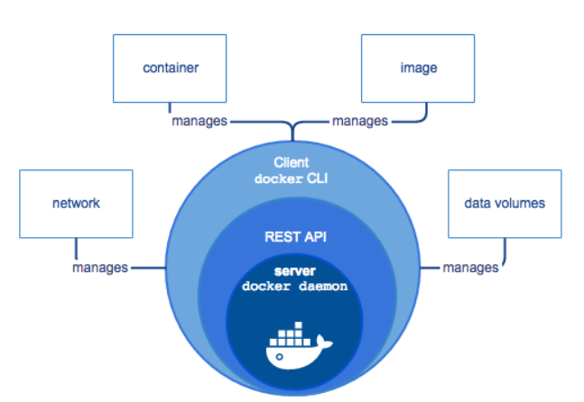

**Docker**是采用了(c/s)架构模式的应用程序

Client dockerCLI :客户端docker命令行

REST API : 一套介于客户端与服务端的之间进行通信并指示其执行的接口

Server docker daemon:服务端dacker守护进程等待客户端发送命令来执行


**Docker**的四大核心技术

镜像：一个Docker的可执行文件，其中包括运行应用程序所需的所有代码内容、依赖库、环境变量和配置文件等。

容器：镜像被运行起来后的实例。

网络：外部或者容器间如何互相访问的网络方式，如host模式、bridge模式。

数据卷：容器与宿主机之间、容器与容器之间共享存储方式，类似虚拟机与主机之间的共享文件目录。


**结构图**

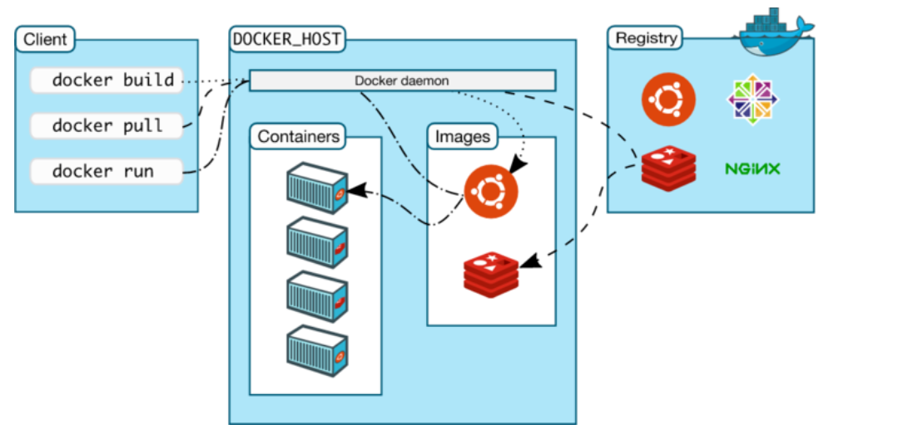


- 客户端 -> 一个服务

  - 一个守护进程, 通过shell终端可以进行一些操作

- 服务器 -> 守护进程

  - 接收客户端的请求
  - 管理容器, 管理镜像

- docker镜像

  - 一个可执行程序
  - 只占用硬盘资源

- docker容器

  - 镜像启动之后运行在docker容器中
  - 占用cpu和内存资源

- docker仓库

  - 存储镜像

  - docker hub

    


### 1.1.4官方资料：

Docker 官网：http://www.docker.com

Github Docker 源码：https://github.com/docker/docker

Docker 英文文档网址：https://docs.docker.com/

Docker 中文文档网址：http://docker-doc.readthedocs.io/zh_CN/latest/


## 1.2 docker快速入门


### 1.2.1docker历程：

​	自2013年出现以来，发展势头很猛，现在可说是风靡全球。

​	docker的第一版为0.1.0 发布于2013年03月23日

​	Docker2017年改版前的版本号是1.13.1发布于2017年02月08日

​	Docker从1.13.x版本开始，版本分为企业版EE和社区版CE，版本号也改为按照时间线来发布，比如17.03就是2017年3月，有点类似于ubuntu的版本发布方式。
​	企业版自然会提供一些额外的服务，当然肯定也是收费的。
​	企业版说明https://blog.docker.com/2017/03/docker-enterprise-edition/
社区版分为stable和edge两种发布方式。

stable版本是季度发布方式，比如17.03, 17.06, 17.09

edge版本是月份发布方式， 比如17.03, 17.04......


### 1.2.2 官方要求

为什么用ubuntu学docker

 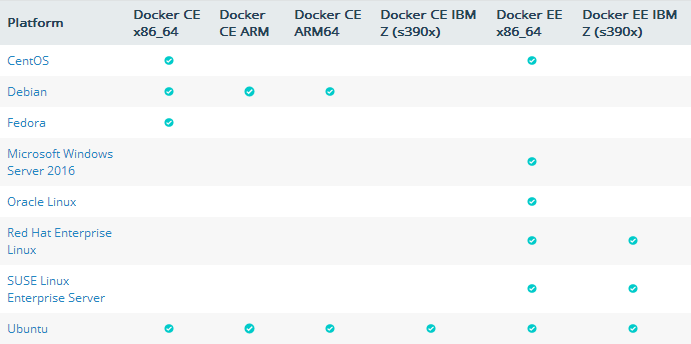

图片来源：https://docs.docker.com/engine/installation/#server

docker要求的ubuntu环境

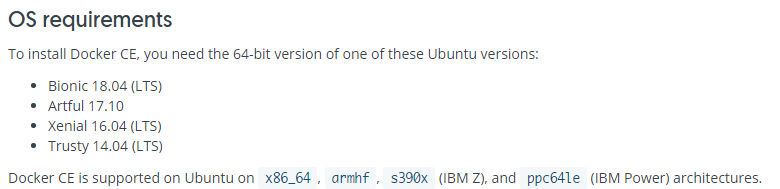


ubuntu下载地址：https://www.ubuntu.com/download/desktop

#### ubuntu主机环境需求

```shell
#执行命令
$ uname -a
$ ls -l /sys/class/misc/device-mapper
```


##### 执行效果

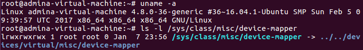

### 1.2.3 部署docker

#### 官网参考：

https://docs.docker.com/engine/installation/linux/docker-ce/ubuntu/#upgrade-docker-after-using-the-convenience-script

#### 安装步骤

```shell
#安装基本软件
$ sudo apt-get update
$ sudo apt-get install apt-transport-https ca-certificates curl software-properties-common lrzsz -y
#使用官方推荐源{不推荐}#
$ sudo curl -fsSL https://download.docker.com/linux/ubuntu/gpg | sudo apt-key add -
add-apt-repository "deb [arch=amd64] https://download.docker.com/linux/ubuntu $(lsb_release -cs) stable"
#使用阿里云的源{推荐}
$ sudo curl -fsSL https://mirrors.aliyun.com/docker-ce/linux/ubuntu/gpg | sudo apt-key add -
$ sudo add-apt-repository "deb [arch=amd64] https://mirrors.aliyun.com/docker-ce/linux/ubuntu $(lsb_release -cs) stable"

#软件源升级
$ sudo apt-get update

#安装docker
$ sudo apt-get install docker-ce -y

#注：
#可以指定版本安装docker：
$ sudo apt-get install docker-ce=<VERSION> -y
  
#查看支持的docker版本
$ sudo apt-cache madison docker-ce
#测试docker
docker version
```


#### 网卡区别：

安装前：只有ens33和lo网卡

 

安装后：docker启动后，多出来了docker0网卡，网卡地址172.17.0.1

 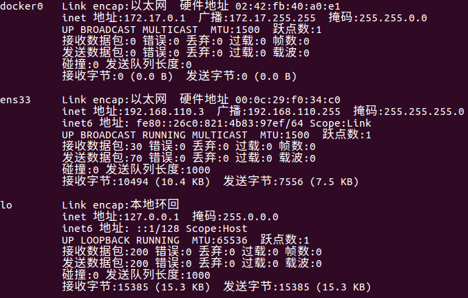


### 1.2.4 docker加速器

在国内使用docker的官方镜像源，会因为网络的原因，造成无法下载，或者一直处于超时。所以我们使用 daocloud的方法进行加速配置。
加速器文档链接：http://guide.daocloud.io/dcs/daocloud-9153151.html

#### 方法:

访问 https://dashboard.daocloud.io 网站，登录 daocloud 账户

 


点击右上角的 加速器

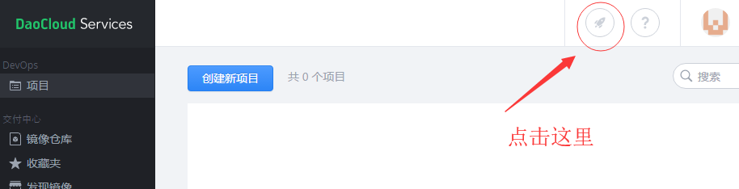

在新窗口处会显示一条命令，

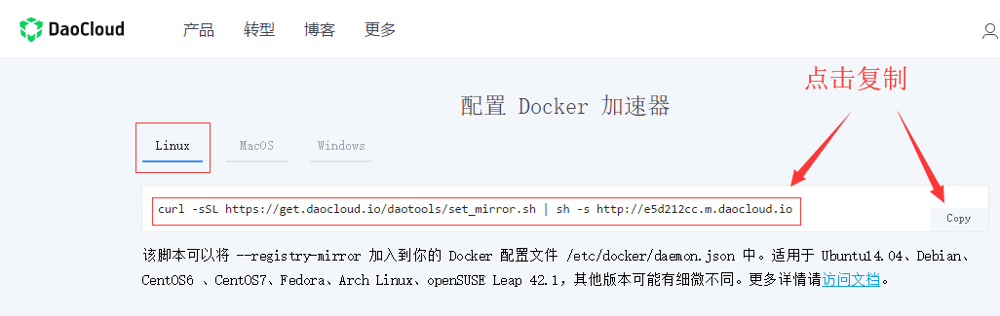

 


```shell
#我们执行这条命令
curl -sSL https://get.daocloud.io/daotools/set_mirror.sh | sh -s http://f1361db2.m.daocloud.io

#修改daemon.json文件，增加

, "insecure-registries": []

#到大括号后

# cat /etc/docker/daemon.json


{"registry-mirrors": ["http://f1361db2.m.daocloud.io"], "insecure-registries": []}

#注意：
#docker cloud加速器的默认内容是少了一条配置，所以我们要编辑文件把后面的内容补全
#重启docker
systemctl restart docker
```


 

### 1.2.5 docker 其他简介

#### docker的基本命令格式：

```shell
#基本格式
systemctl [参数] docker
#参数详解：
	start         开启服务
    stop          关闭
    restart       重启
    status        状态
```


#### 删除docker命令：

```shell
$  sudo apt-get purge docker-ce -y
$  sudo rm -rf /etc/docker
$  sudo rm -rf /var/lib/docker/
```


#### docker基本目录简介:

```SHELL
/etc/docker/                #docker的认证目录
/var/lib/docker/            #docker的应用目录
```


#### docker常见bug:

##### 背景

​	因为使用的是sudo安装docker，所以会导致一个问题。以普通用户登录的状况下，在使用docker images时必须添加sudo，那么如何让docker免sudo依然可用呢？

##### 理清问题

​	当以普通用户身份去使用docker命令时，出现以下错误：

```shell
Got permission denied while trying to connect to the Docker daemon socket at unix:///var/run/docker.sock: Post http://%2Fvar%2Frun%2Fdocker.sock/v1.35/images/create?fromSrc=-&message=&repo=ubuntu-16.04&tag=: dial unix /var/run/docker.sock: connect: permission denied
```

​	可以看都，最后告知我们时权限的问题。那么在linux文件权限有三个数据左右drwxrwxrwx，其中第一为d代表该文件是一个文件夹前三位、中三位、后三位分别代表这属主权限、属组权限、其他人权限。

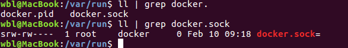

​	上图是报错文件的权限展示，可以看到其属主为root，权限为rw，可读可写；其属组为docker，权限为rw，可读可写。如果要当前用户可直接读取该文件，那么我们就为docker.sock 添加一个其他用户可读写权限 或者添加1个用户组就可以了

##### 方法1：一劳永逸

```shell
#如果还没有 docker group 就添加一个：
$sudo groupadd docker
#将用户加入该 group 内。然后退出并重新登录就生效啦。
$sudo gpasswd -a ${USER} docker
#重启 docker 服务
$systemctl restart docker
#切换当前会话到新 group 或者重启 X 会话
$newgrp - docker
#注意:最后一步是必须的，否则因为 groups 命令获取到的是缓存的组信息，刚添加的组信息未能生效，
#所以 docker images 执行时同样有错。
```

##### 方法2：

```shell
#每次启动docker或者重启docker的之后
$cd /var/run
$sudo chmod 666 docker.sock
```

##### 方法3：每条命令前面加上sudo


.AVI

#  第 2 章 Docker 核心技术

Docker的核心技术内容很多，我们学习则从以下四个方面来介绍Docker的核心技术
**镜像**、**容器**、**数据**、**网络**

## 2.1 docker镜像管理

### 2.1.1 镜像简介

Docker镜像是什么？
​	镜像是一个Docker的可执行文件，其中包括运行应用程序所需的所有代码内容、依赖库、环境变量和配置文件等。
​	通过镜像可以创建一个或多个容器。

### 2.1.2 搜索、查看、获取


#### 搜索镜像

```shell
#作用
	搜索Docker Hub(镜像仓库)上的镜像
#命令格式：
    docker search [镜像名称]
#命令演示：
$ docker search ubuntu
#NAME：名称
#DESCRIPTION：基本功能描述
#STARS：星级（收到关注程度）
#OFFICIAL：是否官方创建
#AUTOMATED：是否自动创建
```


#### 获取镜像

```shell
#作用：
	下载远程仓库（如Docker Hub）中的镜像
#命令格式：
docker pull [镜像名称]
#命令演示：
$ docker pull ubuntu
$ docker pull nginx

#注释：
#获取的镜像在哪里？
#/var/lib/docker 目录下

#由于权限的原因我们需要切换root用户
#那我们首先要重设置root用户的密码：
:~$ sudo passwd root
#这样就可以设置root用户的密码了。
#之后就可以自由的切换到root用户了
:~$ su
#输入root用户的密码即可。

#当然，如果想从root用户切换回一般用户，则可使用 su -val(一般用户名)
#而当你再次切回到root用户，则只需要键入exit,再次输入exit则回到最初的用户下
#操作下面的文件可以查看相关的镜像信息       
:~$ vim /var/lib/docker/image/overlay2/repositories.json 
#文件所在
:~$ pwd
/var/lib/docker/image/overlay2/imagedb/content/sha256

```


#### 查看镜像

 ```shell
#作用：
	列出本地镜像
#命令格式：
docker images [镜像名称]
docker image ls [镜像名称]
#命令演示：
$ docker images
#镜像的ID唯一标识了镜像，如果ID相同,说明是同一镜像。TAG信息来区分不同发行版本，如果不指定具体标记,默认使用latest标记信息
#docker images -a 列出所有的本地的images(包括已删除的镜像记录)
#REPOSITORY：镜像的名称 
#TAG ：镜像的版本标签
#IMAGE ID：镜像id
#CREATED：镜像是什么时候创建的
#SIZE：大小
 ```


### 2.1.3 重命名、删除

#### 镜像重命名

```shell
#作用：
	对本地镜像的NAME、TAG进行重命名，并新产生一个命名后镜像
#命令格式：
docker tag [老镜像名称]:[老镜像版本][新镜像名称]:[新镜像版本]
#命令演示：
$ docker tag nginx:latest panda-nginx:v1.0
```


#### 删除镜像

```shell
#作用：
	将本地的一个或多个镜像删除
#命令格式：
docker rmi [命令参数][镜像ID]
docker rmi [命令参数][镜像名称]:[镜像版本]
docker image rm [命令参数][镜像]
#命令演示：
$docker rmi 3fa822599e10
$docker rmi mysql:latest
#注意：
如果一个image_id存在多个名称，那么应该使用 名称:版本 的格式删除镜像
#命令参数(OPTIONS)：	
	-f, --force      		强制删除
```


### 2.1.4 导出、导入

#### 导出镜像

将已经下载好的镜像，导出到本地，以备后用。

```shell
#作用：
	将本地的一个或多个镜像打包保存成本地tar文件
#命令格式：
docker save [命令参数][导出镜像名称][本地镜像名称]
#命令参数(OPTIONS)：	
	-o, --output string   		指定写入的文件名和路径
#导出镜像
:~$ docker save -o nginx.tar nginx
```


#### 导入镜像

```shell
#作用：
	将save命令打包的镜像导入本地镜像库中
#导入镜像命令格式：
$ docker load [命令参数][被导入镜像压缩文件的名称]
$ docker load < [被导入镜像压缩文件的名称]
$ docker load --input [被导入镜像压缩文件的名称]
#命令参数(OPTIONS)：	
	-i,  --input string   	指定要打入的文件，如没有指定，默认是STDIN
	
#为了更好的演示效果，我们先将nginx的镜像删除掉
docker rmi nginx:v1.0
docker rmi nginx    

#导入镜像文件：
$ docker load < nginx.tar
#注意：
	如果发现导入的时候没有权限需要使用chmod命令修改镜像文件的权限
```


### 2.1.5 历史、详细信息、创建

#### 查看镜像历史


```shell
#作用：
	查看本地一个镜像的历史(历史分层)信息
#查看镜像命令格式：
docker history [镜像名称]:[镜像版本]
docker history [镜像ID]
#我们获取到一个镜像，想知道他默认启动了哪些命令或者都封装了哪些系统层，那么我们可以使用docker history这条命令来获取我们想要的信息
$ docker history sswang-nginx:v1.0
 
#IMAGE：编号           
#CREATED：创建的  
#CREATED BY ：基于那些命令创建的                                 
#SIZE：大小
#COMMENT：评论
```

#### 镜像详细信息 

```shell
#作用：
	查看本地一个或多个镜像的详细信息
#命令格式：
$ docker image inspect [命令参数] [镜像名称]:[镜像版本]
$ docker inspect [命令参数] [镜像ID]
#查看镜像详细信息：
$ docker inspect nginx
```


#### 根据模板创建镜像

```shell
#登录系统模板镜像网站：  
#https://download.openvz.org/template/precreated/
#找到一个镜像模板进行下载，比如说ubuntu-16.04-x86_64.tar.gz，地址为：
#https://download.openvz.org/template/precreated/ubuntu-16.04-x86_64.tar.gz    
#命令格式：
cat 模板文件名.tar | docker import - [自定义镜像名]
#演示效果：
$ cat ubuntu-16.04-x86_64.tar.gz | docker import - ubuntu-mini
```

### 2.1.6总结

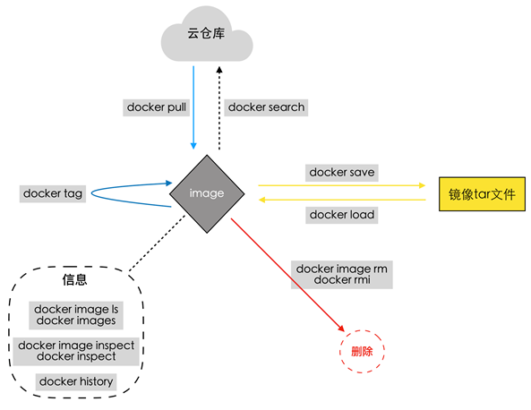

## 2.2 容器管理

​	docker容器技术指Docker是一个由GO语言写的程序运行的“容器”（Linux containers， LXCs）

​       containers的中文解释是集装箱。

​    Docker则实现了一种应用程序级别的隔离，它改变我们基本的开发、操作单元，由直接操作虚拟主机（VM）,转换到操作程序运行的“容器”上来。


### 2.2.1 容器简介

#### 容器是什么？

​	容器（Container）：容器是一种轻量级、可移植、并将应用程序进行的打包的技术，使应用程序可以在几乎任何地方以相同的方式运行

​	•Docker将镜像文件运行起来后，产生的对象就是容器。容器相当于是镜像运行起来的一个实例。

​	•容器具备一定的生命周期。

​	•另外，可以借助docker ps命令查看运行的容器，如同在linux上利用ps命令查看运行着的进程那样。

​	我们就可以理解容器就是被封装起来的进程操作,只不过现在的进程可以简单也可以复杂,复杂的话可以运行1个操作系统.简单的话可以运行1个回显字符串.

#### 容器与虚拟机的相同点

•容器和虚拟机一样，都会对物理硬件资源进行共享使用。

•容器和虚拟机的生命周期比较相似（创建、运行、暂停、关闭等等）。

•容器中或虚拟机中都可以安装各种应用，如redis、mysql、nginx等。也就是说，在容器中的操作，如同在一个虚拟机(操作系统)中操作一样。

•同虚拟机一样，容器创建后，会存储在宿主机上：linux上位于/var/lib/docker/containers下

#### 容器与虚拟机的不同点

**注意**：容器并不是虚拟机，但它们有很多相似的地方

•虚拟机的创建、启动和关闭都是基于一个完整的操作系统。一个虚拟机就是一个完整的操作系统。而容器直接运行在宿主机的内核上，其本质上以一系列进程的结合。

•容器是轻量级的，虚拟机是重量级的。

​	首先容器不需要额外的资源来管理，虚拟机额外更多的性能消耗；

​	其次创建、启动或关闭容器，如同创建、启动或者关闭进程那么轻松，而创建、启动、关闭一个操作系统就没那么方便了。

•也因此，意味着在给定的硬件上能运行更多数量的容器，甚至可以直接把Docker运行在虚拟机上。


### 2.2.2 查看、创建、启动

#### 查看容器

```shell
#作用
	显示docker容器列表
#命令格式：
docker ps
#命令演示：
$ docker ps
#CONTAINER ID 容器ID        
#IMAGE 基于那个镜像              
#COMMAND  运行镜像使用了哪些命令？           
#CREATED多久前创建时间             
#STATUS   开启还是关闭           
#PORTS端口号               
#NAMES容器名称默认是随机的
#注意：
管理docker容器可以通过名称，也可以通过ID
ps是显示正在运行的容器， -a是显示所有运行过的容器，包括已经不运行的容器
```


#### 创建待启动容器

```shell
#作用：
	利用镜像创建出一个Created 状态的待启动容器
#命令格式：
	docker create [OPTIONS] IMAGE [COMMAND] [ARG...]
	docker create [参数命令] 依赖镜像 [容器内命令] [命令参数]
#命令参数(OPTIONS)：查看更多
	-t, --tty           		分配一个伪TTY，也就是分配虚拟终端
    -i, --interactive    	    即使没有连接，也要保持STDIN打开
        --name          		为容器起名，如果没有指定将会随机产生一个名称
#命令参数（COMMAND\ARG）:
	COMMAND 表示容器启动后，需要在容器中执行的命令，如ps、ls 等命令
	ARG 表示执行 COMMAND 时需要提供的一些参数，如ps 命令的 aux、ls命令的-a等等
#创建容器（附上ls命令和a参数）
	docker create -it --name ubuntu-1  ubuntu ls -a
```


**启动容器**

启动容器有三种方式

1、启动待启动或已关闭容器

2、基于镜像新建一个容器并启动

3、守护进程方式启动docker


#### 启动容器

```shell
#作用：
	将一个或多个处于创建状态或关闭状态的容器启动起来

#命令格式：
docker start [容器名称]或[容器ID]
#命令参数(OPTIONS)：
	-a, --attach		将当前shell的 STDOUT/STDERR 连接到容器上
	-i, --interactive		将当前shell的 STDIN连接到容器上	
#启动上面创建的容器 
	docker start -a ubuntu-1
```


#### 创建新容器并启动

```shell
#作用：
	利用镜像创建并启动一个容器
#命令格式：
docker run [命令参数]  [镜像名称][执行的命令]
命令参数(OPTIONS)：
	-t, --tty           	分配一个伪TTY，也就是分配虚拟终端
    -i, --interactive    	即使没有连接，也要保持STDIN打开
        --name          	为容器起名，如果没有指定将会随机产生一个名称
	-d, --detach			在后台运行容器并打印出容器ID
	--rm					当容器退出运行后，自动删除容器

#启动一个镜像输出内容并删除容器
$ docker run --rm  --name nginx1   nginx  /bin/echo "hello docker" 


#注意：
docker run 其实 是两个命令的集合体 docker create + docker start
```


#### 守护进程方式启动容器<常用的方式>

更多的时候，需要让Docker容器在后台以守护形式运行。此时可以通过添加-d参数来实现

```shell
#命令格式：
docker run -d [image_name] command ...
#守护进程方式启动容器:
:~$ docker run -d nginx
```

### 2.2.3暂停与取消暂停与重启

#### 容器暂停 

```shell
#作用：
	暂停一个或多个处于运行状态的容器
#命令格式：
	docker pause [容器名称]或[容器ID]
#暂停容器
	docker pause a229eabf1f32 

```

#### 容器取消暂停

```shell
#作用：
	取消一个或多个处于暂停状态的容器，恢复运行
#命令格式：
	docker unpause [容器名称]或[容器ID]
#恢复容器
	docker unpause a229eabf1f32
```

####  重启
```shell
#作用：
	重启一个或多个处于运行状态、暂停状态、关闭状态或者新建状态的容器
	该命令相当于stop和start命令的结合
#命令格式：
	docker restart [容器名称]或[容器ID]
#命令参数(OPTIONS)：
	 -t, --time int   		重启前，等待的时间，单位秒(默认 10s) 

#恢复容器
	docker restart -t 20 a229eabf1f32
```


### 2.2.4 关闭、终止、删除

#### 关闭容器

在生产中，我们会以为临时情况，要关闭某些容器，我们使用 stop 命令来关闭某个容器

```shell
#作用：
	延迟关闭一个或多个处于暂停状态或者运行状态的容器
#命令格式：
  docker stop [容器名称]或[容器ID]

#关闭容器:
$ docker stop  8005c40a1d16
```


#### 终止容器

```shell
#作用：
	强制并立即关闭一个或多个处于暂停状态或者运行状态的容器
#命令格式：
	docker kill [容器名称]或[容器ID]
#终止容器
$ docker kill  8005c40a1d16
```


####  

#### 删除容器

删除容器有三种方法：
正常删除    --        删除已关闭的

强制删除    --        删除正在运行的

强制批量删除 --        删除全部的容器


##### 正常删除容器

```shell
#作用：
	删除一个或者多个容器

#命令格式：
$ docker rm [容器名称]或[容器ID]   
#删除已关闭的容器:
$ docker rm 1a5f6a0c9443
```


```
Error response from daemon: You cannot remove a running container c7f5e7fe5aca00e0cb987d486dab3502ac93d7180016cfae9ddcc64e56149fc9. Stop the container before attempting removal or force remove
错误响应守护进程:你不能删除一个容器c7f5e7fe5aca00e0cb987d486dab3502ac93d7180016cfae9ddcc64e56149fc9运行。在尝试拆卸或强制拆卸之前，先停止容器。
```


##### 强制删除运行容器

```shell
#作用：
	强制删除一个或者多个容器
#命令格式：
  docker rm -f [容器名称]或[容器ID]
#删除正在运行的容器
$ docker rm -f 8005c40a1d16
```


##### 拓展批量关闭容器

```shell
#作用：
	批量强制删除一个或者多个容器
#命令格式：
$ docker rm -f $(docker ps -a -q)
#按照执行顺序$（）， 获取到现在容器的id然后进行删除
```


### 2.2.5 进入、退出

**进入容器我们学习三种方法：**

1、创建容器的同时进入容器
2、手工方式进入容器
3、生产方式进入容器

#### 创建并进入容器


```shell
#命令格式：
docker run --name [container_name] -it [docker_image] /bin/bash

#命令演示：
$  docker run -it --name panda-nginx nginx /bin/bash
#进入容器后
root@7c5a24a68f96:/# echo "hello world"
hello world

root@7c5a24a68f96:/# exit
exit        
 
#docker 容器启动命令参数详解：
#--name:给容器定义一个名称
#-i:则让容器的标准输入保持打开。
#-t:让docker分配一个伪终端,并绑定到容器的标准输入上
#/bin/bash:执行一个命令
```


#### 退出容器：

```shell
#方法一：
exit
#方法二：
Ctrl + D
```


#### 手工方式进入容器

```shell
#命令格式：
docker exec -it  容器id  /bin/bash
#效果演示：
$ docker exec -it d74fff341687 /bin/bash
```

#### 生产方式进入容器

我们生产中常用的进入容器方法是使用脚本，脚本内容如下

```shell
#!/bin/bash

#定义进入仓库函数
docker_in(){
  NAME_ID=$1
  PID=$(docker inspect --format {{.State.Pid}} $NAME_ID)
  nsenter --target $PID --mount --uts --ipc --net --pid
}
docker_in $1
```

直接执行的话是没有执行权限的所以需要赋值权限

```shell
#赋权执行
$  chmod +x docker_in.sh 
#进入指定的容器，并测试
$  ./docker_in.sh b3fbcba852fd
```


####  注意：

| 当拷贝到linux下的时候会出现                                  |
| ------------------------------------------------------------ |
| -bash: ./docker_in.sh: /bin/bash^M: 解释器错误: 没有那个文件或目录<br/>这个问题大多数是因为你的脚本文件在windows下编辑过。windows下，每一行的结尾是\n\r，而在linux下文件的结尾是\n，那么你在windows下编辑过的文件在linux下打开看的时候每一行的结尾就会多出来一个字符\r,用cat -A docker_in.sh时你可以看到这个\r字符被显示为^M，这时候只需要删除这个字符就可以了。<br/>可以使用命令   sed -i 's/\r$//' docker_in.sh |


### 2.2.6 基于容器创建镜像

#### 方式一：

```shell
#命令格式：
docker commit -m '改动信息' -a "作者信息" [container_id][new_image:tag]
#命令演示：
#进入一个容器，创建文件后并退出:
$ ./docker_in.sh d74fff341687
$ mkdir /hello
$ mkdir /world
$ ls
$ exit
#创建一个镜像:
$ docker commit -m 'mkdir /hello /world ' -a "panda"  d74fff341687  nginx:v0.2
#查看镜像:
$ docker images
#启动一个容器
$ docker run -itd  nginx:v0.2 /bin/bash
#进入容器进行查看
$ ./docker_in.sh ae63ab299a84
$ ls
```


#### 方式二:

```shell
#命令格式：
docker export [容器id] > 模板文件名.tar
#命令演示：
#创建镜像:
$ docker export ae63ab299a84 > nginx.tar
#导入镜像:
$ cat nginx.tar | docker import - panda-test
```


| 导出（export）导入（import）与保存（save）加载（load）的恩怨情仇 |
| ------------------------------------------------------------ |
| import与load的区别：<br/>import可以重新指定镜像的名字，docker load不可以 |
| export 与 保存 save 的区别：<br/>1、export导出的镜像文件大小，小于 save保存的镜像。<br/>2、export 导出（import导入）是根据容器拿到的镜像，再导入时会丢失镜像所有的历史。 |


### 2.2.7 日志、信息、端口、重命名

#### 查看容器运行日志

```shell
#命令格式：
docker logs [容器id]
#命令效果：
$ docker logs 7c5a24a68f96
```


#### 查看容器详细信息

```shell
#命令格式：
docker inspect [容器id]
#命令效果：
查看容器全部信息:
$ docker inspect 930f29ccdf8a

```


#### 查看容器端口信息

```shell
#命令格式：
docker port [容器id]
#命令效果：
$ docker port 930f29ccdf8a
#没有效果没有和宿主机关联
```

#### 容器重命名
```shell
#作用：
	修改容器的名称
#命令格式：
	docker rename [容器id]或[容器名称] [容器新名称]
#命令效果：
$ docker rename 930f29ccdf8a u1

```


#### 总结

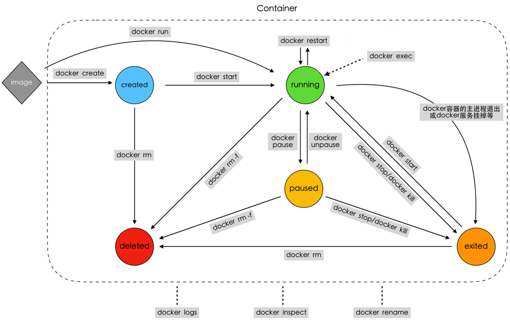


## 2.3 数据管理

​	生产环境使用Docker的过程中，往往需要对数据进行持久化保存，或者需要更多容器之间进行数据共享，那我们需要怎么要的操作呢？

​	答案就是：数据卷（Data Volumes）和数据卷容器（Data Volume Containers）

### 2.3.1 数据卷简介

#### 什么是数据卷？

​	就是将宿主机的某个目录，映射到容器中，作为数据存储的目录，我们就可以在宿主机对数据进行存储  

​	数据卷（Data Volumes）：容器内数据直接映射到本地主机环境

##### 数据卷特性

1、数据卷可以在容器之间共享和重用，本地与容器间传递数据更高效；

2、对数据卷的修改会立马有效，容器内部与本地目录均可；

3、对数据卷的更新，不会影响镜像，对数据与应用进行了解耦操作；

4、卷会一直存在，直到没有容器使用。

#### docker 数据卷命令详解

```shell
:~$ docker run --help

-v, --volume list               Bind mount a volume (default [])
                                    挂载一个数据卷，默认为空
```


​	我们可以使用命令 docker run 用来创建容器，可以在使用docker run 命令时添加 -v 参数，就可以创建并挂载一个到多个数据卷到当前运行的容器中。
​	-v 参数的作用是将宿主机的一个目录作为容器的数据卷挂载到docker容器中，使宿主机和容器之间可以共享一个 目录，如果本地路径不存在，Docker也会自动创建。


### 2.3.2 数据卷实践

​	关于数据卷的管理我们从两个方面来说：

1、目录

2、普通文件

#### 数据卷实践 之 目录


```shell
#命令格式：
docker run -itd --name [容器名字] -v [宿主机目录]:[容器目录][镜像名称] [命令(可选)]

#命令演示：
#创建测试文件:
$ echo "file1" > tmp/file1.txt
#启动一个容器，挂载数据卷:
$ docker run -itd --name test1 -v /home/itcast/tmp/:/test1/  nginx
#注意宿主机目录需要绝对路径
#测试效果
$ docker exec -it a53c61c77 /bin/bash
root@a53c61c77bde:/# cat /test1/file1.txt 
file1
```


#### 数据卷实践 之 文件{不推荐}


```shell
#命令格式：
docker run -itd --name [容器名字] -v [宿主机文件]:[容器文件][镜像名称] [命令(可选)]

#命令演示：
#创建测试文件
$ echo "file1" > /tmp/file1.txt
#启动一个容器，挂载数据卷
$ docker run -itd --name test2 -v /home/itcast/tmp/file1.txt:/nihao/nihao.sh nginx
 
#测试效果
:~$ docker exec -it 84c37743 /bin/bash
root@84c37743d339:/# cat /nihao/nihao.sh 
file1
```

####  注意：

```shell
1、Docker挂载数据卷的默认读写权限（rw），用户可以通过ro设置为只读
格式：[宿主机文件]:[容器文件]:ro
2、如果直接挂载一个文件到容器，使用文件工具进行编辑，可能会造成文件的改变，从Docker1.1.0起，这会导致报错误信息。所以推荐的方式是直接挂在文件所在的目录。
```


### 2.3.3 数据卷容器简介

什么是数据卷容器？
需要在多个容器之间共享一些持续更新的数据，最简单的方式是使用数据卷容器。数据卷容器也是一个容器，但是它的目的是专门用来提供数据卷供其他容器挂载。

数据卷容器（Data Volume Containers）：使用特定容器维护数据卷

简单点：数据卷容器就是为其他容器提供数据交互存储的容器

#### docker 数据卷命令详解

```shell
:~$  docker run --help
。。。
-v, --volumes-from list     Mount volumes from the specified container(s) (default[])
                                  #从指定的容器挂载卷，默认为空
```


#### 数据卷容器操作流程

如果使用数据卷容器，在多个容器间共享数据，并永久保存这些数据，需要有一个规范的流程才能做得到：

1、创建数据卷容器

2、其他容器挂载数据卷容器

注意：
数据卷容器自身并不需要启动，但是启动的时候依然可以进行数据卷容器的工作。

### 2.3.4 数据卷容器实践

数据卷容器实践包括两部分：创建数据卷容器和使用数据卷容器

#### 创建一个数据卷容器


```shell
#命令格式：
docker create -v [容器数据卷目录] --name [容器名字][镜像名称] [命令(可选)]
#执行效果
$ docker create -v /data --name v1-test1 nginx
```

#### 创建两个容器，同时挂载数据卷容器

```shell
#命令格式：
docker run --volumes-from [数据卷容器id/name] -tid --name [容器名字][镜像名称] [命令(可选)]
#执行效果：
#创建 vc-test1 容器:
docker run --volumes-from 4693558c49e8 -tid --name vc-test1 nginx /bin/bash
#创建 vc-test2 容器:
docker run --volumes-from 4693558c49e8 -tid --name vc-test2 nginx /bin/bash

```


#### 确认卷容器共享

```shell
#进入vc-test1，操作数据卷容器:
:~$  docker exec -it vc-test1 /bin/bash
root@c408f4f14786:/# ls /data/
root@c408f4f14786:/# echo 'v-test1' > /data/v-test1.txt
root@c408f4f14786:/# exit
#进入vc-test2，确认数据卷:
:~$  docker exec -it vc-test2 /bin/bash
root@7448eee82ab0:/# echo 'v-test2' > /data/v-test2.txt
root@7448eee82ab0:/# ls /data/
v-test1.txt
root@7448eee82ab0:/# exit
#回到vc-test1进行验证
:~$  docker exec -it vc-test1 /bin/bash
root@c408f4f14786:/# ls /data/
v-test1.txt  v-test2.txt
root@c408f4f14786:/# cat /data/v-test2.txt 
v-test2
```


### 2.3.5 数据备份原理

为什么需要数据备份和恢复？
工作中很多的容器的数据需要查看，所有需要备份将数据很轻松的拿到本地目录。

原理图：

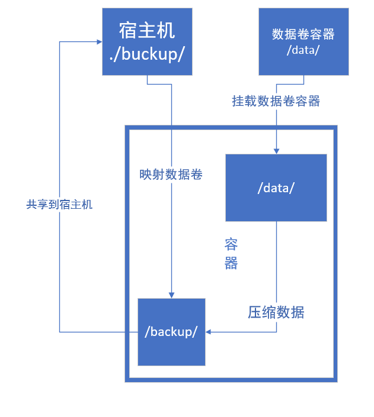

数据备份方案：
1 创建一个挂载数据卷容器的容器

2 挂载宿主机本地目录作为备份数据卷

3 将数据卷容器的内容备份到宿主机本地目录挂载的数据卷中

4 完成备份操作后销毁刚创建的容器

### 2.3.6 数据备份实践

在2.3.4的数据卷容器基础上做数据的备份

```shell
#命令格式：
$ docker run --rm --volumes-from [数据卷容器id/name] -v [宿主机目录]:[容器目录][镜像名称] [备份命令]

#命令演示：
#创建备份目录:
$ mkdir /backup/
#创建备份的容器:
$ docker run --rm --volumes-from 60205766d61a  -v /home/itcast/backup/:/backup/ nginx tar zcPf /backup/data.tar.gz /data

#验证操作:
$ ls /backup
$ zcat /backup/data.tar.gz
```


 注释:
​	-P：使用原文件的原来属性（属性不会依据使用者而变），恢复字段到它们的原始方式，忽略现有的用户权限屏蔽位（umask)。 加了-p之后，tar进行解压后，生成的文件的权限，是直接取自tar包里面文件的权限（不会再使用该用户的umask值进行运算），那么不加-p参数，将还要再减去umask的值（位运算的减），但是如果使用root用户进行操作，加不加-p参数都一样。


### 2.3.7 数据还原原理

原理图：

数据恢复方案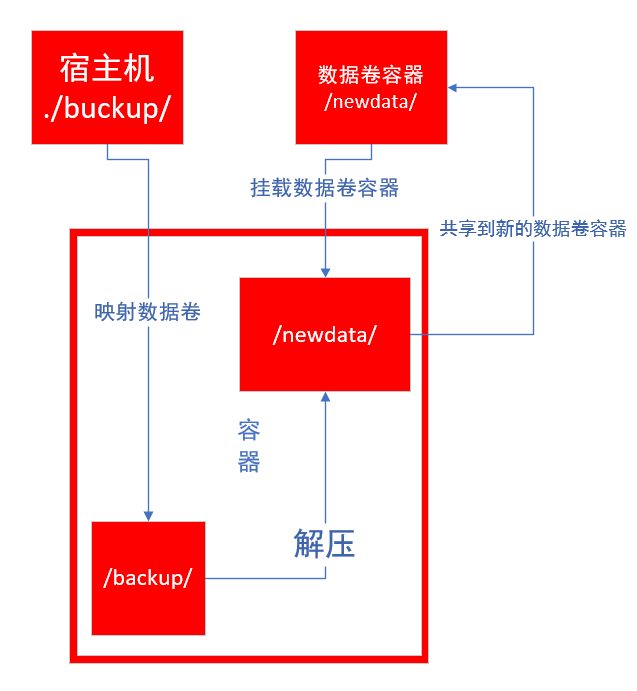
1、创建一个新的数据卷容器（或删除原数据卷容器的内容）

2、创建一个新容器，挂载数据卷容器，同时挂载本地的备份目录作为数据卷

3、将要恢复的数据解压到容器中

4、完成还原操作后销毁刚创建的容器

### 2.3.8 数据还原实践

```shell
#命令格式：
docker run --rm -itd --volumes-from [数据要到恢复的容器] -v [宿主机备份目录]:[容器备份目录][镜像名称]  [解压命令]
#命令实践：
#启动数据卷容器:
$ docker start c408f4f14786

#删除源容器内容:
$  docker exec -it vc-test1 bash 
root@c408f4f14786:/# rm -rf /data/*

#恢复数据:
docker run --rm --volumes-from v-test  -v /home/itcast/backup/:/backup/ nginx tar xPf /backup/data.tar.gz -C /data

#验证:
:~$ docker exec -it vc-test1/bin/bash 
root@c408f4f14786:/# ls /data/data/
v-test1.txt  v-test2.txt
 
#新建新的数据卷容器：
:~$ docker create -v /newdata --name v-test2 nginx
#简历新的容器挂载数据卷容器
:~$ docker run --volumes-from a7e9a33f3acb -tid --name vc-test3 nginx /bin/bash
#恢复数据：
docker run --rm --volumes-from v-test2  -v /home/itcast/backup/:/backup/ nginx tar xPf /backup/data.tar.gz -C /newdata
#验证:
:~$ docker exec -it vc-test3 /bin/bash 
root@c408f4f14786:/# ls /newdata
v-test1.txt  v-test2.txt
```


注意：
解压的时候，如果使用目录的话，一定要在解压的时候使用 -C 制定挂载的数据卷容器，不然的话容器数据是无法恢复的，因为容器中默认的backup目录不是数据卷，即使解压后，也看不到文件。

数据是最宝贵的资源，docker在设计上考虑到了这点，并且为数据的操作提供了充分的支持。


## 2.4 网络管理

​	Docker 网络很重要，重要的，我们在上面学到的所有东西都依赖于网络才能工作。我们从两个方面来学习网络：端口映射和网络模式
​	为什么先学端口映射呢？
在一台主机上学习网络，学习端口映射最简单，避免过多干扰。

### 2.4.1 端口映射详解

默认情况下，容器和宿主机之间网络是隔离的，我们可以通过端口映射的方式，将容器中的端口，映射到宿主机的某个端口上。这样我们就可以通过宿主机的ip+port的方式来访问容器里的内容


**Docker的端口映射**

1、随机映射     -P(大写)

2、指定映射     -p 宿主机ip:宿主机端口:容器端口

注意：
生产场景一般不使用随机映射，但是随机映射的好处就是由docker分配，端口不会冲突,
不管哪种映射都会有所消耗，影响性能，因为涉及到映射的操作

### 2.4.2 随机映射实践

随机映射我们从两个方面来学习：
1、默认随机映射
2、指定主机随机映射

#### 默认随机映射

```SHELL
#命令格式：
docker run -d -P [镜像名称]
#命令效果：
#先启动一个普通的nginx镜像
$ docker run -d  nginx
#查看当前宿主机开放了哪些端口
$ netstat -tnulp
```


 

```shell
#启动一个默认随机映射的nginx镜像
$ docker run -d -P nginx
#查看当前宿主机开放了哪些端口
$ netstat -tnulp
```

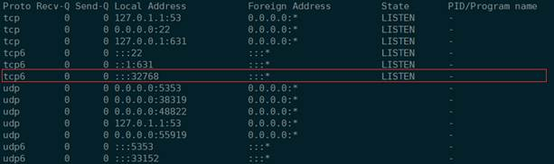

 


 

**注意：**
​    宿主机的32768被映射到容器的80端口
-P 自动绑定所有对外提供服务的容器端口，映射的端口将会从没有使用的端口池中自动随机选择，
但是如果连续启动多个容器的话，则下一个容器的端口默认是当前容器占用端口号+1

 

在浏览器中访问http://192.168.110.20:32768

效果显示
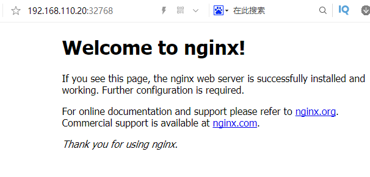

注意：
浏览器输入的格式是： docker容器宿主机的ip:容器映射的端口

#### 指定主机随机映射

```shell
#命令格式
    :~$ docker run -d -p [宿主机ip]::[容器端口] --name [容器名称][镜像名称]
#命令效果
    :~$ docker run -d -p 192.168.8.14::80 --name nginx-1 nginx
#检查效果
    :~$ docker ps 
```

### 2.4.3 指定映射实践

**指定端口映射我们从二个方面来讲**：

指定端口映射

指定多端口映射


#### 指定端口映射

```shell
#命令格式：
    docker run -d -p [宿主机ip]:[宿主机端口]:[容器端口] --name [容器名字][镜像名称]
#注意：
#如果不指定宿主机ip的话，默认使用 0.0.0.0，
    
#命令实践：
#现状我们在启动容器的时候，给容器指定一个访问的端口 1199
    docker run -d -p 192.168.8.14:1199:80 --name nginx-2 nginx
#查看新容器ip
    docker inspect --format='{{range .NetworkSettings.Networks}}{{.IPAddress}}{{end}}' 0ad3acfbfb76
#查看容器端口映射
    docker ps 
```


#### 多端口映射方法

```shell
#命令格式
    docker run -d -p [宿主机端口1]:[容器端口1]  -p [宿主机端口2]:[容器端口2] --name [容器名称][镜像名称] 
#开起多端口映射实践
    docker run -d -p 520:443 -p 6666:80 --name nginx-3 nginx
#查看容器进程
    docker ps 
```


### 2.4.4 网络管理基础

#### docker网络命令

```shell
#查看网络命令帮助
:~$ docker network help
    。。。。。。
connect     Connect a container to a network
   #将一个容器连接到一个网络
create      Create a network
   #创建一个网络
disconnect  Disconnect a container from a network
   #从网络断开一个容器
inspect     Display detailed information on one or more networks
   #在一个或多个网络上显示详细信息
ls          List networks
   #网络列表
prune       Remove all unused networks
   #删除所有未使用的网络
rm          Remove one or more networks
   #删除一个或多个网络。
```


#### 经常使用的网络查看命令

```shell
#查看当前主机网络
$ docker network ls

NETWORK ID          NAME                DRIVER              SCOPE
#网络id             #名称               #驱动                #范围
c2dcffa83a29        bridge              bridge              local
c4deefdaf53b        host                host                local
57942890c6d6        none                null                local
```


```shell
#查看bridge的网络内部信息
:~$ docker network inspect bridge
[
    {
        "Name": "bridge",
。。。。。。
            "Config": [
                {
                    "Subnet": "172.17.0.0/16",
                    "Gateway": "172.17.0.1"
                }
            ]
        },
。。。。。。
        "Containers": {
            "1f182f7163cb194c7d49c75e46fc6dc7cbee59b55f04d74319df75b45a6f5ba0": {
                "Name": "nginx-2",
                "EndpointID": "9e91f5d77b9c0ef85bb8a4f8aa2f4fb883243371b0946ee5f5e728ba9a409b0d",
                "MacAddress": "02:42:ac:11:00:03",
                "IPv4Address": "172.17.0.3/16",
                "IPv6Address": ""
            },
            "faecdcae982a658b1c1a1abbd57125ca5eae5234d3e684ce771b8a952317a3b6": {
                "Name": "nginx-1",
                "EndpointID": "72f7a99c28838ee670240c9e7bd79eee24c0dea28203e4fe0286fdb3ab084ac7",
                "MacAddress": "02:42:ac:11:00:02",
                "IPv4Address": "172.17.0.2/16",
                "IPv6Address": ""
            }
        },
      ]
```


 	

#### **回忆一下**

##### 查看容器详细信息

```shell
#命令格式：
    docker inspect [容器id]
#命令效果：
    查看容器全部信息:
    :~$ docker inspect 930f29ccdf8a
    查看容器网络信息:
    :~$ docker inspect --format='{{range .NetworkSettings.Networks}}{{.IPAddress}}{{end}}' 930f29ccdf8a
```


##### 查看容器端口信息

```shell
#命令格式：
    docker port [容器id]
#命令效果：
    :~$ docker port 930f29ccdf8a
```


 

 

### 2.4.5 网络模式简介

​	从1.7.0版本开始，Docker正式把网络跟存储这两个部分的功能实现都以插件化的形式剥离出来，允许用户通过指令来选择不同的后端实现。这也就是Docker希望构建围绕着容器的强大生态系统的一些积极尝试。
​	剥离出来的独立网络项目叫做libnetwork，libnetwork中的网络模型（Container Networking Model ，CNM）十分简洁，可以让上层的大量应用容器最大程度上不去关心底层实现。

#### docker的常用的网络模式

**bridge模式：**
简单来说：就是穿马甲，打着宿主机的旗号，做自己的事情。
Docker的**默认模式**，它会在docker容器启动时候，自动配置好自己的网络信息，同一宿主机的所有容器都在一个网络下，彼此间可以通信。类似于我们vmware虚拟机的桥接模式。
利用宿主机的网卡进行通信，因为涉及到网络转换，所以会造成资源消耗，网络效率会低。

 

**host模式：**
简单来说，就是鸠占鹊巢，用着宿主机的东西，干自己的事情。容器使用宿主机的ip地址进行通信。
特点：容器和宿主机共享网络

 

**container模式：**
新创建的容器间使用，使用已创建的容器网络，类似一个局域网。
特点：容器和容器共享网络


**none模式：**
这种模式最纯粹，不会帮你做任何网络的配置，可以最大限度的定制化。
不提供网络服务，容器启动后无网络连接。


**overlay模式：**
容器彼此不再同一网络，而且能互相通行。


### 2.4.6 定制bridge实践一

​	其实我们在端口映射的部分就是bridge模式的简单演示了，因为他们使用的是默认bridge网络模式，现在我们来自定义桥接网络。
​	**这一部分我们从三个方面来演示：**
​	创建桥接网络

​	使用自定义网络创建容器

​	容器断开、连接网络

#### 创建网络

```shell
#命令格式：
docker network create --driver [网络类型][网络名称]

#参数
create  	创建一个网络
--driver	指定网络类型

#命令演示：
$ docker network create --driver bridge bridge-test

#查看主机网络类型:
:~$ docker network ls
NETWORK ID          NAME                DRIVER              SCOPE
#网络id              #名称               #驱动                #范围
c2dcffa83a29        bridge              bridge              local
c4deefdaf53b        host                host                local
57942890c6d6        none                null                local
d5c061bc02b1        bridge-test         bridge              local 

#查看新建网络的网络信息
:~$ docker network inspect  bridge-test 
[
    {
        "Name": "bridge-test",
。。。。。。
            "Config": [
                {
                    "Subnet": "172.18.0.0/16",#ip/子网
                    "Gateway": "172.18.0.1"#网关
                }
            ]
        },
。。。。。。
    }
]

#宿主机又多出来一个网卡设备：
$ ifconfig
br-17847710137f Link encap:以太网  硬件地址 02:42:cb:8b:48:37  
inet 地址:172.18.0.1  广播:172.18.255.255  掩码:255.255.0.0
。。。。。。
```


#### 自定义网段与网关

```shell
#自定义网段与网关
#查看关于网段和网管的相关命令
:~$ docker network create --help

--gateway strings      IPv4 or IPv6 Gateway for the master subnet
                           主子网的IPv4或IPv6网关。

--subnet strings       Subnet in CIDR format that represents a network segment
                        表示网络段的CIDR格式的子网。
#查看刚刚创建的网络信息
:~$ docker network inspect bridge-test 
[
    {
        "Name": "bridge-test",

。。。
        "Config": [
            {
                "Subnet": "172.18.0.0/16",#ip/子网
                "Gateway": "172.18.0.1"#网关
。。。

#创建自定义网段与网关信息
:~$ docker network create --driver bridge --gateway 172.99.0.1 --subnet 172.99.0.0/16 bridge-test1
#成功返回对应的sha256码
9d02a01fa98b7a538027b624171481a2098232fa707cdc83084fc880d0afd091

#查看网络列表
:~$ docker network ls
NETWORK ID          NAME                DRIVER              SCOPE
c2dcffa83a29        bridge              bridge              local
17847710137f        bridge-test         bridge              local
9d02a01fa98b        bridge-test1        bridge              local
c4deefdaf53b        host                host                local
57942890c6d6        none                null                local

#查看自定义网络的网关与网络信息
:~$ docker network inspect bridge-test1 
[
    {
            "Name": "bridge-test1",
。。。。。。
            "Config": [
                {
                    "Subnet": "172.99.0.0/16"#ip/子网
                    "Gateway": "172.99.0.1"#网关
                }
。。。。
#查看主机网络信息
$ ifconfig
br-9d02a01fa98b Link encap:以太网  硬件地址 02:42:41:18:2c:5a  
          inet 地址:172.99.0.1  广播:172.99.255.255  掩码:255.255.0.0
          UP BROADCAST MULTICAST  MTU:1500  跃点数:1
          接收数据包:0 错误:0 丢弃:0 过载:0 帧数:0
          发送数据包:0 错误:0 丢弃:0 过载:0 载波:0
          碰撞:0 发送队列长度:0 
          接收字节:0 (0.0 B)  发送字节:0 (0.0 B)
```


#### 在自定义网络中启动容器

~~~shell
#命令格式： 
    docker run --net=[网络名称] -itd --name=[容器名称][镜像名称]
#使用效果：
    #查看创建的网络bridge-test
    :~$ docker network inspect bridge-test
            "Containers": {},#容器是空的
    #查看创建的网络bridge-test1
    :~$ docker network inspect bridge-test1
            "Containers": {},#容器也是是空的
    #创建启动1个使用网络为bridge-test  名为nginx--1的容器
    :~$ docker run --net=bridge-test -itd --name nginx--1 nginx
    ff07009ba3c29872145630814d163ccffe72643abef3acda2d443d6848004d87

```
#查看下容器
:~$ docker ps
CONTAINER ID        IMAGE        COMMAND                  CREATED         STATUS          PORTS      NAMES
ff07009ba3c2        nginx        "nginx -g 'daemon of…"   2 minutes ago   Up 2 minutes    80/tcp     nginx--1
 
#查看容器的信息 
:~$ docker inspect ff07009ba3c2
#网络信息已经变成bridge-test的网段了
                    "Gateway": "172.18.0.1",
                    "IPAddress": "172.18.0.2",
#创建启动1个使用网络为bridge-test1  名为nginx--2的容器
:~$ docker run --net=bridge-test1 -itd --name nginx--2 nginx
cc55de5710ad8133991d52482d363b42dcdf6fff50f476b3024c626eb1c14da3
 
#查看下容器
:~$ docker ps
CONTAINER ID        IMAGE        COMMAND                  CREATED         STATUS          PORTS      NAMES
cc55de5710ad        nginx        "nginx -g 'daemon of…"   5 seconds ago   Up 4 seconds    80/tcp     nginx--2
#查看容器的信息
:~$ docker inspect cc55de5710ad
#网络信息已经变成bridge-test1的网段了
                    "Gateway": "172.99.0.1",
                    "IPAddress": "172.99.0.2",

#查看bridge-test的网络信息
:~$ docker network inspect bridge-test
#bridge-test下包含了nginx--1
        "Containers": {
            "ff07009ba3c29872145630814d163ccffe72643abef3acda2d443d6848004d87": {
                "Name": "nginx--1",
                "EndpointID": "e2e8ba3091b27b333cf73673059dbc3a973540873fe64bd6c6300c89dc57eb75",
                "MacAddress": "02:42:ac:12:00:02",
                "IPv4Address": "172.18.0.2/16",

#查看bridge-test1的网络信息
:~$ docker network inspect bridge-test1
#bridge-test下包含了nginx--2
        "Containers": {
            "cc55de5710ad8133991d52482d363b42dcdf6fff50f476b3024c626eb1c14da3": {
                "Name": "nginx--2",
                "EndpointID": "66eefc70755e94a306a7b71ea08f262ea656f7e7a2b117ee716e9de2014a35e5",
                "MacAddress": "02:42:ac:63:00:02",
                "IPv4Address": "172.99.0.2/16",

```

#注意部分
#使用默认的桥接模型创建的容器是可以直接联网的。
#使用自定义的桥接模型创建的容器不可以直接联网，但是可以通过端口映射来实现联网
~~~


#### 容器断开网络

```shell
#命令格式： 
    docker network disconnect [网络名][容器名] 
#命令演示：
    docker network disconnect bridge-test nginx1
#效果展示：
    #断开容器nginx--1网络bridge-test
    :~$ docker network disconnect bridge-test nginx--1
    
    #查看下容器
    :~$ docker ps
    #发现nginx-1的网络消失
    CONTAINER ID        IMAGE        COMMAND                  CREATED             STATUS              PORTS   NAMES
    ff07009ba3c2        nginx        "nginx -g 'daemon of…"   37 minutes ago      Up 37 minutes               nginx--1
    
    #断开容器nginx--2网络bridge-test1
    :~$ docker network disconnect bridge-test1 nginx--2 
    
    #查看下容器
    :~$ docker ps
    #发现nginx-2的网络消失
    CONTAINER ID        IMAGE        COMMAND                  CREATED             STATUS              PORTS   NAMES
    cc55de5710ad        nginx        "nginx -g 'daemon of…"   28 minutes ago      Up 28 minutes               nginx--2
    
    #分别查看网络bridge-test  bridge-test1的网络
    :~$ docker network inspect bridge-test
    :~$ docker network inspect bridge-test1
    #发现容器内容消失
            "Containers": {},#已经没有容器了
    
    #分别查看两个容器的信息发现容器网络信息消失
    :~$docker inspect nginx--1
    :~$docker inspect nginx--2

 
```


#### 容器连接网络

```shell
#命令格式： 
    docker network connect [网络名][容器名]
#命令演示：
#将容器nginx--1连接到bridge-test1网络
:~$ docker network connect bridge-test1 nginx--1
:~$ docker ps
CONTAINERID IMAGE COMMAND             CREATED        STATUS     PORTS NAMES
cc55de5710ad nginx "nginx-g'daemonof…" Aboutanhourago UpAboutanhour    nginx--2
    
#将容器nginx--2连接到bridge-test网络
:~$ docker network connect bridge-test nginx--2
:~$ docker ps
CONTAINERID  IMAGE COMMAND             CREATED         STATUS        PORTS    NAMES
ff07009ba3c2 nginx "nginx-g'daemonof…" Aboutanhourago  UpAboutanhour 80/tcp   nginx1
    
查看bridge-test网络是否包含容器
:~$ docker network inspect bridge-test
           "Containers": {
                "cc55de5710ad8133991d52482d363b42dcdf6fff50f476b3024c626eb1c14da3": {
                    "Name": "nginx--2",
                    "EndpointID": "6eee4258bc62645fd611f292f52e8b0ea2d0262ab5c99bc097f26eed95d1f886",
                    "MacAddress": "02:42:ac:12:00:02",
                    "IPv4Address": "172.18.0.2/16",
                    "IPv6Address": ""
                    
查看bridge-test1网络是否包含容器
:~$ docker network inspect bridge-test1
            "Containers": {
                "ff07009ba3c29872145630814d163ccffe72643abef3acda2d443d6848004d87": {
                    "Name": "nginx--1",
                    "EndpointID": "0c0367f49338274698e58aed371bf582d931d5824edf7f1385637ea3fabd242c",
                    "MacAddress": "02:42:ac:63:00:02",
                    "IPv4Address": "172.99.0.2/16",
                    "IPv6Address": ""
```


### 2.4.7 定制bridge实践二

​	之前我们创建的容器，它们的ip都是从docker0自动获取的，接下来我们自己定义一个br0网桥，然后启动的容器就用这个

**网桥是什么？**
他是一种设备，根据设备的物理地址来划分网段，并传输数据的，docker0就是默认的网桥。

**需求：**
定制docker网桥

**分析**：
1、网桥的创建

2、docker服务使用新网桥

3、测试


**知识点**：
1、bridge-utils软件的brctl工具可以实现创建网桥
2、
​	配置/etc/default/docker文件
​	编辑systemctl的配置文件使用该docker文件
​	重载systemctl配置
​	重启docker
3、创建容器，查看容器信息即可

**实施**：

```shell
#1、网桥环境部署
    #1.1 网桥软件部署
    #ubuntu默认不自带网桥管理工具，安装网桥软件
    :~$ sudo apt-get install bridge-utils -y
    
    #查看网卡
    :~$ brctl show
    bridge name  bridge id       STP enabled    interfaces 
    #网卡名称     网卡id           STP启用         物理接口
    #1.2 创建网桥
    :~$ sudo brctl addbr br0
    :~$ brctl show
    bridge name bridge id       STP enabled interfaces
    br0     8000.000000000000   no      

#给网桥设置网段
    :~$ sudo ifconfig br0 192.168.99.1 netmask 255.255.255.0
    :~$ ifconfig
    br0       Link encap:以太网  硬件地址 f2:6c:fb:c6:89:f4  
          inet 地址:192.168.99.1  广播:192.168.99.255  掩码:255.255.255.0

#2、docker配置网桥
    #2.1    配置docker文件
    :~$ sudo vim /etc/default/docker
    #最末尾添加
    DOCKER_OPTS="-b=br0"


#2.2    systemctl使用docker文件
#创建服务依赖文件
:~$ sudo mkdir -p /etc/systemd/system/docker.service.d
:~$ sudo vim /etc/systemd/system/docker.service.d/Using_Environment_File.conf
#内容如下：
[Service]
EnvironmentFile=-/etc/default/docker 
ExecStart=
ExecStart=/usr/bin/dockerd -H fd:// $DOCKER_OPTS
#重载服务配置文件
:~$ systemctl daemon-reload

#2.3    重启docker 
#重启前效果
:~$ ps aux |grep docker 
root      32949  0.1  1.4 783160 59632 ?        Ssl  2月24   1:01 /usr/bin/dockerd -H fd://

#重启
:~$ systemctl restart docker

#重启后效果
:~$ ps aux |grep docker 
root  45737 4.3  1.2 527600 50572 ?  Ssl 09:32 0:00 /usr/bin/dockerd -H fd:// -b=br0

#3、容器测试
    #3.1 创建容器并测试
    #创建默认网络的容器
    :~$ docker run -itd --name nginx--3 nginx
    92d4b5e434d2ba1a00426e987b113fdaa1dff82364240a9c498ee813529331b4
    
    :~$ docker ps
CONTAINERID  IMAGE COMMAND                CREATED      STATUS      PORTS    NAMES
92d4b5e434d2 nginx "nginx -g 'daemon of…" 5secondsago  Up4seconds  80/tcp   nginx--3
    
#查看信息已经使用了br0的网卡的网络
:~$ docker inspect 92d4b5e434d2
                        "Gateway": "192.168.99.1",
                        "IPAddress": "192.168.99.2",
#查看下网络
:~$ docker network ls
NETWORK ID          NAME                DRIVER              SCOPE
e2f5f07d1d54        bridge              bridge              local

#查看网络下的容器
:~$ docker network inspect bridge
 
        "Name": "bridge",
        "Driver": "bridge",
            "Config": [
                {
                    "Subnet": "192.168.99.0/24",
                    "Gateway": "192.168.99.1"
        "Containers": {
            "92d4b5e434d2ba1a00426e987b113fdaa1dff82364240a9c498ee813529331b4": {
                "Name": "nginx--3",
                "EndpointID": "b5c2e1ea9dcd722b102b7f63f569604cd65be378da649e8f8edd492c083cfec5",
                "MacAddress": "02:42:c0:a8:63:02",
                "IPv4Address": "192.168.99.2/24",
```


### 2.4.8 host模型实践

host模型我们知道，容器使用宿主机的ip地址进行对外提供服务，本身没有ip地址。


```shell
#命令格式：
    docker run --net=host -itd --name [容器名称] 镜像名称
#命令示例：
    #查看下网络情况
    :~$ docker network ls
    NETWORK ID          NAME                DRIVER              SCOPE
    35e1fe4bfd90        bridge              bridge              local
    b5a84f949a9f        host                host                local
    e70e4cb94db2        none                null                local
    #查看host下有哪些容器
    :~$ docker network  inspect  host
    #发现是空的
            "Containers": {}
    #查看宿主机启动网络
    :~$ netstat -tnulp 
    #发现没有80端口  
    #根据host网络创建启动容器
    :~$ docker run --net=host -itd --name nginx-1 nginx
    cf5f44228d7efa6271d494bc658a8073c1a3961dc0c7acab3c58796dfa925f6e
    :~$ docker ps
#发现没有端口映射
CONTAINER ID    IMAGE    COMMAND                  CREATED             STATUS              PORTS   NAMES
cf5f44228d7e    nginx    "nginx -g 'daemon of…"   15 minutes ago      Up 15 minutes               nginx-1
 
#查看宿主机启动网络
:~$ netstat -tnulp 
Proto Recv-Q Send-Q Local Address           Foreign Address         State       PID/Program name
#多出了80端口           
tcp        0      0 0.0.0.0:80              0.0.0.0:*               LISTEN      -               
#查看host下有哪些容器
:~$ docker network  inspect  host
#发现网络下包含了容器 nginx-1
        "Name": "host",
        "Containers": {
            "cf5f44228d7efa6271d494bc658a8073c1a3961dc0c7acab3c58796dfa925f6e": {
                "Name": "nginx-1",
                "EndpointID": "98f3a7d052fabd7aa3e06c5a8d95d1db1ed28ffd81f7b0344b104217a505f94b",
#查看nginx-1这个容器的全部信息
:~$ docker inspect nginx-1 
 #发现网络信息为空
    "Networks": {
            "host": {
                "IPAMConfig": null,
                "Links": null,
                "Aliases": null,
                "NetworkID": "b5a84f949a9f2466430c7734a9e68d4499382efdee27886cb97bfdec0fb3834f",
                "EndpointID": "98f3a7d052fabd7aa3e06c5a8d95d1db1ed28ffd81f7b0344b104217a505f94b",
                "Gateway": "",
                "IPAddress": "",
                "IPPrefixLen": 0,
                "IPv6Gateway": "",
                "GlobalIPv6Address": "",
                "GlobalIPv6PrefixLen": 0,
                "MacAddress": "",
                "DriverOpts": null
```


**查看网络运行效果**
http://192.168.110.4

**此处IP为对应宿主机ip并不固定**

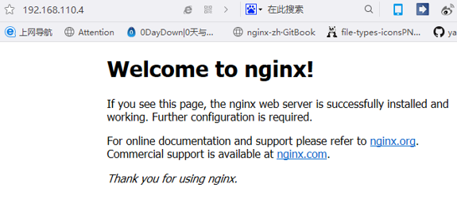

**host特点：**
​	host模型比较适合于，一台宿主机跑一个固定的容器，比较稳定，或者一个宿主机跑多个占用不同端口的应用的场景，他的网络性能是很高的。
​	host模型启动的容器不会有任何地址，他其实是使用了宿主机的所有信息

### 2.4.9 none 模型实践

none网络模式，是一种自由度非常高的网络模式，我们可以最大化的自定义我们想要的网络 


```shell
#命令格式：
     docker run --net=none -itd --name [容器名称] 镜像名称     
#命令示例：
    #查看网络
    itcast@itcast-virtual-machine:~$ docker network ls
    NETWORK ID          NAME                DRIVER              SCOPE
    35e1fe4bfd90        bridge              bridge              local
    b5a84f949a9f        host                host                local
    e70e4cb94db2        none                null                local
 
    #查看网络none的信息
    :~$ docker  network inspect  none
    #发现包含容器为空
            "Name": "none",
            "Containers": {},
 
    #根据none网络创建nginx-2容器
    :~$ docker run -itd --name nginx-2 --net=none nginx
    31b52114415459a415ffebb527aea43b857f4c4f82daaab363293a0a98cef713
 
    :~$ docker ps
CONTAINERID  IMAGE COMMAND             CREATED         STATUS         PORTS  NAMES
31b521144154 nginx "nginx-g'daemonof…" Aboutaminuteago UpAboutaminute      nginx-2
    #查看nginx-2的全部信息
    :~$ docker inspect  nginx-2
    #发现网络信息皆为空 
     "Networks": {
                    "none": {
                        "IPAMConfig": null,
                        "Links": null,
                        "Aliases": null,
                        "NetworkID": "e70e4cb94db206011a26daa48331d376318fd6060ac20f027709d5e6b70fdbc2",
                        "EndpointID": "2bcba7434eee8ec827192b45bb0b0d2b71c916fd7da5a21562a34dca3726387a",
                        "Gateway": "",
                        "IPAddress": "",
                        "IPPrefixLen": 0,
                        "IPv6Gateway": "",
                        "GlobalIPv6Address": "",
                        "GlobalIPv6PrefixLen": 0,
                        "MacAddress": "",
                        "DriverOpts": null
                    }
                }
            }
        }
    ]
    :~$ docker network inspect none
    #none网络下有none的网络下包含容器 nginx-2并且没有网络信息
    [
        {
            "Name": "none",
            "Containers": {
                "31b52114415459a415ffebb527aea43b857f4c4f82daaab363293a0a98cef713": {
                    "Name": "nginx-2",
                    "EndpointID": "2bcba7434eee8ec827192b45bb0b0d2b71c916fd7da5a21562a34dca3726387a",
                    "MacAddress": "",
                    "IPv4Address": "",
                    "IPv6Address": ""
                }
 
    :~$ netstat -tnulp
    #发现并没有80端口的网络启动
Proto Recv-Q Send-Q Local Address      Foreign Address   State      PID/Program name
    tcp        0      0 127.0.1.1:53   0.0.0.0:*         LISTEN     -               
    tcp        0      0 0.0.0.0:22     0.0.0.0:*         LISTEN     -               
    tcp        0      0 127.0.0.1:631  0.0.0.0:*         LISTEN     -                             
    tcp6       0      0 :::22          :::*              LISTEN     -               
    tcp6       0      0 ::1:631        :::*              LISTEN     -               
    udp        0      0 127.0.1.1:53   0.0.0.0:*                           -               
    udp        0      0 0.0.0.0:45194  0.0.0.0:*                           -               
    udp        0      0 0.0.0.0:631    0.0.0.0:*                           -               
    udp        0      0 0.0.0.0:39822  0.0.0.0:*                           -               
    udp        0      0 0.0.0.0:5353   0.0.0.0:*                           -               
    udp6       0      0 :::56067       :::*                                -               
    udp6       0      0 :::5353        :::*                                -               

```


### 2.4.10 none案例--自定义桥接网络

**配置自定义桥接网络案例 **
为了使本地网络中和Docker容器更方便的通信，我们经常会有将Docker容器配置到和主机同一网段，而且还要指定容器的ip地址。

**需求**：
自定义容器网络和宿主机为同一网段，容器ip可以指定。

**案例分析：**
1、自定义容器网络段和宿主机一样

2、自定义容器ip地址 
**知识关键点：**
1、网络配置

docker虚拟网桥配置

docker服务使用网桥 

容器创建使用none模式

2、使用pipwork工具实现定制docker容器ip地址 

注释：pipwork的命令格式

pipework [桥接设备][容器id或者名字] [容器ip]/[ip掩码]@[宿主机网关]

例子：

pipework br0 ubuntu-test1 192.168.8.201/24@192.168.8.2

3、映射虚拟机软件源进入到容器，替换掉容器内部软件源后进行软件源更新与安装

注释：docker上pull下来的Ubuntu,使用apt-get  install 命令下载速度奇慢无比,需要修改其软件源,进入etc/apt 

目录欲修改sources.list     发现vi,vim,gedit都没有,再下这些软件也非常慢.

解决方法：

3.1启动容器时,挂载本地Linux系统的etc/apt文件    

docker run -ti -v /etc/apt/:/home/etc ubuntu

3.2删除容器下的sources.lis   rm /etc/apt/sources.list

3.3将本地sources.list 复制过来 cp /home/etc/sources.list  /etc/apt/


**自定义桥接网络实施**


```shell
#1、网络环境部署
#1.1 网卡环境部署
#1.1.1 网桥软件部署
	:~$ sudo apt-get install bridge-utils -y
	
	:~$ brctl show
	bridge  name    bridge id           STP enabled interfaces
	docker0         8000.0242a6e980f2   no      
	 
#1.1.2 桥接网卡配置
#编辑网卡信息编辑Ubuntu的网卡信息文件
#对源文件进行备份
	:~$ sudo cp /etc/network/interfaces /etc/network/interfaces-old
	:~$ sudo vim /etc/network/interfaces
	
#与源文件内容进行1行的空行
auto br0
iface br0 inet static 
address 192.168.110.14
netmask 255.255.255.0
gateway 192.168.110.2
dns-nameservers 192.168.110.2 
bridge_ports ens33
#重启
service networking restart
    
#1.2    docker服务配置
    #1.2.1  配置docker文件
    :~$ sudo vim /etc/default/docker
    #最末尾添加
    DOCKER_OPTS="-b=br0"
    
    #1.2.2  systemctl使用docker文件
    #创建服务依赖文件
    :~$ sudo mkdir -p /etc/systemd/system/docker.service.d
    :~$ sudo vim /etc/systemd/system/docker.service.d/Using_Environment_File.conf
    #内容如下：
[Service]
EnvironmentFile=-/etc/default/docker
ExecStart=
ExecStart=/usr/bin/dockerd -H fd:// $DOCKER_OPTS
    #重载服务配置文件
    :~$ systemctl daemon-reload
#1.2.3  重启docker 第一次配置的时候需要重启linux虚拟机：reboot
systemctl restart docker

#注意查看网卡信息
    :~$ brctl show
    bridge      name    bridge id           STP enabled     interfaces
    br0                 8000.000c2960060c   no              ens33
    docker0             8000.02427c11f899   no  
    
    br0       Link encap:以太网  硬件地址 00:0c:29:60:06:0c  
         inet 地址:192.168.110.14  广播:192.168.110.255  掩码:255.255.255.0
         inet6 地址: fe80::20c:29ff:fe60:60c/64 Scope:Link
         UP BROADCAST RUNNING MULTICAST  MTU:1500  跃点数:1
     
    ens33     Link encap:以太网  硬件地址 00:0c:29:60:06:0c  
      UP BROADCAST RUNNING MULTICAST  MTU:1500  跃点数:1
#广播运行多播

#验证dns解析是否正常
    ping www.baidu.com   
#网络可能会没有dns解析所以我们需要进行dns的配置

#16.04：
:~$ sudo vim/etc/resolvconf/resolv.conf.d/base
#18.04：
:~$ sudo vim/etc/resolv.conf

#增加内容
nameserver 223.5.5.5
nameserver 114.114.114.114
nameserver 8.8.8.8

#注意如果重启后网络并未生效则
    sudo /etc/init.d/networking restart

#1.3 容器创建
    #基于ubuntu镜像创建一个容器，网络模式使用none ，启动容器时,挂载本地Linux系统的etc/apt文件
    :~$ docker run -itd --net=none --name ubuntu-test1 -v /etc/apt/:/home/etc   ubuntu  /bin/bash
    5f7b976ddfdf60dbc08cb81569488b70da15bc183d7f21da7030c316cd6ec96b
    :~$ docker ps
    CONTAINER ID  IMAGE     COMMAND      CREATED             STATUS          PORTS   NAMES
    5f7b976ddfdf  ubuntu    "/bin/bash"  5 seconds ago       Up 4 seconds            ubuntu-test1
        
#2、定制容器ip
    #2.1 pipwork软件部署
    #安装pipwork
    #方法1：
    git clone https://github.com/jpetazzo/pipework
    #方法2：将软件直接拖入ubuntu虚拟机
    #直接解压安装包
    :~$unzip pipework-master.zip
    #将文件拷贝到bin下
    sudo cp pipework-master/pipework /usr/local/bin/
    
    #2.2 定制容器ip
    :~$ sudo pipework br0 ubuntu-test1 192.168.110.129/24@192.168.110.2
    
    #2.3 测试效果
    #进入容器查看ip地址信息
    :~$ docker exec -it ubuntu-test1 /bin/bash
    
    #删除容器下的sources.lis
    :~# rm /etc/apt/sources.list
    #将本地sources.list 复制过来
    :~# cp /home/etc/sources.list  /etc/apt/
    #进行软件源更新
    :~# apt-get update
    #安装ping命令
    :~# apt-get install inetutils-ping -y
    #安装ifconfig命令
    :~# apt-get install net-tools -y
    宿主机ping命令测试
    > ping 192.168.110.14
```


### 2.4.11 跨主机容器通信

容器网络拓扑图

 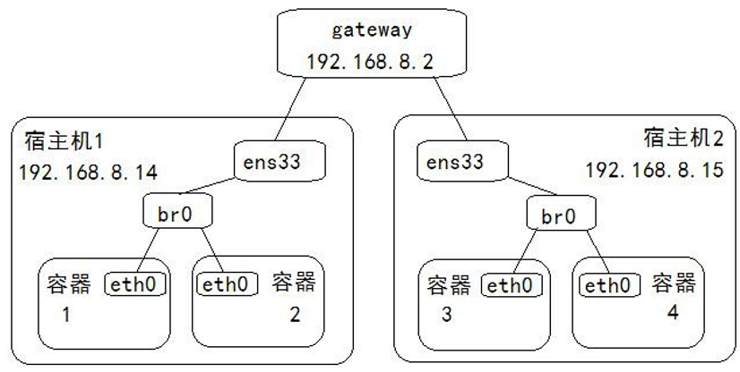

主机信息：

主机1：ubuntu 18.04 192.168.8.14

主机2：ubuntu 16.04 192.168.8.15

均安装 bridge-utils软件

分析：
1、自定义br0

2、docker服务使用br0

3、创建容器使用br0

4、跨主机间网络测试


知识点：
1、使用手工方式定制ubuntu的网卡

2、
配置/etc/default/docker文件

编辑systemctl的配置文件使用该docker文件

重载systemctl配置

重启docker或者重启虚拟机

3、创建容器，查看容器信息即可

4、两台主机分别测试

注意：
1、2、3 这三条在两台主机的配置大部分一模一样
ip地址划分不一样

方案：
1、ubuntu桥接网卡配置

1.1 软件安装

1.2 编辑网卡

2、docker配置网桥

2.1 配置docker文件

2.2 systemctl使用docker文件

2.3 重启主机

3、容器测试

3.1 创建容器

3.2 容器间测试


实施：

```shell
#1、ubuntu桥接网卡配置
    #1.1 软件安装
    apt-get install bridge-utils -y
    #1.2 编辑网卡
    :~$ sudo vim /etc/network/interfaces
    #与文件源内容进行1行的空行
    #主机1
auto br0
iface br0 inet static
address 192.168.110.14
netmask 255.255.255.0
gateway 192.168.110.2
dns-nameservers 192.168.110.2
bridge_ports ens33
    #主机2
    auto br0
    iface br0 inet static
    address 192.168.110.15
    netmask 255.255.255.0
    gateway 192.168.110.2
    dns-nameservers 192.168.110.2
    bridge_ports ens33
    
#2、docker配置网桥
    #2.1 配置docker文件
    #修改docker的守护进程文件
    vim /etc/default/docker
    #末尾添加:
    #主机1
    DOCKER_OPTS="-b=br0 --fixed-cidr=192.168.110.99/26"
    #主机2
    DOCKER_OPTS="-b=br0 --fixed-cidr=192.168.110.170/26"    
    #注释：
    #-b 用来指定容器连接的网桥名字
    #--fixed-cidr用来限定为容器分配的IP地址范围
    #192.168.110.99/26地址范围：192.168.110.64~192.168.110.127
    #192.168.110.170/26地址范围：192.168.110.128~192.168.110.191
    #网段的计算可以参考网址：http://help.bitscn.com/ip/
    
    #2.2 systemctl使用docker文件
    创建服务依赖文件
    :~$ sudo mkdir -p /etc/systemd/system/docker.service.d
    :~$ sudo vim /etc/systemd/system/docker.service.d/Using_Environment_File.conf
    内容如下：
[Service]
EnvironmentFile=-/etc/default/docker
ExecStart=
ExecStart=/usr/bin/dockerd -H fd:// $DOCKER_OPTS
    #重载服务配置文件
    :~$systemctl daemon-reload
    #2.3 重启主机
    reboot
    #注意如果重启后网络并未生效则
    sudo /etc/init.d/networking restart
    #注意查看网卡信息
    :~$ brctl show
    bridge      name    bridge id           STP enabled     interfaces
    br0                 8000.000c2960060c   no              ens33
    docker0             8000.02427c11f899   no  
    
    br0       Link encap:以太网  硬件地址 00:0c:29:60:06:0c  
         inet 地址:192.168.110.14  广播:192.168.110.255  掩码:255.255.255.0
         inet6 地址: fe80::20c:29ff:fe60:60c/64 Scope:Link
         UP BROADCAST RUNNING MULTICAST  MTU:1500  跃点数:1
     


ens33     Link encap:以太网  硬件地址 00:0c:29:60:06:0c  
  UP BROADCAST RUNNING MULTICAST  MTU:1500  跃点数:1
#广播运行多播


广播运行多播
#验证dns解析是否正常 
    ping www.baidu.com 
#网络可能会没有dns解析所以我们需要进行dns的配置
#16.04：
:~$ sudo vim/etc/resolvconf/resolv.conf.d/base
#18.04：
:~$ sudo vim/etc/resolv.conf
#增加内容
nameserver 223.5.5.5
nameserver 114.114.114.114
nameserver 8.8.8.8
 #注意如果重启后网络并未生效则
    sudo /etc/init.d/networking restart

#3、容器测试
    #3.1 创建容器
    
    #主机1：
    :~$ docker run -itd --name ubuntu-test1 -v /etc/apt/:/home/etc ubuntu /bin/bash
    :~$ docker run -itd --name ubuntu-test2 -v /etc/apt/:/home/etc ubuntu /bin/bash
    #主机2                                                                      
    :~$ docker run -itd --name ubuntu-test3 -v /etc/apt/:/home/etc ubuntu /bin/bash
    :~$ docker run -itd --name ubuntu-test4 -v /etc/apt/:/home/etc ubuntu /bin/bash
    #3.2 容器间测试
    进入容器
    #主机1
    :~$docker exec -it ubuntu-test1 /bin/bash
    :~$docker exec -it ubuntu-test2 /bin/bash
    #主机2
    :~$docker exec -it ubuntu-test3 /bin/bash
    :~$docker exec -it ubuntu-test4 /bin/bash

:~# rm /etc/apt/sources.list
#容器内部将本地sources.list 复制过来
:~# cp /home/etc/sources.list /etc/apt/
#容器内部进行软件源更新
:~# apt-get update
#容器内部安装ping命令
:~# apt-get install inetutils-ping -y
#容器内部安装ifconfig命令
:~# apt-get install net-tools -y

#四个容器之间相互ping通

宿主机ping命令测试
> ping 192.168.110.14
> ping 192.168.110.15


```
总结：
优点：
配置简单，不依赖第三方软件
缺点：
容器依赖于主机间的网络
容器与主机在同网段，注意ip地址分配
生产中不容易实现、不好管理
​    

# 第 3 章 Docker 高级实践


在这一部分我们来介绍一些Docker的高级内容：
Dockerfile 和 Docker compose

## 3.1 Dockerfile


### 3.1.1 Dockerfile简介

**什么是Dockerfile**
​	Dockerfile类似于我们学习过的脚本，将我们在上面学到的docker镜像，使用自动化的方式实现出来。

注意事项:

- 文件名首字母大写
- 存储Dockerfile的目录, 尽量是空目录
- 制作的镜像功能尽量单一
- 制作步骤要尽可能精简

**dockerfile的组成**

> dockerfile中的注释使用: #

- 基础镜像信息
  - 要制作的新的镜像, 基于那个镜像来制作的
  - 通过 docker images 查看
- 维护者信息
  - 这个dockerfile是谁写的
- 镜像操作指令
  - 基于原始进行进行的操作
- 容器启动指令
  - 基于第三步得到了新镜像
  - 新的镜像启动之后, 在容器中默认执行的指令

**Dockerfile使用命令：**

```shell
#构建镜像命令格式：
docker build -t [镜像名]:[版本号][Dockerfile所在目录]
#构建样例：
docker build -t nginx:v0.2 /opt/dockerfile/nginx/
#参数详解：
	-t        					指定构建后的镜像信息，
	/opt/dockerfile/nginx/      则代表Dockerfile存放位置，如果是当前目录，则用 .(点)表示
```


### 3.1.2 Dockerfile快速入门


​	接下来我们快速的使用Dockerfile来基于ubuntu创建一个定制化的镜像：nginx。


```shell
#创建Dockerfile专用目录
:~$ mkdir ./docker/images/nginx -p
:~$ cd docker/images/nginx/
#创建Dockerfile文件
:~/docker/images/nginx$ vim Dockerfile
```

**dockerfile内容**


```Dockerfile
# 构建一个基于ubuntu的docker定制镜像
# 基础镜像
FROM ubuntu

# 镜像作者
MAINTAINER panda kstwoak47@163.com

# 执行命令
RUN mkdir hello
RUN mkdir world
RUN sed -i 's/archive.ubuntu.com/mirrors.ustc.edu.cn/g' /etc/apt/sources.list
RUN sed -i 's/security.ubuntu.com/mirrors.ustc.edu.cn/g' /etc/apt/sources.list
RUN apt-get update  
RUN apt-get install nginx -y

# 对外端口
EXPOSE 80
```

**进行构建操作**


```shell
#构建镜像
:~/docker/images/nginx$ docker build -t ubuntu-nginx:v0.1 .
#查看新生成镜像
:~/docker/images/nginx$ docker images
REPOSITORY    TAG     IMAGE ID      CREATED        SIZE
ubuntu-nginx  v0.1    a853de1b8be4  9 seconds ago  208MB
nginx         latest  e548f1a579cf  6 days ago     109MB
ubuntu        latest  0458a4468cbc  4 weeks ago    112MB
#查看构建历史
:~/docker/images/nginx$ docker history a853de1b8be4
IMAGE         CREATED            CREATED BY                         SIZE   COMMENT
#镜像			创建时间             依赖命令                            大小    评论
a853de1b8be4  41 seconds ago     /bin/sh -c #(nop)  EXPOSE 80                  0B      
925825b680fd  42 seconds ago     /bin/sh -c apt-get install nginx -y          56.5MB  
4c57d6c99603  About a minute ago /bin/sh -c apt-get update                     40MB    
b6d030a0d123  About a minute ago /bin/sh -c sed -i's/security.ubuntu.com/mir… 2.77kB  
3357bf8069ca  About a minute ago /bin/sh -c sed -i's/archive.ubuntu.com/mirr… 2.77kB  
7bfb90c1e20d  About a minute ago /bin/sh -c mkdir world                         0B      
972d6ab76d01  About a minute ago /bin/sh -c mkdir hello                         0B      
a76394bfad01  About a minute ago /bin/sh -c #(nop) MAINTAINER panda kstwoak4…  0B    
#注意：
因为容器没有启动命令，所以肯定访问不了

```


**优化刚刚的Dockerfile文件**


```Dockerfile
# 构建一个基于ubuntu的docker定制镜像
# 基础镜像
FROM ubuntu

# 镜像作者
MAINTAINER panda kstwoak47@163.com

# 执行命令
RUN mkdir hello
RUN mkdir world
RUN sed -i 's/archive.ubuntu.com/mirrors.ustc.edu.cn/g' /etc/apt/sources.list
RUN sed -i 's/security.ubuntu.com/mirrors.ustc.edu.cn/g' /etc/apt/sources.list
RUN apt-get update  
RUN apt-get install nginx -y

# 对外端口
EXPOSE 80
```

  **运行修改好的Dockerfile进行构建**


```shell
:~/docker/images/nginx$ docker build -t  ubuntu-nginx:v0.2 .
:~/docker/images/nginx$ docker history ubuntu-nginx:v0.2
IMAGE         CREATED         CREATED BY                                     SIZE    COMMENT
eaba9bd1c4ac  3 minutes ago   /bin/sh -c #(nop)  EXPOSE 80                   0B      
ed08d6e29eb1  3 minutes ago   /bin/sh -c apt-get update && apt-get install…  96.5MB  
eef6238ec5bd  6 minutes ago   /bin/sh -c sed -i 's/archive.ubuntu.com/mirr…  2.77kB  
58f755a1b29c  6 minutes ago   /bin/sh -c mkdir hello &&  mkdir world         0B      
a76394bfad01  25 minutes ago  /bin/sh -c #(nop)  MAINTAINER panda kstwoak4…  0B    
#对比两个镜像的大小
:~/docker/images/nginx$ docker images 
REPOSITORY    TAG   IMAGE ID      CREATED         SIZE
ubuntu-nginx  v0.2  eaba9bd1c4ac  7 seconds ago   208MB
ubuntu-nginx  v0.1  a853de1b8be4  21 minutes ago  208MB
#深度对比连个镜像的大小
:~/docker/images/nginx$ docker inspect a853de1b8be4
        "Size": 208237435,
        "VirtualSize": 208237435,
:~/docker/images/nginx$ docker inspect eaba9bd1c4ac
        "Size": 208234662,
        "VirtualSize": 208234662,
```


**Dockerfile构建过程：**
​	从基础镜像1运行一个容器A

​	遇到一条Dockerfile指令，都对容器A做一次修改操作

​	执行完毕一条命令，提交生成一个新镜像2

​	再基于新的镜像2运行一个容器B

​	遇到一条Dockerfile指令，都对容器B做一次修改操作

​	执行完毕一条命令，提交生成一个新镜像3

​	…


**构建过程镜像介绍

​       构建过程中，创建了很多镜像，这些中间镜像，我们可以直接使用来启动容器，通过查看容器效果，从侧面能看到我们每次构建的效果。提供了镜像调试的能力

### 3.1.3 基础指令详解

#### **FROM**


```shell
FROM
#格式：
    FROM <image>
    FROM <image>:<tag>
#解释：
    #FROM 是 Dockerfile 里的第一条而且只能是除了首行注释之外的第一条指令
    #可以有多个FROM语句，来创建多个image
    #FROM 后面是有效的镜像名称，如果该镜像没有在你的本地仓库，那么就会从远程仓库Pull取，如果远程也没有，就报错失败
    #下面所有的 系统可执行指令 在 FROM 的镜像中执行。

 
```

#### **MAINTAINER**


```shell
MAINTAINER
#格式：
    MAINTAINER <name>
#解释：
    #指定该dockerfile文件的维护者信息。类似我们在docker commit 时候使用-a参数指定的信息
```


#### **RUN**


```shell
RUN
#格式：
    RUN <command>                                   (shell模式)
    RUN["executable", "param1", "param2"]            (exec 模式)
#解释：
    #表示当前镜像构建时候运行的命令，如果有确认输入的话，一定要在命令中添加 -y
    #如果命令较长，那么可以在命令结尾使用 \ 来换行
    #生产中，推荐使用上面数组的格式
#注释：
    #shell模式：类似于  /bin/bash -c command
    #举例： RUN echo hello
    #exec模式：类似于 RUN["/bin/bash", "-c", "command"]
    #举例： RUN["echo", "hello"]
```


#### **EXPOSE**


```shell
EXPOSE
#格式：
    EXPOSE <port> [<port>...]
#解释：
    设置Docker容器对外暴露的端口号，Docker为了安全，不会自动对外打开端口，如果需要外部提供访问，
    还需要启动容器时增加-p或者-P参数对容器的端口进行分配。
#     docker run -itd -p 8888:80
  EXPOSE 80
```


### 3.1.4 运行时指令详解


#### **CMD**


```shell
CMD
#格式：
    CMD ["executable","param1","param2"]         (exec 模式)推荐
    CMD command param1 param2                     (shell模式)
    CMD ["param1","param2"]          提供给ENTRYPOINT的默认参数；
#解释： 
    #CMD指定容器启动时默认执行的命令
    #每个Dockerfile只能有一条CMD命令，如果指定了多条，只有最后一条会被执行
    #如果你在启动容器的时候使用docker run 指定的运行命令，那么会覆盖CMD命令。
    #举例： CMD ["/usr/sbin/nginx","-g","daemon off；"]
    "/usr/sbin/nginx"   nginx命令
    "-g"				设置配置文件外的全局指令
    "daemon off；"		后台守护程序开启方式 关闭
#CMD指令实践:
    #修改Dockerfile文件内容：
    #在上一个Dockerfile文件内容基础上，末尾增加下面一句话：
    CMD ["/usr/sbin/nginx","-g","daemon off;"]
    #构建镜像
    :~/docker/images/nginx$ docker build  -t ubuntu-nginx:v0.3  .
    #根据镜像创建容器,创建时候，不添加执行命令
    :~/docker/images/nginx$ docker run --name nginx-1 -itd ubuntu-nginx:v0.3
    #根据镜像创建容器,创建时候，添加执行命令/bin/bash
    :~/docker/images/nginx$ docker run  --name nginx-2 -itd ubuntu-nginx:v0.3 /bin/bash
    docker ps
    
    #发现两个容器的命令行是不一样的
    itcast@itcast-virtual-machine:~/docker/images/nginx$ docker ps -a
    CONTAINER ID  IMAGE             COMMAND                 CREATED           NAMES
    921d00c3689f  ubuntu-nginx:v0.3 "/bin/bash"             5 seconds ago    nginx-2
    e6c39be8e696  ubuntu-nginx:v0.3 "/usr/sbin/nginx -g …"  14 seconds ago   nginx-1
    
```


 

 

#### **ENTRYPOINT**


```shell
ENTRYPOINT
#格式：
    ENTRYPOINT ["executable", "param1","param2"] (exec 模式)
    ENTRYPOINT command param1 param2 (shell 模式)
#解释：
    #和CMD 类似都是配置容器启动后执行的命令，并且不会被docker run 提供的参数覆盖。
    #每个Dockerfile 中只能有一个ENTRYPOINT，当指定多个时，只有最后一个起效。
    #生产中我们可以同时使用ENTRYPOINT 和CMD，
    #想要在docker run 时被覆盖，可以使用"docker run --entrypoint"
#ENTRYPOINT指令实践：
    #修改Dockerfile文件内容：
    #在上一个Dockerfile 文件内容基础上，修改末尾的CMD 为ENTRYPOINT：
    ENTRYPOINT ["/usr/sbin/nginx","-g","daemon off;"]
    
    #构建镜像
    :~/docker/images/nginx$ docker build -t ubuntu-nginx:v0.4 .
    
    #根据镜像创建容器,创建时候，不添加执行命令
    :~/docker/images/nginx$ docker run  --name nginx-3 -itd ubuntu-nginx:v0.4
    
    #根据镜像创建容器,创建时候，添加执行命令/bin/bash
    :~/docker/images/nginx$ docker run  --name nginx-4 -itd ubuntu-nginx:v0.4 /bin/bash
    
    #查看ENTRYPOINT是否被覆盖
    :~/docker/images/nginx$ docker ps -a
    CONTAINER ID  IMAGE               COMMAND                  CREATED              NAMES
    e7a2f0d0924e  ubuntu-nginx:v0.4   "/usr/sbin/nginx -g …"   59 seconds ago       nginx-4
    c92b2505e28e  ubuntu-nginx:v0.4   "/usr/sbin/nginx -g …"   About a minute ago   nginx-3
    
    #根据镜像创建容器,创建时候，使用--entrypoint参数，添加执行命令/bin/bash
    docker run  --entrypoint "/bin/bash" --name nginx-5 -itd ubuntu-nginx:v0.4
    
    #查看ENTRYPOINT是否被覆盖
    :~/docker/images/nginx$ docker ps 
    CONTAINER ID  IMAGE               COMMAND                  CREATED              NAMES
    6c54726b2d96  ubuntu-nginx:v0.4   "/bin/bash"              3 seconds ago        nginx-5

```


 


#### **CMD ENTRYPOINT 综合使用实践**


```shell
#修改Dockerfile文件内容：

# 在上一个Dockerfile文件内容基础上，修改末尾的ENTRYPOINT

    :~/docker/images/nginx$ vim Dockerfile
    ENTRYPOINT ["/usr/sbin/nginx"]
    CMD ["-g"]
    #构建镜像
    :~/docker/images/nginx$ docker build -t ubuntu-nginx:v0.5 .
    #根据镜像创建容器,创建时候，不添加执行命令
    :~/docker/images/nginx$ docker run --name nginx-6 -d ubuntu-nginx:v0.5
    
    #查看效果
   :~/docker/images/nginx$ docker ps -a 
    CONTAINER ID   IMAGE               COMMAND                  CREATED         NAMES
    e28875d281eb   ubuntu-nginx:v0.5   "/usr/sbin/nginx -g"     9 seconds ago   nginx-6
#根据镜像创建容器,创建时候，不添加执行命令，覆盖cmd的参数 -g "daemon off;"
:~/docker/images/nginx$ docker run  --name nginx-7 -d ubuntu-nginx:v0.5 -g "daemon off;"

#查看效果
itcast@itcast-virtual-machine:~/docker/images/nginx$ docker ps -a 
CONTAINER ID    IMAGE               COMMAND                  CREATED         NAMES
e5addad86ef5    ubuntu-nginx:v0.5   "/usr/sbin/nginx -g …"   5 seconds ago   nginx-7
#注释：
#任何docker run设置的命令参数或者CMD指令的命令，都将作为ENTRYPOINT 指令的命令参数，追加到ENTRYPOINT指令之后
```


### 3.1.5 文件编辑指令详解

#### **ADD**


```shell
#ADD
#格式：
    ADD <src>... <dest>
    ADD ["<src>",... "<dest>"]
#解释：
	# 将宿主机文件拷贝到容器目录中
  	# 如果宿主机文件是可识别的压缩包, 会进行解压缩 -> tar
  	ADD 宿主机文件 容器目录/文件
  	
#	ADD ["宿主机文件", "容器目录"]
   - 宿主机文件一般放到Dockerfile对应的目录中
   - 容器目录, 有可能存在, 有可能不存在
    	- 存在: 直接拷贝到容器目录
      - 不存在: 先在容器中创建一个, 再拷贝
  ADD ["a.txt", "/home/go/a.txt"]
   - 第二个参数如果指定的是一个文件名
     - 这个文件存在: 直接覆盖
     - 不存在: 直接拷贝
#ADD实践：
    #拷贝普通文件
    :~/docker/images/nginx$ vim Dockerfile 
    
    #Dockerfile文件内容
    
    # 构建一个基于ubuntu的docker定制镜像
    # 基础镜像
    FROM ubuntu
    # 镜像作者
    MAINTAINER panda kstwoak47@163.com
    # 执行命令
    ADD ["sources.list","/etc/apt/sources.list"]
    RUN apt-get clean
    RUN apt-get update
    RUN apt-get install nginx -y
    # 对外端口
    EXPOSE 80
 
    #构建镜像
    :~/docker/images/nginx$ docker build -t ubuntu-nginx:v0.6 .
    
    #根据镜像创建容器,创建时候，不添加执行命令进入容器查看效果
    docker run  --name nginx-8 -it ubuntu-nginx:v0.6
    
    #拷贝压缩文件
    tar zcvf this.tar.gz ./*
    #Dockerfile文件内容
    ...
    # 执行命令
    ...
    # 增加文件
    ADD ["linshi.tar.gz","/nihao/"]
    ...
    #构建镜像
    :~/docker/images/nginx$ docker build -t ubuntu-nginx:v0.7 .
    #根据镜像创建容器,创建时候，不添加执行命令进入容器查看效果
    docker run --name nginx-9 -it ubuntu-nginx:v0.7
    :~/docker/images/nginx$ docker run --name nginx-9 -it ubuntu-nginx:v0.7
```


#### COPY


```shell
#COPY
    #格式：
    COPY <src>... <dest>
    COPY ["<src>",... "<dest>"]
    #解释：
    #COPY 指令和ADD 指令功能和使用方式类似。只是COPY 指令不会做自动解压工作。
    #单纯复制文件场景，Docker 推荐使用COPY
#COPY实践
    #修改Dockerfile文件内容:
    # 构建一个基于ubuntu的docker定制镜像
    # 基础镜像
    FROM ubuntu
    # 镜像作者
    MAINTAINER panda kstwoak47@163.com
    # 执行命令
ADD ["sources.list","/etc/apt/sources.list"]
RUN apt-get clean
RUN apt-get update
RUN apt-get install nginx -y
COPY ["index.html","/var/www/html/"]
# 对外端口
EXPOSE 80
#运行时默认命令 
ENTRYPOINT ["/usr/sbin/nginx","-g","daemon off;"]
index.html 文件内容：
<h1>hello world </h1>
<h1>hello docker </h1>
<h1>hello nginx</h1>
 
#构建镜像
:~/docker/images/nginx$ docker build -t ubuntu-nginx:v0.8 .
#根据镜像创建容器,创建时候，不添加执行命令
:~/docker/images/nginx$ docker run  --name nginx-10 -itd ubuntu-nginx:v0.8
#查看nginx-10信息
:~/docker/images/nginx$docker inspect  nginx-10
#浏览器访问nginx查看效果    
```


 

**VOLUME**


```shell
#VOLUME
    #格式：
    VOLUME ["/data"]
    #解释：
    #VOLUME 指令可以在镜像中创建挂载点，这样只要通过该镜像创建的容器都有了挂载点
    #通过VOLUME 指令创建的挂载点，无法指定主机上对应的目录，是自动生成的。
    #举例：
    VOLUME ["/var/lib/tomcat7/webapps/"]
```

**VOLUME实践**


```shell
#VOLUME实践
#修改Dockerfile文件内容：
#将COPY替换成为VOLUME
:~/docker/images/nginx$vim Dockerfile
VOLUME ["/helloworld/"]
...
#构建镜像
:~/docker/images/nginx$docker build -t ubuntu-nginx:v0.9 .
#创建数据卷容器
:~/docker/images/nginx$docker run -itd --name nginx-11 ubuntu-nginx:v0.9
#查看镜像信息
:~/docker/images/nginx$docker inspect nginx-11
#验证操作
:~/docker/images/nginx$docker run -itd --name vc-nginx-1 --volumes-from nginx-11 nginx
:~/docker/images/nginx$docker run -itd --name vc-nginx-2 --volumes-from nginx-11 nginx
#进入容器1
:~/docker/images/nginx$docker exec -it vc-nginx-1 /bin/bash
:/# echo 'nihao itcast' > helloworld/nihao.txt
#进入容器2
:~/docker/images/nginx$ docker exec -it vc-nginx-2 /bin/bash
:/# cat helloworld/nihao.txt
```

 


### 3.1.6 环境指令详解

#### ENV


```shell
#ENV
    #格式：
    ENV <key> <value>                    （一次设置一个环节变量）
    ENV <key>=<value> ...                （一次设置一个或多个环节变量）
    ENV HELLO 12345
  	ENV HELLO=12345
  	ENV HELLO=12345 WORLD=12345 NIHAO=12345
#解释：
#设置环境变量，可以在RUN 之前使用，然后RUN 命令时调用，容器启动时这些环境变量都会被指定
```

**ENV实践**


```shell
#ENV实践：
    #命令行创建ENV的容器
    :~$ docker run -e NIHAO="helloworld" -itd --name ubuntu-111 ubuntu /bin/bash
    #进入容器ubuntu-111
    :~$ docker exec -it ubuntu-111 /bin/bash
    :/# echo $NIHAO
    
    #修改Dockerfile文件内容：
    #在上一个Dockerfile 文件内容基础上，在RUN 下面增加一个ENV
    ENV NIHAO=helloworld
    ...
    #构建镜像
    docker build -t ubuntu-nginx:v0.10 .
    
    #根据镜像创建容器,创建时候，不添加执行命令
    docker run  --name nginx-12 -itd ubuntu-nginx:v0.10
    docker exec -it nginx-12 /bin/bash
    echo $NIHAO
```


#### WORKDIR


```shell
#WORKDIR
    #格式：
    WORKDIR /path/to/workdir (shell 模式)
    #解释：
    #切换目录，为后续的RUN、CMD、ENTRYPOINT 指令配置工作目录。相当于cd
    #可以多次切换(相当于cd 命令)，
    #也可以使用多个WORKDIR 指令，后续命令如果参数是相对路径，则会基于之前命令指定的路径。例如
    #举例：
    WORKDIR /a
    WORKDIR b
    WORKDIR c
    RUN pwd
    #则最终路径为/a/b/c
```

**WORKDIR实践**

```shell
#WORKDIR实践：
    #修改Dockerfile文件内容：
    # 在上一个Dockerfile 文件内容基础上，在RUN 下面增加一个WORKDIR
    WORKDIR /nihao/itcast/
    RUN ["touch","itcast1.txt"]
    WORKDIR /nihao
    RUN ["touch","itcast2.txt"]
    WORKDIR itcast
    RUN ["touch","itcast3.txt"]
    ...
    #构建镜像
    :~/docker/images/nginx$ docker build -t ubuntu-nginx:v0.11 .
    #根据镜像创建容器,创建时候，不添加执行命令
    docker run  --name nginx-13 -itd ubuntu-nginx:v0.11
    #进入镜像
    docker exec -it nginx-13 /bin/bash
```


**USER与ARG**

```shell

#USER
    #格式：
    USER daemon
    #解释：
    #指定运行容器时的用户名和UID，后续的RUN 指令也会使用这里指定的用户。
    #如果不输入任何信息，表示默认使用root 用户

#ARG
    #格式：
    ARG <name>[=<default value>]
    #解释：
    #ARG 指定了一个变量在docker build 的时候使用，可以使用--build-arg <varname>=<value>来指定参数的值，不过
    #如果构建的时候不指定就会报错。

```


 

### 3.1.7 触发器指令详解

触发器指令


```shell
ONBUILD
#格式：
    ONBUILD [command]
#解释：
    #当一个镜像A被作为其他镜像B的基础镜像时，这个触发器才会被执行，
    #新镜像B在构建的时候，会插入触发器中的指令。
    #使用场景对于版本控制和方便传输，适用于其他用户。
    
  # 原始镜像 -> 纯净版
  	-> 修改 ONBUILD ["echo", "hello,linux"]
  	   
  # 基于原始镜像制作新镜像 -> 镜像A
  	-> 启动镜像A -> 不会输出hello, linux
  	
  # 基于镜像A制作了镜像B
  	-> 启动镜像B -> 会输出 hello, linux
```


触发器实践


```shell
#编辑Dockerfile
:~/docker/images/nginx$ vim Dockerfile 
#内容如下：
# 构建一个基于ubuntu的docker定制镜像
# 基础镜像
FROM ubuntu
# 镜像作者
MAINTAINER panda kstwoak47@163.com
# 执行命令
ADD ["sources.list","/etc/apt/sources.list"] 
RUN apt-get clean
RUN apt-get update 
RUN apt-get install nginx -y 
#触发器
ONBUILD COPY ["index.html","/var/www/html/"]
# 对外端口
EXPOSE 80
#运行时默认命令 
ENTRYPOINT ["/usr/sbin/nginx","-g","daemon off;"]
 
#构建镜像
:~/docker/images/nginx$ docker build -t ubuntu-nginx:v0.12 .
 
#根据镜像创建容器,
:~/docker/images/nginx$docker run -p 80 --name nginx-14 -itd ubuntu-nginx:v0.12
:~/docker/images/nginx$docker ps
#查看镜像信息
:~/docker/images/nginx$ docker inspect ubuntu-nginx:v0.12  
#访问容器页面，是否被更改
:~/docker/images/nginx$ docker inspect nginx-14

```


```shell
#构建子镜像Dockerfile文件
FROM ubuntu-nginx:v0.12
MAINTAINER panda kstwoak47@163.com
EXPOSE 80
ENTRYPOINT ["/usr/sbin/nginx","-g","daemon off;"]
 
#构建子镜像
:~/docker/images/nginx$ docker build -t ubuntu-nginx:v0.13 .
#根据镜像创建容器,
docker run -p 80 --name nginx-15 -itd ubuntu-nginx:v0.13
#查看镜像信息
:~/docker/images/nginx$ docker inspect ubuntu-nginx:v0.13
docker ps
#访问容器页面，是否被更改

```

 

### 3.1.8 Dockerfile构建缓存

我们第一次构建很慢，之后的构建都会很快，因为他们用到了构建的缓存。

```shell
#取消缓存：
docker build --no-cache -t [镜像名]:[镜像版本][Dockerfile位置]
```


 

## 3.2 Dockerfile构建go环境

接下来我们就来做一个工作实践，搭建一个go环境,然后尝试使用Dockerfile的方式，构造一个镜像。


### 3.2.1 项目描述

beego官方网站：https://beego.me/

我们借助于beego的简介，部署一个go项目，然后运行起来。


### 3.2.2 手工部署go语言环境

**需求：**

基于docker镜像，手工部署go项目环境

**方案分析：**

1、docker环境部署

2、go环境部署

3、go项目部署

4、测试

技术关键点：

1、docker环境部署

使用docker镜像启动一个容器即可

2、go环境部署

go软件的依赖环境

go软件的基本环境配置

3、go项目部署

beego框架的下载

项目文件配置

启动go项目

4、测试

宿主机测试

解决方案：

1、docker环境配置

1.1 获取docker镜像

1.2 启动docker容器

2、go环境部署

2.1 基础环境配置

2.2 go环境配置

3、go项目部署

3.1 获取beego代码

3.2 项目文件配置

3.3 项目启动

4、测试

4.1 宿主机测试


**实施方案：**

```shell
#1、docker环境配置
#1.1 获取docker镜像
#获取一个ubuntu的模板文件
cat ubuntu-16.04-x86_64.tar.gz | docker import - ubuntu-nimi
#1.2 启动docker容器
#启动容器，容器名称叫go-test
docker run -itd --name go-test ubuntu-nimi
#进入容器
docker exec -it go-test /bin/bash
#2、go环境部署
#2.1 基础环境配置
#配置国内源
vim /etc/apt/sources.list
#文件内容如下
deb http://mirrors.aliyun.com/ubuntu/ xenial main restricted
deb http://mirrors.aliyun.com/ubuntu/ xenial-updates main restricted
deb http://mirrors.aliyun.com/ubuntu/ xenial universe
deb http://mirrors.aliyun.com/ubuntu/ xenial-updates universe
deb http://mirrors.aliyun.com/ubuntu/ xenial multiverse
deb http://mirrors.aliyun.com/ubuntu/ xenial-updates multiverse
deb http://mirrors.aliyun.com/ubuntu/ xenial-backports main restricted universe multiverse
deb http://mirrors.aliyun.com/ubuntu/ xenial-security main restricted
deb http://mirrors.aliyun.com/ubuntu/ xenial-security universe
deb http://mirrors.aliyun.com/ubuntu/ xenial-security multiverse
#如果由于网络环境原因不能进行软件源更新可以使用如下内容
sudo sed -i 's/cn.archive.ubuntu.com/mirrors.ustc.edu.cn/g' /etc/apt/sources.list 

#更新软件源，安装基本软件
apt-get update
apt-get install gcc libc6-dev git vim lrzsz -y
#2.2 go环境配置
#安装go语言软件
//apt-get install golang -y
由于软件源问题改使用新版本go
将go1.10.linux-amd64.tar.gz拷贝到容器中进行解压
tar -C /usr/local  -zxf go1.10.linux-amd64.tar.gz

#配置go基本环境变量
export GOROOT=/usr/local/go                
export PATH=$PATH:/usr/local/go/bin   
export GOPATH=/root/go
export PATH=$GOPATH/bin/:$PATH
#3、go项目部署
#3.1 获取beego代码
#下载项目beego
go get github.com/astaxie/beego
#3.2 项目文件配置
#创建项目目录
mkdir /root/go/src/myTest
cd /root/go/src/myTest
#编辑go项目测试文件test.go
package main
import (
"github.com/astaxie/beego"
)
type MainController struct {
beego.Controller
}
func (this *MainController) Get() {
this.Ctx.WriteString("hello world\n")
}
func main() {
beego.Router("/", &MainController{})
beego.Run()
}
#3.3 项目启动
#运行该文件
go run test.go
#可以看到：
#这个go项目运行起来后，开放的端口是8080
#4、测试
#4.1宿主机测试
#查看容器的ip地址
docker inspect go-test
#浏览器查看效果：
curl 172.17.0.2:8080
```


 

### 3.2.3 Dockerfile案例分析

环境分析：

1、软件源文件，使用国外源，速度太慢，所以我们可以自己使用国内的软件源。

因为我们在手工部署的时候，使用的是官方(国外)的源，所以为了部署快一点呢，我使用国内的阿里云的源。
源内容：

```shell
deb http://mirrors.aliyun.com/ubuntu/ xenial main restricted
deb http://mirrors.aliyun.com/ubuntu/ xenial-updates main restricted
deb http://mirrors.aliyun.com/ubuntu/ xenial universe
deb http://mirrors.aliyun.com/ubuntu/ xenial-updates universe
deb http://mirrors.aliyun.com/ubuntu/ xenial multiverse
deb http://mirrors.aliyun.com/ubuntu/ xenial-updates multiverse
deb http://mirrors.aliyun.com/ubuntu/ xenial-backports main restricted universe multiverse
deb http://mirrors.aliyun.com/ubuntu/ xenial-security main restricted
deb http://mirrors.aliyun.com/ubuntu/ xenial-security universe
deb http://mirrors.aliyun.com/ubuntu/ xenial-security multiverse
```


 由于阿里云的源出现问题所有更换为中科大的源 详情见3.1.1


2、软件安装，涉及到了各种软件


3、涉及到了go的环境变量设置


4、软件运行涉及到了软件的运行目录

5、项目访问，涉及到端口


关键点分析：

1、增加文件，使用 ADD 或者 COPY 指令

2、安装软件，使用 RUN 指令

3、环境变量，使用 ENV 指令

4、命令运行，使用 WORKDIR 指令

5、项目端口，使用 EXPOSE 指令


定制方案：

1、基于ubuntu基础镜像进行操作

2、增加国内源文件

3、安装环境基本软件

4、定制命令工作目录

5、执行项目

6、开放端口

### 3.2.4 Dockerfile实践

**创建目录**

```
#创建目录
#进入标准目录
mkdir /docker/images/beego
cd /docker/images/beego
```


**Dockerfile内容**


```shell
# 构建一个基于ubuntu 的docker 定制镜像
# 基础镜像
FROM ubuntu

# 镜像作者
MAINTAINER panda kstwoak47@163.com

# 增加国内源
#COPY sources.list /etc/apt/

RUN sed -i 's/archive.ubuntu.com/mirrors.ustc.edu.cn/g' /etc/apt/sources.list
RUN sed -i 's/security.ubuntu.com/mirrors.ustc.edu.cn/g' /etc/apt/sources.list

# 执行命令

RUN apt-get update
RUN apt-get install gcc libc6-dev git lrzsz -y
#将go复制解压到容器中
ADD go1.10.linux-amd64.tar.gz  /usr/local/

# 定制环境变量

ENV GOROOT=/usr/local/go                
ENV PATH=$PATH:/usr/local/go/bin   
ENV GOPATH=/root/go
ENV PATH=$GOPATH/bin/:$PATH

# 下载项目

RUN go get github.com/astaxie/beego

# 增加文件

COPY test.go /root/go/src/myTest/

# 定制工作目录

WORKDIR /root/go/src/myTest/

# 对外端口

EXPOSE 8080

# 运行项目

ENTRYPOINT ["go","run","test.go"]

#把sources.list和test.go文件放到这个目录中
#构建镜像
docker build -t go-test:v0.1 .
#运行镜像
docker run -p 8080:8080 -itd go-test:v0.1
#访问镜像，查看效果
```


 

## 3.3 Docker compose

Docker compose是一种docker容器的任务编排工具

官方地址：https://docs.docker.com/compose/


### 3.3.1 compose简介

任务编排介绍

场景：

​       我们在工作中为了完成业务目标，首先把业务拆分成多个子任务，然后对这些子任务进行顺序组合，当子任务按照方案执行完毕后，就完成了业务目标。

​       任务编排，就是对多个子任务执行顺序进行确定的过程。


常见的任务编排工具：

单机版：   docker compose

集群版：

Docker swarm               Docker

Mesos                 		Apache

Kubernetes（k8s）       Google


**docker compose是什么**

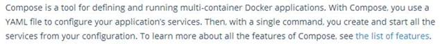

**译文：**
compose是定义和运行多容器Docker应用程序的工具。通过编写，您可以使用YAML文件来配置应用程序的服务。然后，使用单个命令创建并启动配置中的所有服务。要了解更多有关组合的所有特性，请参见特性列表。

**docker compose的特点；**
本质：docker 工具

对象：应用服务

配置：YAML 格式配置文件

命令：简单

执行：定义和运行容器


**docker compose的配置文件**

docker-compose.yml

文件后缀是yml

文件内容遵循 ymal格式


### docker 和 Docker compose

| **Compose file format** | **Docker Engine release** |      | **Compose file format** | **Docker Engine release** |
| ----------------------- | ------------------------- | ---- | ----------------------- | ------------------------- |
| 3.4                     | 17.09.0+                  |      | 2.3                     | 17.06.0+                  |
| 3.3                     | 17.06.0+                  |      | 2.2                     | 1.13.0+                   |
| 3.2                     | 17.04.0+                  |      | 2.1                     | 1.12.0+                   |
| 3.1                     | 1.13.1+                   |      | 2.0                     | 1.10.0+                   |
| 3.0                     | 1.13.0+                   |      | 1.0                     | 1.9.1.+                   |


官方地址：https://docs.docker.com/compose/overview/


 

### 3.3.2 compose 快速入门

**docker compose 安装**

```shell
#安装依赖工具
sudo apt-get install python-pip -y
#安装编排工具
sudo pip install docker-compose
#查看编排工具版本
sudo docker-compose version
#查看命令帮助
docker-compose --help
```


**PIP 源问题**

```shell
#用pip安装依赖包时默认访问https://pypi.python.org/simple/，
#但是经常出现不稳定以及访问速度非常慢的情况，国内厂商提供的pipy镜像目前可用的有：

#在当前用户目录下创建.pip文件夹
mkdir ~/.pip
#然后在该目录下创建pip.conf文件填写：
[global]
trusted-host=mirrors.aliyun.com
index-url=http://mirrors.aliyun.com/pypi/simple/
```


**compose简单配置文件**

```shell
#创建compose文件夹
:~$ mkdir -p ./docker/compose
#进入到文件夹
:~$ cd ./docker/compose
#创建yml文件
:~$ vim docker-compose.yml
```


**docker-compose.yml 文件内容**

```yml
version: '2'
services:
  web1:
    image: nginx
    ports:
      - "9999:80"
    container_name: nginx-web1
  web2:
    image: nginx
    ports:
      - "8888:80"
    container_name: nginx-web2
```


 

**运行一个容器**

```shell
#后台启动：
docker-compose up -d
#注意：
    #如果不加-d，那么界面就会卡在前台
#查看运行效果
docker-compose ps
```


### 3.3.3 compose命令详解

**注意：**

所有命令尽量都在docker compose项目目录下面进行操作

项目目录：docker-compose.yml所在目录


**compose服务启动、关闭、查看**

```shell
#后台启动：
docker-compose up -d
#删除服务
docker-compose down
#查看正在运行的服务
docker-compose ps
```


**容器开启、关闭、删除**

```shell
#启动一个服务
docker-compose start <服务名>
#注意：
    #如果后面不加服务名，会停止所有的服务
#停止一个服务
docker-compose stop <服务名>
#注意：
    #如果后面不加服务名，会停止所有的服务
#删除服务
docker-compose rm
#注意：
    #这个docker-compose rm不会删除应用的网络和数据卷。工作中尽量不要用rm进行删除
```


**其他信息查看**

```shell
#查看运行的服务
docker-compose ps
#查看服务运行的日志
docker-compose logs -f
#注意：
    #加上-f 选项，可以持续跟踪服务产生的日志
#查看服务依赖的镜像
docke-compose  images
#进入服务容器
docker-compose exec <服务名> <执行命令>
#查看服务网络
docker network ls
```


### 3.3.4 compose文件详解

官方参考资料：
https://docs.docker.com/compose/overview/

**文件命名：**

后缀是 .yml

### 2.2 yaml文件格式

> - YAML有以下基本规则： 
>   1、大小写敏感 
>   2、使用缩进表示层级关系 
>   3、禁止使用tab缩进，只能使用空格键 
>   4、缩进长度没有限制，只要元素对齐就表示这些元素属于一个层级。 
>   5、使用#表示注释 
>   6、字符串可以不用引号标注
>
>   ​     	"我是字符串"
>
>   ​	'我是字符串'
>
>   ​       我是字符串   

yaml中的三种数据结构

- map - 散列表

  ```yaml
  # 使用冒号（：）表示键值对，同一缩进的所有键值对属于一个map，示例：
  age : 12
  name : huang
  # 也可以这样写
  {age:12, name:huang}
   
  # 使用json
  {"age":12, "name":"huang"}
  ```

- list - 数组

  ```yaml
  # 使用连字符（-）表示：
  # YAML表示
  - a
  - b
  - 12
  [a, b, 12]
  
  # 使用json表示
  ["a", "b", 12]
  ```

- scalar - 纯量 

  ```yaml
  字符串
   - "wos字符串"
   - 我是字符串
  布尔值
    - true
    - false
  整数
  浮点数
  NULL 
   - 使用 ~ 表示
  ```

- 例子

  ```yaml
  # 1
  Websites:
   YAML: yaml.org 
   Ruby: ruby-lang.org 
   Python: python.org 
   Perl: use.perl.org 
   
  # 使用json表示
  {"Websites": {"YAML":"yaml.org ", "Ruby":"ruby-lang.org"}}
  
  # 2
  languages:
   - Ruby
   - Perl
   - Python 
   - c
   # 使用json表示
   {"languages":["ruby", "perl", "python", "c"]}
   
  # 3
  -
    - Ruby
    - Perl
    - Python 
  - 
    - c
    - c++
    - java
   # 使用json表示
  [["ruby", "perl", "python"], ["c", "c++", "java"]]
  # 4
  -
    id: 1
    name: huang
  -
    id: 2
    name: liao
  # 使用json表示
  [{"id":1, "name":"huang"}, {"id":2, "name":"liao"}] 
  ```


**compose文件样例：**

```yml
version: '2'                        # compose 版本号
services:                           # 服务标识符
  web1:                             # 子服务命名
    image: nginx                    # 服务依赖镜像属性
    ports:                          # 服务端口属性
      - "9999:80"                   # 宿主机端口:容器端口
    container_name: nginx-web1      # 容器命名

```


**格式详解：**

```shell
compose版本号、服务标识符必须顶格写
属性名和属性值是以': '(冒号+空格) 隔开
层级使用'  '(两个空格)表示
服务属性使用' - '(空格空格-空格)来表示
```


**compose属性介绍**

```shell
#镜像：
    格式：
        image: 镜像名称:版本号
    举例：
        image: nginx:latest

#容器命名：
    格式：
        container_name: 自定义容器命名
    举例：
        container_name: nginx-web1

#数据卷：
    格式：
        volumes:
          - 宿主机文件:容器文件
    举例：
        volumes:
          - ./linshi.conf:/nihao/haha.sh

#端口：
    格式：
        ports:
          - "宿主机端口:容器端口"
    举例：
        ports:
          - "9999:80"

#镜像构建：
    格式：
        build: Dockerfile 的路径
    举例：
        build: .
        build: ./dockerfile_dir/
        build: /root/dockerfile_dir/
#镜像依赖：
    格式：
        depends_on:
          - 本镜像依赖于哪个服务
    举例：
        depends_on:
          - web1
#networks：
加入指定网络，格式如下：
services:
  some-service:
    networks:
     - some-network
     - other-network
```


 

 

### 3.3.5 go项目实践

**项目分析**

 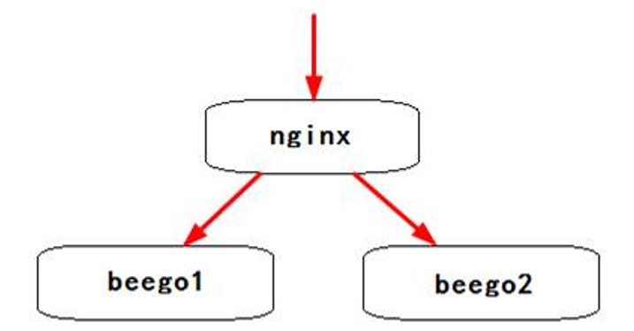

**需求：**

自动部署一个集群，使用nginx代理两个go项目

**流程分析：**

1、go项目部署

2、nginx代理部署

3、docker 环境

4、docker compose任务编排


**技术点分析：**

1、go项目部署

go项目基础环境

go项目配置

2、nginx代理部署

nginx的配置文件

3、docker 环境

docker基础镜像

go镜像

nginx镜像

4、docker compose任务编排

4个任务：1个镜像构建任务、2个go任务、1个nginx任务

任务依赖关系：go任务执行依赖于nginx任务

镜像依赖：go镜像依赖于nginx镜像完毕

**实施方案：**

1、基础环境

1.1 compose基础目录

1.2 环境依赖文件：

sources.list、test.go、test1.go、test2.go、nginx-beego.conf

1.3 dockerfile文件

go项目环境的Dockerfile文件

2、任务编排文件

2.1 nginx任务

基于nginx镜像，增加一个nginx的代理配置即可

2.2 go基础镜像任务

基于ubuntu镜像，构建go基础环境镜像，参考3.2.4内容

该任务依赖于2.1 nginx任务

2.3 go项目任务

基于go基础镜像，增加测试文件即可

该任务依赖于2.2 go基础镜像任务

3、测试

3.1 集群测试


方案实施

1、基础环境

1.1 compose基础目录

创建compose基础目录


```shell
:~$ mkdir /docker/compose/
:~$ cd /docker/compose/
```

1.2 环境依赖文件：

**nginx配置文件**


```shell
创建nginx专用目录
:~$ mkdir nginx
:~$ cd nginx
创建nginx负载均衡配置nginx-beego.conf
:~$ vim nginx-beego.conf
```

**文件内容**


```shell
upstream beegos {  
#upstream模块
  server 192.168.8.14:10086;
  server 192.168.8.14:10087;
}
server {
  listen 80;
  #提供服务的端口 
  server_name _;
  #服务名称
  location / {
    proxy_pass http://beegos;
    #反选代理 upstream模块  beegos
    index index.html index.htm;
    #默认首页
    }
}
```

go**基础镜像依赖文件**


```shell
#创建go基础镜像目录：
:~$ mkdir go-base
:~$ cd go-base
#创建source.lise
:~$ vim sources.list
```


**文件内容**


```shell
deb http://mirrors.aliyun.com/ubuntu/ xenial main restricted
deb http://mirrors.aliyun.com/ubuntu/ xenial-updates main restricted
deb http://mirrors.aliyun.com/ubuntu/ xenial universe
deb http://mirrors.aliyun.com/ubuntu/ xenial-updates universe 
deb http://mirrors.aliyun.com/ubuntu/ xenial multiverse
deb http://mirrors.aliyun.com/ubuntu/ xenial-updates multiverse
deb http://mirrors.aliyun.com/ubuntu/ xenial-backports main restricted universe multiverse 
deb http://mirrors.aliyun.com/ubuntu/ xenial-security main restricted
deb http://mirrors.aliyun.com/ubuntu/ xenial-security universe
deb http://mirrors.aliyun.com/ubuntu/ xenial-security multiverse
```

**或者**

```shell
RUN sed -i 's/archive.ubuntu.com/mirrors.ustc.edu.cn/g' /etc/apt/sources.list
RUN sed -i 's/security.ubuntu.com/mirrors.ustc.edu.cn/g' /etc/apt/sources.list
```


**test.go配置文件**


```Go
package main
import (
	"github.com/astaxie/beego"
)

type MainController struct { 
	beego.Controller
}

func (this *MainController) Get(){ 
	this.Ctx.WriteString("hello world\n")
}

func main() {
	beego.Router("/", &MainController{})
	beego.Run()
}
```

go任务依赖文件：
**beego1/test.go配置文件**

```go
package main
import (
"github.com/astaxie/beego"
)

type MainController struct { 
beego.Controller
}

func (this *MainController) Get(){ 
this.Ctx.WriteString("<h1>hello beego1</h1>\n")
}

func main() {
beego.Router("/", &MainController{})
beego.Run()
}
```

**Beego2/test.go配置文件**

```Go
package main
import (
	"github.com/astaxie/beego"
)

type MainController struct { 
	beego.Controller
}

func (this *MainController) Get(){ 
	this.Ctx.WriteString("<h1>hello beego2</h1>\n")
}

func main() {
	beego.Router("/", &MainController{})
	beego.Run()
}
```

1.3 dockerfile文件

go项目环境的Dockerfile文件


创建Dockerfile文件


```
:~$ vim dockerfile
```

文件内容


```Dockerfile
# 构建一个基于ubuntu 的docker 定制镜像
# 基础镜像
FROM ubuntu
# 镜像作者
MAINTAINER panda kstwoak47@163.com
# 增加国内源
#COPY sources.list /etc/apt/

RUN sed -i 's/archive.ubuntu.com/mirrors.ustc.edu.cn/g' /etc/apt/sources.list
RUN sed -i 's/security.ubuntu.com/mirrors.ustc.edu.cn/g' /etc/apt/sources.list

# 执行命令
RUN apt-get update
RUN apt-get install gcc libc6-dev git lrzsz -y
#将go复制解压到容器中
ADD go1.10.linux-amd64.tar.gz  /usr/local/
# 定制环境变量
ENV GOROOT=/usr/local/go
ENV PATH=$PATH:/usr/local/go/bin
ENV GOPATH=/root/go
ENV PATH=$GOPATH/bin/:$PATH
# 下载项目
#RUN go get github.com/astaxie/beego
ADD astaxie.tar.xz  /root/go/src/github.com
# 增加文件
COPY test.go /root/go/src/myTest/
# 定制工作目录
WORKDIR /root/go/src/myTest/
# 对外端口
EXPOSE 8080
# 运行项目
ENTRYPOINT ["go","run","test.go"]

```


最终的文件目录结构


```shell
:~# tree /docker/compose/
/docker/compose/beego/
├── beego1
│   └── test.go
├── beego2
│   └── test.go
├── docker-compose.yml
├── go-base
│   ├── astaxie.tar.xz
│   ├── Dockerfile
│   ├── go1.10.linux-amd64.tar.gz
│   └── test.go
└── nginx
    └── nginx-beego.conf

```


2、任务编排文件

docker-compose.yml文件内容


```yml
version: '2'
services:
  web1:
    image: nginx
    ports:
      - "9999:80"
    volumes:
      - ./nginx/nginx-beego.conf:/etc/nginx/conf.d/default.conf
      #将配置文件映射到nginx的配置文件位置
    container_name: nginx-web1

  go-base:
    build: ./go-base/
    image: go-base:v0.1

  beego-web1:
    image: go-base:v0.1
    volumes:
      - ./beego1/test.go:/root/go/src/myTest/test.go
    ports:
      - "10086:8080"
    container_name: beego-web1
    depends_on:
    - go-base

  beego-web2:
    image: go-base:v0.1
    volumes:
      - ./beego2/test.go:/root/go/src/myTest/test.go
    ports:
      - "10087:8080"
    container_name: beego-web2
    depends_on:
      - go-base
```


3、 最后测试


```shell
#构建镜像
$docker-compose build
#启动任务
$docker-compose up -d
#查看效果
$docker-compose ps
#浏览器访问
192.168.110.5:9999
```


 


