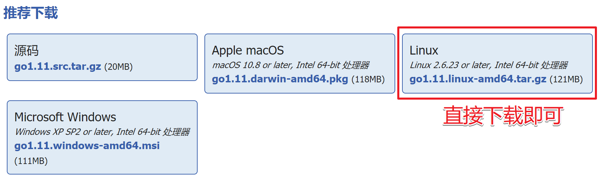

## 1. Fabric环境搭建

准备工作

> 1. 官方帮助文档：https://hyperledger-fabric.readthedocs.io/en/release-1.4/
> 2. 安装 cURL(https://curl.haxx.se/download.html),`curl --version` 查询版本
> 3. 安装docker，`docker --version` 查询版本
> 4. 安装docker-compose,`docker-compose --version` 查询版本
> 5. 安装 go 语言环境，`go version` 查询版本
> 6. 安装node.js, `node  -v` 查询版本
> 7. Python 版本要求为 2.7，`python --version` 查询版本

### 1.1 安装docker

1. 基础软件安装

   ```shell
   # 安装基本软件
   $ sudo apt-get update
   $ sudo apt-get install apt-transport-https ca-certificates curl git software-properties-common lrzsz -y
   ```

2. 添加阿里的docker镜像仓库

   ```shell
   # 添加阿里的docker镜像仓库
   $ curl -fsSL https://mirrors.aliyun.com/docker-ce/linux/ubuntu/gpg | sudo apt-key add -
   $ sudo add-apt-repository "deb [arch=amd64] https://mirrors.aliyun.com/docker-ce/linux/ubuntu $(lsb_release -cs) stable"
   # 更新软件源
   $ sudo apt-get update
   ```

3. 安装docker

   ```shell
   # 安装docker
   $ sudo apt-get install docker-ce -y
   # 查看安装的docker版本
   $ docker version
   	Client:
            Version:           18.06.1-ce
            API version:       1.38
            Go version:        go1.10.3
            Git commit:        e68fc7a
            Built:             Tue Aug 21 17:24:51 2018
            OS/Arch:           linux/amd64
            Experimental:      false
       Got permission denied while trying to connect to the Docker daemon socket at
       unix:///var/run/docker.sock: Get
       http://%2Fvar%2Frun%2Fdocker.sock/v1.38/version: 
       dial unix /var/run/docker.sock: connect: `permission denied`
   # 当前用户直接操作docker时, 权限不够, 需要做下面的第4不操作
   ```

4. 将当前用户添加到docker组

   ```shell
   # 将用户加入该 group 内。然后退出并重新登录就生效啦。
   $ sudo gpasswd -a ${USER} docker
   # 重启docker服务
   $ systemctl restart docker
   # 当前用户切换到docker群组
   $ newgrp - docker
   $ docker version
   	Client:
            Version:           18.06.1-ce
            API version:       1.38
            Go version:        go1.10.3
            Git commit:        e68fc7a
            Built:             Tue Aug 21 17:24:51 2018
            OS/Arch:           linux/amd64
            Experimental:      false
   
       Server:
            Engine:
            Version:          18.06.1-ce
            API version:      1.38 (minimum version 1.12)
            Go version:       go1.10.3
            Git commit:       e68fc7a
            Built:            Tue Aug 21 17:23:15 2018
            OS/Arch:          linux/amd64
            Experimental:     false
   ```

5. 安装docker-compose

   ```shell
   #安装依赖工具
   $ sudo apt-get install python-pip -y
   #安装编排工具
   $ sudo pip install docker-compose
   #查看版本
   $ sudo docker-compose version
   ```

### 1.2 安装go

```http
# 安装包下载地址:
https://golang.org/dl/  - 翻墙
https://studygolang.com/dl - 国内镜像源
```



如果没有进行安装包下载, 课直接使用如下命令(目前最新版本):

```shell
# 1. 使用wget工具下载安装包
$ wget https://dl.google.com/go/go1.11.linux-amd64.tar.gz
# 2. 解压tar包到/usr/local
$ sudo tar zxvf go1.11.linux-amd64.tar.gz -C /usr/local
# 3. 创建Go目录
$ mkdir $HOME/go
# 4. 用vi打开~./bashrc，配置环境变量
$ vim ~/.bashrc
# 5. 增加下面的环境变量，保存退出
	export GOROOT=/usr/local/go
    export GOPATH=$HOME/go
    export PATH=$PATH:$GOROOT/bin:$GOPATH/bin
# 6. 使环境变量立即生效, 一些命令二选一
$ source ~/.bashrc  
$ . ~/.bashrc
# 7. 检测go是否安装好
$ go version
```

### 1.3 安装Node.js

1. 官方下载地址

   ```http
   https://nodejs.org/en/download/
   ```

   

2. 下载二进制源码包

   ```shell
   $ wget https://nodejs.org/dist/v8.11.4/node-v8.11.4-linux-x64.tar.xz
   ```

3. 解压并安装

   ```shell
   # 指定压缩包解压到/opt目录下
   $ sudo tar xvf node-v8.11.4-linux-x64.tar.xz -C /opt
   	- 在/opt目录下得到 node-v8.11.4-linux-x64 目录
   ```

4. 将node.js设置为全局可用

   ```shell
   # 打开系统级别的配置文件 /etc/profile
   $ sudo vim /etc/profile
   # 添加如下配置项, 保存退出
       export NODEJS_HOME=/opt/node-v8.11.4-linux-x64
       export PATH=$PATH:$NODEJS_HOME/bin
   # 重新加载配置文件
   $ . /etc/profile
   /etc/profile -> 设置环境变量的配置文件
   	- 对当前系统下所有用户生效
   ```

5. 测试

   ```shell
   $ node -v
   ```

### 1.4 部署hyperledger Fabric

> 1. 下载了一些可执行程序
>
> 2. 下载了一些实例 (测试案例)
>
> 3. 下载了fabric的镜像
>
>    /var/lib/docker
>

1. 下载并执行fabric的引导脚本bootstrap.sh

   ```shell
   # 参考资料
   https://hyperledger-fabric.readthedocs.io/en/release-1.4/install.html
   # 创建放置的目录，然后进入该目录，用curl下载脚本。
   $ cd ~ # 这里在家目录下创建放置目录
   $ mkdir hyperledger-fabric # 创建放置目录
   $ cd hyperledger-fabric
   # 下载并执行脚本, [ ***语法格式*** ] - 
   # 下边是具体的执行命令 - 看我
   # 下边是具体的执行命令 - 看我
   # 下边是具体的执行命令 -- 重要的事情说三遍, 使用下边不翻墙的命令
   $ curl -sSL http://bit.ly/2ysbOFE | bash -s <fabric> <fabric-ca> <thirdparty>
   	- fabric: fabric的版本
   	- fabric-ca: fabric-ca的版本
   	- thirdparty: 第三方库的版本
   # 下载并执行脚本, [ ***需要翻墙, 需要翻墙, 需要翻墙, 需要翻墙, 需要翻墙,*** ]
   $ curl -sSL http://bit.ly/2ysbOFE | bash -s 1.2.1 1.2.1 0.4.10
   	- http://bit.ly/2ysbOFE: 该地址必须翻墙才能访问
   # ***不翻墙的方式***
   $ curl -sSL https://raw.githubusercontent.com/hyperledger/fabric/master/scripts/bootstrap.sh | bash -s 1.2.1 1.2.1 0.4.10
   # 该脚本启动之后会下载两个压缩包和一些镜像文件, 整个过程会比较长, 耐心等待...
   # 温馨提示: 这个过程会让你产生想要砸电脑的冲动, 控制好你的情绪!!!!
   # 上述命令刚开始会下载以下两个压缩包, 这两个包下载速度特别慢慢慢慢慢慢慢.......
   # 	1. hyperledger-fabric-linux-amd64-1.2.0.tar.gz
   # 	2. hyperledger-fabric-ca-linux-amd64-1.2.0.tar.gz
   以上两个压缩包下载下来之后会被解压, 解压目录:
   ~/hyperledger-fabric/fabric-samples
可以将事先下载好的两个压缩包放到该目录下, 提高下载速度 (强烈建议), 放好之后再重新执行上边的curl命令
   ```

   安装过程中输出的log信息
   
   > Installing hyperledger/fabric-samples repo
   >
   > ===> Cloning hyperledger/fabric-samples repo and checkout v1.2.0
   > 正克隆到 'fabric-samples'...
   > remote: Enumerating objects: 29, done.
   > remote: Counting objects: 100% (29/29), done.
   > remote: Compressing objects: 100% (28/28), done.
   > remote: Total 1821 (delta 5), reused 25 (delta 1), pack-reused 1792
   > 接收对象中: 100% (1821/1821), 646.82 KiB | 156.00 KiB/s, 完成.
   > 处理 delta 中: 100% (877/877), 完成.
   > 注意：正在检出 'v1.2.0'。
   >
   > 您正处于分离头指针状态。您可以查看、做试验性的修改及提交，并且您可以通过另外
   > 的检出分支操作丢弃在这个状态下所做的任何提交。
   >
   > 如果您想要通过创建分支来保留在此状态下所做的提交，您可以通过在检出命令添加
   > 参数 -b 来实现（现在或稍后）。例如：
   >
   >   git checkout -b <新分支名>
   >
   > HEAD 目前位于 ed81d7b [FAB-10811] fabric-ca sample is broken on v1.2
   >
   > Installing Hyperledger Fabric binaries
   >
   > ===> Downloading version 1.2.0 platform specific fabric binaries
   > ===> Downloading:  https://nexus.hyperledger.org/content/repositories/releases/org/hyperledger/fabric/hyperledger-fabric/linux-amd64-1.2.0/hyperledger-fabric-linux-amd64-1.2.0.tar.gz
   >   % Total    % Received % Xferd  Average Speed   Time    Time     Time  Current
   > ​                                 Dload  Upload   Total   Spent    Left  Speed
   >   4 39.0M    4 1650k    0     0   7322      0  1:33:08  0:03:50  1:29:18  1642
   > ==> File downloaded. Verifying the md5sum...
   > ==> Extracting hyperledger-fabric-linux-amd64-1.2.0.tar.gz...
   > ==> Done.
   > ===> Downloading version 1.2.0 platform specific fabric-ca-client binary
   > ===> Downloading:  https://nexus.hyperledger.org/content/repositories/releases/org/hyperledger/fabric-ca/hyperledger-fabric-ca/linux-amd64-1.2.0/hyperledger-fabric-ca-linux-amd64-1.2.0.tar.gz
   > ==> Partial binary file found. Resuming download...
   > ==> File downloaded. Verifying the md5sum...
   > ==> Extracting hyperledger-fabric-ca-linux-amd64-1.2.0.tar.gz...
   > ==> Done.
   >
   > Installing Hyperledger Fabric docker images
   >
   > ===> Pulling fabric Images
   > ==> FABRIC IMAGE: peer
   >
   > 1.2.0: Pulling from hyperledger/fabric-peer
   > b234f539f7a1: Pull complete 
   > 55172d420b43: Pull complete 
   > 5ba5bbeb6b91: Pull complete 
   > 43ae2841ad7a: Pull complete 
   > f6c9c6de4190: Pull complete 
   > c6af77e36488: Pull complete 
   > 964f7f4f22f3: Pull complete 
   > d4a3f4cfba3d: Pull complete 
   > 73782018d902: Pull complete 
   > 039eb34e730e: Pull complete 
   > Digest: sha256:949b38bad9496d7694b54d30b90b72653804d761a44d721c4dc7a16a5cbcabe8
   > Status: Downloaded newer image for hyperledger/fabric-peer:1.2.0
   > ==> FABRIC IMAGE: orderer
   >
   > 1.2.0: Pulling from hyperledger/fabric-orderer
   > b234f539f7a1: Already exists 
   > 55172d420b43: Already exists 
   > 5ba5bbeb6b91: Already exists 
   > 43ae2841ad7a: Already exists 
   > f6c9c6de4190: Already exists 
   > c6af77e36488: Already exists 
   > 964f7f4f22f3: Already exists 
   > d4a3f4cfba3d: Already exists 
   > 8d0e11f5a0f7: Pull complete 
   > 0bda0f004d88: Pull complete 
   > Digest: sha256:a10f6d1d4cbb5a0264634c8b5ec63ff6cbbfc7c9fb369a06cc6dfe504d976259
   > Status: Downloaded newer image for hyperledger/fabric-orderer:1.2.0
   > ==> FABRIC IMAGE: ccenv
   >
   > 1.2.0: Pulling from hyperledger/fabric-ccenv
   > b234f539f7a1: Already exists 
   > 55172d420b43: Already exists 
   > 5ba5bbeb6b91: Already exists 
   > 43ae2841ad7a: Already exists 
   > f6c9c6de4190: Already exists 
   > c6af77e36488: Already exists 
   > 964f7f4f22f3: Already exists 
   > 13cd31405e09: Pull complete 
   > e03b35c19d96: Pull complete 
   > 96c2920985e3: Pull complete 
   > e91461be8304: Pull complete 
   > 950c3368692b: Pull complete 
   > c5de8d20c137: Pull complete 
   > 5536b64bc67b: Pull complete 
   > Digest: sha256:0a7fb37111cafce79cf89ca8d1af5ca6f721e60a8bd1b2b93521e671e3348af2
   > Status: Downloaded newer image for hyperledger/fabric-ccenv:1.2.0
   > ==> FABRIC IMAGE: tools
   >
   > 1.2.0: Pulling from hyperledger/fabric-tools
   > b234f539f7a1: Already exists 
   > 55172d420b43: Already exists 
   > 5ba5bbeb6b91: Already exists 
   > 43ae2841ad7a: Already exists 
   > f6c9c6de4190: Already exists 
   > c6af77e36488: Already exists 
   > 964f7f4f22f3: Already exists 
   > 13cd31405e09: Already exists 
   > e03b35c19d96: Already exists 
   > 96c2920985e3: Already exists 
   > e91461be8304: Already exists 
   > 314928def9dd: Pull complete 
   > d5b68ae13f8d: Pull complete 
   > dde25187799d: Pull complete 
   > Digest: sha256:24cca44a2f2ab6325c6ccc1c91a10bd3e0e71764037a85a473f7e9621b3a0f91
   > Status: Downloaded newer image for hyperledger/fabric-tools:1.2.0
   > ===> Pulling fabric ca Image
   > ==> FABRIC CA IMAGE
   >
   > 1.2.0: Pulling from hyperledger/fabric-ca
   > b234f539f7a1: Already exists 
   > 55172d420b43: Already exists 
   > 5ba5bbeb6b91: Already exists 
   > 43ae2841ad7a: Already exists 
   > f6c9c6de4190: Already exists 
   > c6af77e36488: Already exists 
   > 964f7f4f22f3: Already exists 
   > f7a6370a6f7f: Pull complete 
   > 37cc94e973b2: Pull complete 
   > a80e45d2f608: Pull complete 
   > 8feb19f73d3a: Pull complete 
   > 5f3ea048e0c0: Pull complete 
   > Digest: sha256:5fe6d502e52ec2a8d98ee5653e1ba31952098115fb57710ddae86f2c3cc82dad
   > Status: Downloaded newer image for hyperledger/fabric-ca:1.2.0
   > ===> Pulling thirdparty docker images
   > ==> THIRDPARTY DOCKER IMAGE: couchdb
   >
   > 0.4.10: Pulling from hyperledger/fabric-couchdb
   > b234f539f7a1: Already exists 
   > 55172d420b43: Already exists 
   > 5ba5bbeb6b91: Already exists 
   > 43ae2841ad7a: Already exists 
   > f6c9c6de4190: Already exists 
   > c6af77e36488: Already exists 
   > 964f7f4f22f3: Already exists 
   > 13cd31405e09: Already exists 
   > e03b35c19d96: Already exists 
   > 96c2920985e3: Already exists 
   > e91461be8304: Already exists 
   > 6a752ce8f7fe: Pull complete 
   > a49e2cb854b0: Pull complete 
   > 493b25e70e6d: Pull complete 
   > 2721753a3e7c: Pull complete 
   > adede0f2a5f1: Pull complete 
   > 9eb593f76305: Pull complete 
   > bb49a3450e11: Pull complete 
   > 929b9bb5d788: Pull complete 
   > Digest: sha256:c65891b6c2374a06aff61dad8cd60e1f7a8dc2b72cc9f6f5c2f853f94509c1b1
   > Status: Downloaded newer image for hyperledger/fabric-couchdb:0.4.10
   > ==> THIRDPARTY DOCKER IMAGE: kafka
   >
   > 0.4.10: Pulling from hyperledger/fabric-kafka
   > b234f539f7a1: Already exists 
   > 55172d420b43: Already exists 
   > 5ba5bbeb6b91: Already exists 
   > 43ae2841ad7a: Already exists 
   > f6c9c6de4190: Already exists 
   > c6af77e36488: Already exists 
   > 964f7f4f22f3: Already exists 
   > 13cd31405e09: Already exists 
   > e03b35c19d96: Already exists 
   > 96c2920985e3: Already exists 
   > e91461be8304: Already exists 
   > 146aa6695f33: Pull complete 
   > 954e41d8cd46: Pull complete 
   > 9d750070047f: Pull complete 
   > Digest: sha256:3b58cd0f26e7f4d8c49373d6b91e1e465a97321ce106da9c055ed452bb9d7184
   > Status: Downloaded newer image for hyperledger/fabric-kafka:0.4.10
   > ==> THIRDPARTY DOCKER IMAGE: zookeeper
   >
   > 0.4.10: Pulling from hyperledger/fabric-zookeeper
   > b234f539f7a1: Already exists 
   > 55172d420b43: Already exists 
   > 5ba5bbeb6b91: Already exists 
   > 43ae2841ad7a: Already exists 
   > f6c9c6de4190: Already exists 
   > c6af77e36488: Already exists 
   > 964f7f4f22f3: Already exists 
   > 13cd31405e09: Already exists 
   > e03b35c19d96: Already exists 
   > 96c2920985e3: Already exists 
   > e91461be8304: Already exists 
   > c335e6e59168: Pull complete 
   > 016e000b0cc8: Pull complete 
   > e716b0c9790c: Pull complete 
   > 390f47e71470: Pull complete 
> Digest: sha256:151fe67421663fe860c1aba4b80877a22b6b8fa18cbc97990c309c603cd6f5f1
   > Status: Downloaded newer image for hyperledger/fabric-zookeeper:0.4.10

   **通过上述操作拉取的docker镜像为:**

|         镜像文件名称         |                        用途                        |
| :--------------------------: | :------------------------------------------------: |
|   hyperledger/fabric-peer    |                  peer模块镜像文件                  |
|  hyperledger/fabric-orderer  |               orderer节点库镜像文件                |
|   hyperledger/fabric-ccenv   |         Go语言chaincode运行环境库镜像文件          |
|   hyperledger/fabric-tools   | 相关工具镜像文件包含了cryptogen, configtxgen等工具 |
|    hyperledger/fabric-ca     |                   CA模块镜像文件                   |
|  hyperledger/fabric-couchdb  |               couchdb数据库镜像文件                |
|   hyperledger/fabric-kafka   |                  kafka库镜像文件                   |
| hyperledger/fabric-zookeeper |                zookeeper库镜像文件                 |

   下载完，可以看到已经下载的docker相关镜像

   > ===> List out hyperledger docker images
   >
   > hyperledger/fabric-ca                1.2.0               66cc132bd09c        2 months ago        252MB
   >
   > hyperledger/fabric-ca                latest              66cc132bd09c        2 months ago        252MB
   > hyperledger/fabric-tools            1.2.0               379602873003        2 months ago        1.51GB
   > hyperledger/fabric-tools            latest              379602873003        2 months ago        1.51GB
   > hyperledger/fabric-ccenv           1.2.0               6acf31e2d9a4        2 months ago        1.43GB
   > hyperledger/fabric-ccenv           latest              6acf31e2d9a4        2 months ago        1.43GB
   > hyperledger/fabric-orderer        1.2.0               4baf7789a8ec        2 months ago        152MB
   > hyperledger/fabric-orderer        latest              4baf7789a8ec        2 months ago        152MB
   > hyperledger/fabric-peer             1.2.0               82c262e65984        2 months ago        159MB
   > hyperledger/fabric-peer             latest              82c262e65984        2 months ago        159MB
   > hyperledger/fabric-zookeeper   0.4.10              2b51158f3898        2 months ago        1.44GB
   > hyperledger/fabric-zookeeper    latest              2b51158f3898        2 months ago        1.44GB
   > hyperledger/fabric-kafka      	  0.4.10              936aef6db0e6        2 months ago        1.45GB
   > hyperledger/fabric-kafka       	   latest              936aef6db0e6        2 months ago        1.45GB
   > hyperledger/fabric-couchdb      0.4.10              3092eca241fc        2 months ago        1.61GB
   > hyperledger/fabric-couchdb       latest              3092eca241fc        2 months ago        1.61GB

1. 设置全局访问

   ```shell
   # 进入到 ~/hyperledger-fabric/fabric-samples/bin 目录
   $ cd ~/hyperledger-fabric/fabric-samples/bin
   itcast@ubuntu:~/hyperledger-fabric/fabric-samples/bin$ tree
       .
       ├── configtxgen
       ├── configtxlator
       ├── cryptogen
       ├── discover
       ├── fabric-ca-client
       ├── get-docker-images.sh
       ├── idemixgen
       ├── orderer
       └── peer
   # 将这些二进制文件拷贝到 /usr/local/bin 目录下
   $ sudo cp * /usr/local/bin
   # 执行完上述操作之后, fabric的这些可执行程序就可以在全局范围内使用了
   ```

### 1.5 First-Network 环境测试

#### 1.5.1 生成相应文件

**执行 ./byfn.sh generate 命令生成相应的文件**

```shell
$ cd ~/hyperledger-fabric/fabric-samples/first-network/
$ ./byfn.sh generate	
```

> Generating certs and genesis block for channel 'mychannel' with CLI timeout of '10' seconds and CLI delay of '3' seconds
> Continue? [Y/n] y
> proceeding ...
> /home/zoro/hyperledger-fabric/fabric-samples/first-network/../bin/cryptogen
>
> ###### ####################################################
>
> <font color="blue" size=5>Generate certificates using cryptogen tool</font>
>
> ###### ####################################################
>
> - <font color="red">cryptogen generate --config=./crypto-config.yaml</font>
>   org1.example.com
>   org2.example.com
> - res=0
> - set +x
>
> /home/zoro/hyperledger-fabric/fabric-samples/first-network/../bin/configtxgen
>
> ###### ####################################################
>
> <font color="blue" size=5>Generating Orderer Genesis block</font>
>
> ###### ####################################################
>
> - <font color="red">configtxgen **-profile** TwoOrgsOrdererGenesis **-outputBlock** ./channel-artifacts/genesis.block</font>
>   2018-09-23 11:03:32.183 CST [common/tools/configtxgen] main -> WARN 001 Omitting the channel ID for configtxgen is deprecated.  Explicitly passing the channel ID will be required in the future, defaulting to 'testchainid'.
>   2018-09-23 11:03:32.183 CST [common/tools/configtxgen] main -> INFO 002 Loading configuration
>   2018-09-23 11:03:32.190 CST [common/tools/configtxgen/encoder] NewChannelGroup -> WARN 003 Default policy emission is deprecated, please include policy specificiations for the channel group in configtx.yaml
>   2018-09-23 11:03:32.191 CST [common/tools/configtxgen/encoder] NewOrdererGroup -> WARN 004 Default policy emission is deprecated, please include policy specificiations for the orderer group in configtx.yaml
>   2018-09-23 11:03:32.191 CST [common/tools/configtxgen/encoder] NewOrdererOrgGroup -> WARN 005 Default policy emission is deprecated, please include policy specificiations for the orderer org group OrdererOrg in configtx.yaml
>   2018-09-23 11:03:32.192 CST [msp] getMspConfig -> INFO 006 Loading NodeOUs
>   2018-09-23 11:03:32.192 CST [common/tools/configtxgen/encoder] NewOrdererOrgGroup -> WARN 007 Default policy emission is deprecated, please include policy specificiations for the orderer org group Org1MSP in configtx.yaml
>   2018-09-23 11:03:32.193 CST [msp] getMspConfig -> INFO 008 Loading NodeOUs
>   2018-09-23 11:03:32.193 CST [common/tools/configtxgen/encoder] NewOrdererOrgGroup -> WARN 009 Default policy emission is deprecated, please include policy specificiations for the orderer org group Org2MSP in configtx.yaml
>   2018-09-23 11:03:32.193 CST [common/tools/configtxgen] doOutputBlock -> INFO 00a Generating genesis block
>   2018-09-23 11:03:32.194 CST [common/tools/configtxgen] doOutputBlock -> INFO 00b Writing genesis block
> - res=0
> - set +x
>
> ###### ###########################################################
>
>  <font color="blue" size=5>Generating channel configuration transaction 'channel.tx'</font>
>
> ###### ###########################################################
>
> - <font color="red">configtxgen **-profile** TwoOrgsChannel **-outputCreateChannelTx** ./channel-artifacts/channel.tx **-channelID** mychannel</font>
>   2018-09-23 11:03:32.238 CST [common/tools/configtxgen] main -> INFO 001 Loading configuration
>   2018-09-23 11:03:32.252 CST [common/tools/configtxgen] doOutputChannelCreateTx -> INFO 002 Generating new channel configtx
>   2018-09-23 11:03:32.253 CST [common/tools/configtxgen/encoder] NewApplicationGroup -> WARN 003 Default policy emission is deprecated, please include policy specificiations for the application group in configtx.yaml
>   2018-09-23 11:03:32.253 CST [msp] getMspConfig -> INFO 004 Loading NodeOUs
>   2018-09-23 11:03:32.254 CST [common/tools/configtxgen/encoder] NewApplicationOrgGroup -> WARN 005 Default policy emission is deprecated, please include policy specificiations for the application org group Org1MSP in configtx.yaml
>   2018-09-23 11:03:32.254 CST [msp] getMspConfig -> INFO 006 Loading NodeOUs
>   2018-09-23 11:03:32.254 CST [common/tools/configtxgen/encoder] NewApplicationOrgGroup -> WARN 007 Default policy emission is deprecated, please include policy specificiations for the application org group Org2MSP in configtx.yaml
>   2018-09-23 11:03:32.257 CST [common/tools/configtxgen] doOutputChannelCreateTx -> INFO 008 Writing new channel tx
> - res=0
> - set +x
>
> ###### ###########################################################
>
> <font color="blue" size=5>Generating anchor peer update for Org1MSP</font>
>
> ###### ###########################################################
>
> - <font color="red">configtxgen **-profile** TwoOrgsChannel **-outputAnchorPeersUpdate** ./channel-artifacts/Org1MSPanchors.tx **-channelID** mychannel **-asOrg** Org1MSP</font>
>   2018-09-23 11:03:32.298 CST [common/tools/configtxgen] main -> INFO 001 Loading configuration
>   2018-09-23 11:03:32.307 CST [common/tools/configtxgen] doOutputAnchorPeersUpdate -> INFO 002 Generating anchor peer update
>   2018-09-23 11:03:32.307 CST [common/tools/configtxgen] doOutputAnchorPeersUpdate -> INFO 003 Writing anchor peer update
> - res=0
> - set +x
>
> ###### ###########################################################
>
> <font color="blue" size=5>Generating anchor peer update for Org2MSP</font>
>
> ###### ###########################################################
>
> - <font color="red">configtxgen **-profile** TwoOrgsChannel **-outputAnchorPeersUpdate** ./channel-artifacts/Org2MSPanchors.tx **-channelID** mychannel **-asOrg** Org2MSP</font>
>   2018-09-23 11:03:32.350 CST [common/tools/configtxgen] main -> INFO 001 Loading configuration
>   2018-09-23 11:03:32.362 CST [common/tools/configtxgen] doOutputAnchorPeersUpdate -> INFO 002 Generating anchor peer update
>   2018-09-23 11:03:32.363 CST [common/tools/configtxgen] doOutputAnchorPeersUpdate -> INFO 003 Writing anchor peer update
> - res=0
> - set +x

#### 1.5.2 启动网路

**执行 ./byfn.sh up 启动网络**

```shell
# byfn == build your first network
$ ./byfn.sh up
```

当我们看到START的时候，表示启动成功。 

> Starting for channel 'mychannel' with CLI timeout of '10' seconds and CLI delay of '3' seconds
> Continue? [Y/n] y
> proceeding ...
> LOCAL_VERSION=1.2.0
> DOCKER_IMAGE_VERSION=1.2.0
> Creating network "net_byfn" with the default driver
> Creating volume "net_peer0.org2.example.com" with default driver
> Creating volume "net_peer1.org2.example.com" with default driver
> Creating volume "net_peer1.org1.example.com" with default driver
> Creating volume "net_peer0.org1.example.com" with default driver
> Creating volume "net_orderer.example.com" with default driver
> Creating peer1.org1.example.com ... done
> Creating peer0.org1.example.com ... done
> Creating peer0.org2.example.com ... done
> Creating orderer.example.com    ... done
> Creating peer1.org2.example.com ... done
> Creating cli                    ... done
>
> ​                                                                        <font color="red" size=24>START</font>
>
> Build your first network (BYFN) end-to-end test
>
> Channel name : mychannel
> Creating channel...
>
> - <font color="red">peer channel create -o orderer.example.com:7050 -c mychannel -f ./channel-artifacts/channel.tx --tls true --cafile /opt/gopath/src/github.com/hyperledger/fabric/peer/crypto/ordererOrganizations/example.com/orderers/orderer.example.com/msp/tlscacerts/tlsca.example.com-cert.pem</font>
> - res=0
> - set +x
>   2018-09-23 03:03:55.350 UTC [channelCmd] InitCmdFactory -> INFO 001 Endorser and orderer connections initialized
>   2018-09-23 03:03:55.420 UTC [cli/common] readBlock -> INFO 002 Got status: &{NOT_FOUND}
>   2018-09-23 03:03:55.422 UTC [channelCmd] InitCmdFactory -> INFO 003 Endorser and orderer connections initialized
>   2018-09-23 03:03:55.629 UTC [cli/common] readBlock -> INFO 004 Received block: 0
>   ===================== Channel 'mychannel' created ===================== 
>
> Having all peers join the channel...
>
> - peer channel join -b mychannel.block
> - res=0
> - set +x
>   2018-09-23 03:03:55.699 UTC [channelCmd] InitCmdFactory -> INFO 001 Endorser and orderer connections initialized
>   2018-09-23 03:03:55.807 UTC [channelCmd] executeJoin -> INFO 002 Successfully submitted proposal to join channel
>   ===================== peer0.org1 joined channel 'mychannel' ===================== 
> - peer channel join -b mychannel.block
> - res=0
> - set +x
>   2018-09-23 03:03:58.874 UTC [channelCmd] InitCmdFactory -> INFO 001 Endorser and orderer connections initialized
>   2018-09-23 03:03:58.976 UTC [channelCmd] executeJoin -> INFO 002 Successfully submitted proposal to join channel
>   ===================== peer1.org1 joined channel 'mychannel' ===================== 
> - peer channel join -b mychannel.block
> - res=0
> - set +x
>   2018-09-23 03:04:02.058 UTC [channelCmd] InitCmdFactory -> INFO 001 Endorser and orderer connections initialized
>   2018-09-23 03:04:02.169 UTC [channelCmd] executeJoin -> INFO 002 Successfully submitted proposal to join channel
>   ===================== peer0.org2 joined channel 'mychannel' ===================== 
> - peer channel join -b mychannel.block
> - res=0
> - set +x
>   2018-09-23 03:04:05.231 UTC [channelCmd] InitCmdFactory -> INFO 001 Endorser and orderer connections initialized
>   2018-09-23 03:04:05.339 UTC [channelCmd] executeJoin -> INFO 002 Successfully submitted proposal to join channel
>   ===================== peer1.org2 joined channel 'mychannel' ===================== 
>
> Updating anchor peers for org1...
>
> - peer channel update -o orderer.example.com:7050 -c mychannel -f ./channel-artifacts/Org1MSPanchors.tx --tls true --cafile /opt/gopath/src/github.com/hyperledger/fabric/peer/crypto/ordererOrganizations/example.com/orderers/orderer.example.com/msp/tlscacerts/tlsca.example.com-cert.pem
> - res=0
> - set +x
>   2018-09-23 03:04:08.406 UTC [channelCmd] InitCmdFactory -> INFO 001 Endorser and orderer connections initialized
>   2018-09-23 03:04:08.422 UTC [channelCmd] update -> INFO 002 Successfully submitted channel update
>   ===================== Anchor peers updated for org 'Org1MSP' on channel 'mychannel' ===================== 
>
> Updating anchor peers for org2...
>
> - peer channel update -o orderer.example.com:7050 -c mychannel -f ./channel-artifacts/Org2MSPanchors.tx --tls true --cafile /opt/gopath/src/github.com/hyperledger/fabric/peer/crypto/ordererOrganizations/example.com/orderers/orderer.example.com/msp/tlscacerts/tlsca.example.com-cert.pem
> - res=0
> - set +x
>   2018-09-23 03:04:11.503 UTC [channelCmd] InitCmdFactory -> INFO 001 Endorser and orderer connections initialized
>   2018-09-23 03:04:11.519 UTC [channelCmd] update -> INFO 002 Successfully submitted channel update
>   ===================== Anchor peers updated for org 'Org2MSP' on channel 'mychannel' ===================== 
>
> Installing chaincode on peer0.org1...
>
> - peer chaincode install -n mycc -v 1.0 -l golang -p github.com/chaincode/chaincode_example02/go/
> - res=0
> - set +x
>   2018-09-23 03:04:14.610 UTC [chaincodeCmd] checkChaincodeCmdParams -> INFO 001 Using default escc
>   2018-09-23 03:04:14.610 UTC [chaincodeCmd] checkChaincodeCmdParams -> INFO 002 Using default vscc
>   2018-09-23 03:04:15.000 UTC [chaincodeCmd] install -> INFO 003 Installed remotely response:<status:200 payload:"OK" > 
>   ===================== Chaincode is installed on peer0.org1 ===================== 
>
> Install chaincode on peer0.org2...
>
> - peer chaincode install -n mycc -v 1.0 -l golang -p github.com/chaincode/chaincode_example02/go/
> - res=0
> - set +x
>   2018-09-23 03:04:15.069 UTC [chaincodeCmd] checkChaincodeCmdParams -> INFO 001 Using default escc
>   2018-09-23 03:04:15.069 UTC [chaincodeCmd] checkChaincodeCmdParams -> INFO 002 Using default vscc
>   2018-09-23 03:04:15.203 UTC [chaincodeCmd] install -> INFO 003 Installed remotely response:<status:200 payload:"OK" > 
>   ===================== Chaincode is installed on peer0.org2 ===================== 
>
> Instantiating chaincode on peer0.org2...
>
> - peer chaincode instantiate -o orderer.example.com:7050 --tls true --cafile /opt/gopath/src/github.com/hyperledger/fabric/peer/crypto/ordererOrganizations/example.com/orderers/orderer.example.com/msp/tlscacerts/tlsca.example.com-cert.pem -C mychannel -n mycc -l golang -v 1.0 -c '{"Args":["init","a","100","b","200"]}' -P 'AND ('\''Org1MSP.peer'\'','\''Org2MSP.peer'\'')'
> - res=0
> - set +x
>   2018-09-23 03:04:15.284 UTC [chaincodeCmd] checkChaincodeCmdParams -> INFO 001 Using default escc
>   2018-09-23 03:04:15.284 UTC [chaincodeCmd] checkChaincodeCmdParams -> INFO 002 Using default vscc
>   ===================== Chaincode is instantiated on peer0.org2 on channel 'mychannel' ===================== 
>
> Querying chaincode on peer0.org1...
> ===================== Querying on peer0.org1 on channel 'mychannel'... ===================== 
> Attempting to Query peer0.org1 ...3 secs
>
> - peer chaincode query -C mychannel -n mycc -c '{"Args":["query","a"]}'
> - res=0
> - set +x
>
> 100
> ===================== Query successful on peer0.org1 on channel 'mychannel' ===================== 
> Sending invoke transaction on peer0.org1 peer0.org2...
>
> - peer chaincode invoke -o orderer.example.com:7050 --tls true --cafile /opt/gopath/src/github.com/hyperledger/fabric/peer/crypto/ordererOrganizations/example.com/orderers/orderer.example.com/msp/tlscacerts/tlsca.example.com-cert.pem -C mychannel -n mycc --peerAddresses peer0.org1.example.com:7051 --tlsRootCertFiles /opt/gopath/src/github.com/hyperledger/fabric/peer/crypto/peerOrganizations/org1.example.com/peers/peer0.org1.example.com/tls/ca.crt --peerAddresses peer0.org2.example.com:7051 --tlsRootCertFiles /opt/gopath/src/github.com/hyperledger/fabric/peer/crypto/peerOrganizations/org2.example.com/peers/peer0.org2.example.com/tls/ca.crt -c '{"Args":["invoke","a","b","10"]}'
> - res=0
> - set +x
>   2018-09-23 03:05:17.876 UTC [chaincodeCmd] chaincodeInvokeOrQuery -> INFO 001 Chaincode invoke successful. result: status:200 
>   ===================== Invoke transaction successful on peer0.org1 peer0.org2 on channel 'mychannel' ===================== 
>
> Installing chaincode on peer1.org2...
>
> - peer chaincode install -n mycc -v 1.0 -l golang -p github.com/chaincode/chaincode_example02/go/
> - res=0
> - set +x
>   2018-09-23 03:05:17.966 UTC [chaincodeCmd] checkChaincodeCmdParams -> INFO 001 Using default escc
>   2018-09-23 03:05:17.966 UTC [chaincodeCmd] checkChaincodeCmdParams -> INFO 002 Using default vscc
>   2018-09-23 03:05:18.340 UTC [chaincodeCmd] install -> INFO 003 Installed remotely response:<status:200 payload:"OK" > 
>   ===================== Chaincode is installed on peer1.org2 ===================== 
>
> Querying chaincode on peer1.org2...
> ===================== Querying on peer1.org2 on channel 'mychannel'... ===================== 
> Attempting to Query peer1.org2 ...3 secs
>
> - peer chaincode query -C mychannel -n mycc -c '{"Args":["query","a"]}'
> - res=0
> - set +x
>
> 90
> ===================== Query successful on peer1.org2 on channel 'mychannel' ===================== 
>
> ========= All GOOD, BYFN execution completed =========== 
>
> ​                                                                             <font color="red" size=24>END</font>

执行结束，显示END

1. **通过docker ps命令可以查看到节点的启动情况。**

   ```shell
   $ docker ps
   ```

2. **如果我们要停止网络，可以执行./byfn.sh down 命令来停止**

   ```shell
   $ ./byfn.sh down
   ```

   > Stopping for channel 'mychannel' with CLI timeout of '10' seconds and CLI delay of '3' seconds
   > Continue? [Y/n] y
   > proceeding ...
   > Stopping cli                    ... done
   > Stopping orderer.example.com    ... done
   > Stopping peer1.org2.example.com ... done
   > Stopping peer1.org1.example.com ... done
   > Stopping peer0.org2.example.com ... done
   > Stopping peer0.org1.example.com ... done
   > Removing cli                    ... done
   > Removing orderer.example.com    ... done
   > Removing peer1.org2.example.com ... done
   > Removing peer1.org1.example.com ... done
   > Removing peer0.org2.example.com ... done
   > Removing peer0.org1.example.com ... done
   > Removing network net_byfn
   > Removing volume net_peer0.org3.example.com
   > WARNING: Volume net_peer0.org3.example.com not found.
   > Removing volume net_peer1.org3.example.com
   > WARNING: Volume net_peer1.org3.example.com not found.
   > Removing volume net_orderer.example.com
   > Removing volume net_peer0.org2.example.com
   > Removing volume net_peer0.org1.example.com
   > Removing volume net_peer1.org1.example.com
   > Removing volume net_peer1.org2.example.com
   > 80510c01c3e8
   > 3625e4ce1b01
   > 43b4b0dfb14f
   > Untagged: dev-peer1.org2.example.com-mycc-1.0-26c2ef32838554aac4f7ad6f100aca865e87959c9a126e86d764c8d01f8346ab:latest
   > Deleted: sha256:3c7cf25f6520e39afe9ca0770821bcf8892c398ffa8fafaa4d39d4b18bf9a7af
   > Deleted: sha256:ac116d2c1fbb503f766149a2acf422b754d59ba4be58902981d03b2969ef21c1
   > Deleted: sha256:3e07d57882218fc26936d29deefba9e3bb0230d63b5e82d727ddbc92c59d942d
   > Deleted: sha256:9c88b5b791167d2d37be1fc39886e5efa00d522aad7df03869b8eb30aa564b5f
   > Untagged: dev-peer0.org1.example.com-mycc-1.0-384f11f484b9302df90b453200cfb25174305fce8f53f4e94d45ee3b6cab0ce9:latest
   > Deleted: sha256:16229f944e6c2e665587638a47c80d9594693aede0d25d736d7225370efc67ae
   > Deleted: sha256:6a5c627fbc23a646b17a493a6b7df67a2535501b8d77915aab6ac2c1ba97b1b3
   > Deleted: sha256:4d0d3e96c80a3e0ee4c3553a125c99bbaffe6f1b487348f87ffb3059d6eb7f2e
   > Deleted: sha256:a9600d47e71d3abb5f5afcbf56b6b21955e1bbe7fcb92040f1349667cf712bc0
   > Untagged: dev-peer0.org2.example.com-mycc-1.0-15b571b3ce849066b7ec74497da3b27e54e0df1345daff3951b94245ce09c42b:latest
   > Deleted: sha256:5f7c63593550d018ab28312c3d040b27a53f2d1e844ddd7d50a2fcf63454594b
   > Deleted: sha256:a00c5883309d6a80aaf22f8b704b594c6129150c5048fd00d742077f212b28f7
   > Deleted: sha256:71fae53aba930c88450ff286a5e54bceece45ea7aee465a8f2806aa967ab2b21
   > Deleted: sha256:08fe44e007fd3d5377b44cca32e8f78d2249b0a1d9ce9312c68636fdacda2edc

