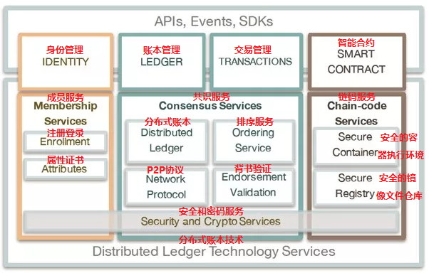
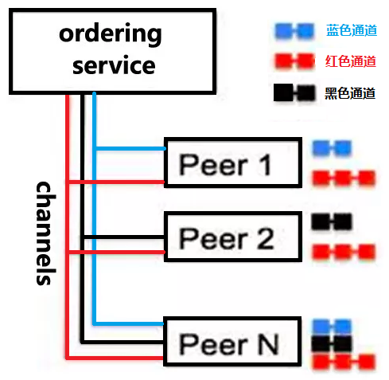

## 2. Hyperledger Fabric介绍

> 如果说以比特币为代表的货币区块链技术为 1.0，以以太坊为代表的合同区块链技术为 2.0，那么实现了完备的权限控制和安全保障的 Hyperledger 项目毫无疑问代表着区块链技术 3.0 时代的到来。

### Fabric1.0架构简介

> **Fabric架构的核心包括三部分：**
>
> - **Identity - 身份管理**
> - **Smart Contact - 智能合约**
> - **Ledger及Transactions - 账本和交易**

#### 1. Identity

> Identity，也就是身份管理，Fabric是目前为止在设计上最贴近联盟链思想的区块链。联盟链考虑到商业应用对安全、隐私、监管、审计、性能的需求，提高准入门槛，成员必须被许可才能加入网络。Fabric成员管理服务为整个区块链网络提供身份管理、隐私、保密和可审计的服务。成员管理服务通过公钥基础设施PKI和去中心化共识机制使得非许可的区块链变成许可制的区块链。

#### 2. Smart Contract

> Fabric的智能合约smart contract称为链码**chaincode**，是一段代码，它处理网络成员所同意的业务逻辑。和以太坊相比，Fabric链码和底层账本是分开的，升级链码时并不需要迁移账本数据到新链码当中，真正实现了逻辑与数据的分离。
>
> 链码可采用`Go、Java、Node.js`语言编写。链码被编译成一个独立的应用程序，fabric用Docker容器来运行chaincode，里面的base镜像都是经过签名验证的安全镜像，包括OS层和开发chaincode的语言、runtime和SDK层。一旦chaincode容器被启动，它就会通过gRPC与启动这个chaincode的Peer节点连接。

#### 3. Ledger | Transactions

> Fabric使用建立在HTTP/2上的P2P协议来管理分布式账本。采取可插拔的方式来根据具体需求来设置共识协议，比如PBFT，Raft，PoW和PoS等。

- **Ledger**

  > 账本Ledger主要包含两块：blockchain和state。blockchain就是一系列连在一起的block，用来记录历史交易。state对应账本的当前最新状态，它是一个key-value数据库，Fabric默认采用`Level DB`, 可以替换成其他的Key-value数据库，如`Couch DB`。举个例子。我们采用区块链实现一个弹珠交易的系统。我们开发了一个Chaincode, 每个弹珠有以下几个属性：Name, owner, color, size.  可以定义一个JSON对象，用name做KEY, JSON对象做Value，存储在Level DB或者CouchDB中。

- **Transactions**

  > **Fabric上的transction交易分两种，部署交易和调用交易。**
  >
  > - **部署交易**
  >
  >   把Chaincode部署到peer节点上并准备好被调用，当一个部署交易成功执行时，Chaincode就被部署到各个peer节点上。好比把一个web service或者EJB部署到应用服务器上的不同实例上。
  >
  > - **调用交易**
  >
  >   客户端应用程序通过Fabric提供的API调用先前已部署好的某个chaincode的某个函数执行交易，并相应地读取和写入K-V数据库，返回是否成功或者失败。

### APIs,Events,SDKs

站在程序猿的角度Fabric开发主要包括客户端和服务器端应用程序的编写

- 服务器端

  > Fabric提供API方便应用开发，对服务端的ChainCode，目前支持用Go、Java或者Node.js开发。

- 客户端

  > 对客户端应用，Fabric目前提供Node.js和Java SDK, Go SDK。未来计划提供Python，Fabric还提供RESTAPI。

对于开发者，还可以通过CLI快速去测试chaincode，或者去查询交易状态。在区块链网络里，节点和chaincode会发送events来触发一些监听动作，方便与其他外部系统的集成。

### Fabric 应用开发流程

> 如下图所示，开发者创建客户端应用和智能合约（chaincode），Chaincode被部署到区块链网络的Peer节点上面。通过chaincode来操作账本，当你调用一个交易transaction时，你实际上是在调用Chaincode中的一个函数方法，它实现业务逻辑，并对账本进行get, put, delete操作。客户端应用提供用户交互界面，并提交交易到区块链网络上。

### Fabric 业务网络

> 业务网络，也叫共识网络或区块链网络，由不同的节点构成。节点是区块链的通信实体，节点是一个逻辑概念，不同类型的节点可以运行在同一台物理服务器上。这些节点可能部署在云上面或者本地。可能来自不同的公司或者组织。在区块链网络中有两种类型的节点：Peer节点和Orderer节点，如下图所示。

- **Peer节点：**

  > chaincode部署在Peer节点上，它对账本进行读写操作。一个Peer节点可以充当多种角色，如背书者endorser, 提交者committer。一个区块链网络中会有多个Peer节点。

- **Orderer节点：**

  > 对交易进行排序，批量打包，生成区块，发给Peer节点。一个区块链网络中会有多个Orderer节点，它们共同提供排序服务。排序服务可以别实现为多种不同的方式，从一个中心化的服务（被用于开发和测试，如Solo）,到分布式协议（如Kafka）。
  >
  > 排序服务提供了通向客户端和Peer节点的共享通信通道。提供了包含交易的消息广播服务（broadcast和deliver）。客户端可以通过这个通道向所有的节点广播（broadcast）消息。通道可以向连接到该通道的节点投递(deliver)消息。
  >
  > 排序服务支持多通道，类似于发布/订阅消息系统中的主题topic。客户端和Peer节点可以连接到一个给点的通道，并通过给定的通道发送和接收消息。多通道使得Peer节点可以基于应用访问控制策略来订阅任意数量的通道; 也就是说，应用程序在指定Peer节点的子集中架设通道。这些peer组成提交到该通道交易的相关者集合，而且只有这些peer可以接收包含相关交易的区块，与其他交易完全隔离，实现数据隔离和保密。
  >
  > 此外，peers的子集将这些私有块提交到不同的账本上，允许它们保护这些私有交易，与其他peers子集的账本隔离开来。应用程序根据业务逻辑决定将交易发送到1个或多个通道。

- **Channel**

  > Channel在fabric中是一个相当重要的概念，可译作通道或频道。对于channel的理解，不妨想象一下电视节目的频道和“我和你不在一个频道”这句话。Channel本身存在于orderer结点内部，但需要通过peer结点使用`peer channel ...`命令进行维护。一个peer结点要想与另一个peer结点发生交易，最基本的前提就是两个结点必须同时处在同一个Channel中，block账本与channel也是一对一的关系，即一个channel一个账本。

> 例如，如上图所示:
>
> - peer 1,2和N订阅红色通道，并共同维护红色账本; 
> - peer 1和N订阅蓝色通道并维护蓝色账本; 
> - peer 2和peer N在黑色通道上并维护黑色账本。
>
> 在这个例子中，peer N订阅了所有通道，我们看到每个通道都有一个相关的账本。也就是说在一个区块链网络中，每个节点上面可以有多个账本。