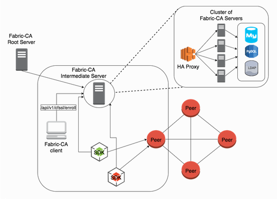

## 6. Fabric 账号

### 6.1 Fabric账号

> Fabric的账号体系是Fabric的重要的组成部分，由于Fabric是基于证书而不是传统的用户名密码形式的身份和角色认证的，因此很多从事传统基于数据库系统开发的技术人员在转向Fabric开发时会遇到很多困惑。因此下边内容将详细介绍Fabric的账号体系，为大家解决关于Fabric账号证书体系相关的困惑。

- **Fabric账号简介**

  > 在任何非开放系统中都需要通过账号和密码对系统入口进行相关的管理。比如我们常用的电子邮件系统都需提供账号和密码方可使用，再比如常见的数据库管理系统也需要获取相应的账号和密码才能对数据库进行操作。我们知道<font color="red">Fabric是一个联盟链，联盟链的特点是用户非权时不能接人区块链</font>。因此Fabric系统中存在一套授权体系，我们将这个体系称为Fabric的账号体系。关于Fabric的账号我们要搞清楚两个问题：
  >
  > - Fabric账号是什么。
  > - 什么样的操作需要使用到Fabric的账号。

- **Fabric账号是什么**

  > Fabric中的账号实际上是根据PKI规范生成的一组证书和秘钥文件。通过`cryptogen`模块生成的文件中就包含Fabric账号相关的证书文件。我们通常接触到的账号系统一般是由账号和密码两个属性组成的，比如常用的电子邮箱系统。在这些系统中账号和密码只是获取操作权限的工具，一旦账号和密码验成功，后面的操作基本上就和账号密码没有什么关系了。
  >
  > 但是区块链系统的一个非常重要的特点是：记录在区块链中的数据具有不可逆、不可篡改的特性。在Fabric中每条交易都会加上发起者的标签（签名证书），同时用发起人的私钥进行加密。如果交易需要其他组织的节点提供背书功能，那么背书节点也会在交易中加入自己的签名。这样每一笔交易的操作过程会非常清晰并且不可篡改。鉴于传统系统中基于账号和密码的验证体系已经无法完成这样的工作，因此Fabric设计了基于PKI规范的账号系统满足这样的要求。
  >
  > 既然Fabric的账号如此重要并且功能强大，同时又和传统的证书体系有本质的区别，那么它到底是什么样子？又由那些部分组成呢？我们通过下面的例子详细了解Fabric账号中包含哪些部分。以`cryptogen`模块生成账号为例，截取其中一个完整的账号包含的内容来说明Fabric账号的结构。

  ```shell
  .
  ├── Admin@orggo.itcast.com
  │   ├── msp
  │   │   ├── admincerts
  │   │   │   └── Admin@orggo.itcast.com-cert.pem
  │   │   ├── cacerts
  │   │   │   └── ca.orggo.itcast.com-cert.pem
  │   │   ├── keystore
  │   │   │   └── a2f15f92d1b1733a9a901aa4e6fa6d5910248a967b13a00521ba26068a2bc592_sk
  │   │   ├── signcerts
  │   │   │   └── Admin@orggo.itcast.com-cert.pem
  │   │   └── tlscacerts
  │   │       └── tlsca.orggo.itcast.com-cert.pem
  │   └── tls
  │       ├── ca.crt
  │       ├── client.crt
  │       └── client.key
  ├── User1@orggo.itcast.com
  │   ├── msp
  │   │   ├── admincerts
  │   │   │   └── User1@orggo.itcast.com-cert.pem
  │   │   ├── cacerts
  │   │   │   └── ca.orggo.itcast.com-cert.pem
  │   │   ├── keystore
  │   │   │   └── 889f0029925920dcff610239140bda797e102cda8072a89e2f46c4798bdb5c1d_sk
  │   │   ├── signcerts
  │   │   │   └── User1@orggo.itcast.com-cert.pem
  │   │   └── tlscacerts
  │   │       └── tlsca.orggo.itcast.com-cert.pem
  │   └── tls
  │       ├── ca.crt
  │       ├── client.crt
  │       └── client.key
  ```

  > 上述示例中的所有文件共构成系统中的账号，通过上面的例子我们发现每个号包含若干证书文件和秘钥文件，由此可见Fabric的账号体系比传统系统中由账号和密码成的认证体系要复杂很多。仔细观察Fabric账号中证书文件的路径，我们发现这些证书分别存放在`msp`文件夹和`tls`文件夹中。
  >
  > - <font color="red">msp文件夹中内容中主要存放签名用的证书文件和加密用的私钥文件。</font>
  >   - admincerts：管理员证书。
  >   - cacerts：根CA服务器的证书。
  >   - keystore：节点或者账号的私钥。
  >   - signcerts：符合x.509的节点或者用户证书文件。
  >   - tlscacerts：TLS根CA的证书。
  > - <font color="red">tls 文件夹中存放加密通信相关的证书文件。</font>

### 6.2 什么地方需要 Fabric 账号

- <font color="red">启动orderer</font>

  > 启动orderer的时候我们需要通过环境变量或者配置文件给当前启动的Orderer设定相应的账号。

  ```shell
  # 环境变量账号： -> 该路径为宿主机上的路径, 非docker启动的orderer节点内部挂载路径
  ORDERER_GENERAL_LOCALMSPDIR=/home/itcast/itcast/crypto-config/ordererOrganizations/itcast.com/orderers/orderer.itcast.com/msp
  # 账号目录信息
  $ tree
  .
  ├── admincerts
  │   └── Admin@itcast.com-cert.pem
  ├── cacerts
  │   └── ca.itcast.com-cert.pem
  ├── keystore
  │   └── 4968fd5b3fa14639ba61ec97f745b2e0ce5592e54838493d965a08ac7ad1c8e7_sk
  ├── signcerts
  │   └── orderer.itcast.com-cert.pem
  └── tlscacerts
      └── tlsca.itcast.com-cert.pem
  ```

- <font color="red">启动peer</font>

  > 启动peer的时候我们需要通过环境变量或者配置文件给当前启动的peer设定相应的账号。

  ```shell
  # 环境变量账号： -> 该路径为宿主机上的路径, 非docker启动的orderer节点内部挂载路径
  CORE_PEER_MSPCONFIGPATH=/home/itcast/itcast/crypto-config/peerOrganizations/orggo.itcast.com/peers/peer0.orggo.itcast.com/msp
  # 账号目录信息
  $ tree
  .
  ├── admincerts
  │   └── Admin@orggo.itcast.com-cert.pem
  ├── cacerts
  │   └── ca.orggo.itcast.com-cert.pem
  ├── config.yaml
  ├── keystore
  │   └── a3a19feb11cac708a038d115d26cf96247bcc5821bca3f2b8e9d07847604268b_sk
  ├── signcerts
  │   └── peer0.orggo.itcast.com-cert.pem
  └── tlscacerts
      └── tlsca.orggo.itcast.com-cert.pem
  ```

- <font color="red">创建channel</font>

  > channel是fabric中的重要组成部分, 创建channel也是需要账号的. 

  ```shell
  # 环境变量账号： -> 该路径为宿主机上的路径, 非docker启动的orderer节点内部挂载路径
  CORE_PEER_MSPCONFIGPATH=/home/itcast/itcast/crypto-config/peerOrganizations/orggo.itcast.com/users/Admin@orggo.itcast.com/msp
  # 账号目录信息
  $ tree
  .
  ├── admincerts
  │   └── Admin@orggo.itcast.com-cert.pem
  ├── cacerts
  │   └── ca.orggo.itcast.com-cert.pem
  ├── keystore
  │   └── a2f15f92d1b1733a9a901aa4e6fa6d5910248a967b13a00521ba26068a2bc592_sk
  ├── signcerts
  │   └── Admin@orggo.itcast.com-cert.pem
  └── tlscacerts
      └── tlsca.orggo.itcast.com-cert.pem
  ```

> 通过上边的内容我们可以发现这些账号的内容是一样的, 都包含是5个不同的文件, 但是仔细观察会发现在文件路径上还是有一些区别的。我们来对比一下：

```shell
  # Orderer 启动路径
  `ordererOrganizations/itcast.com/orderers/orderer.itcast.com/msp
  # Peer启动的账号路径
  `peerOrganizations/orggo.itcast.com/peers/peer0.orggo.itcast.com/msp
  # 创建channel的账号路径
  `peerOrganizations/orggo.itcast.com/users/Admin@orggo.itcast.com/msp
```

> <font color="red">我们可以发现Peer和Orderer都有属于自己的账号，创建Channel使用的是用户账号。其中Peer和创建Channel的用户账号属于某个组织，而Orderer的启动账号只属于他自己。这里特别注意，用户账号在很多操作中都会用到，而且很多操作的错误都是用户账号的路径设置不当而引起的。</font>

### 6.3 Fabric-ca

> fabric-ca 项目是专门为了解决Fabric账号问题而发起的一个开源项目, 它非常完美的解决了fabric账号生成的问题。fabric-ca项目由 fabric-server 和fabric-client这两个模块组成。其中fabric-server在 fabric中占有非常重要的作用。我们使用`cryptogen`命令可以同配置文件生成一些账号信息, 但是如果有动态添加账号的需求, 就无法满足, 所以这个时候我们就应该在项目中引入fabric-ca。




> 上图中Fabric CA提供了两种访问方式调用Server服务
>
> - 通过Fabric-Client调用
> - 通过SDK调用 （node.js，java， go）
>
> 通常情况下， 一个组织会对应一个fabric-server服务器， 下面介绍如何将fabric-server加入到网络中

#### 6.3.1 将fabric-ca加入到网络

在docker-compose启动使用的配置文件`docker-compos.yam`中添加如下配置项:

```yaml
version: '2'

volumes:
  orderer.example.com:
  peer0.org1.example.com:
  peer0.org2.example.com:

networks:
  byfn:

services:
###################### 添加的内容 - START #########################
  ca.example.com:
    image: hyperledger/fabric-ca:latest
    environment:
      - FABRIC_CA_HOME=/etc/hyperledger/fabric-ca-server
      - FABRIC_CA_SERVER_CA_NAME=ca.example.com
      - FABRIC_CA_SERVER_CA_CERTFILE=/etc/hyperledger/fabric-ca-server-config/ca.org1.example.com-cert.pem
      - FABRIC_CA_SERVER_CA_KEYFILE=/etc/hyperledger/fabric-ca-server-config/ee54a6cc9868ffa72f0556895020739409dc69da844628ae804934b7d7f68e92_sk

    ports:
      - "7054:7054"
    command: sh -c 'fabric-ca-server start -b admin:123456'
    volumes:
      - ./crypto-config/peerOrganizations/org1.example.com/ca/:/etc/hyperledger/fabric-ca-server-config
    container_name: ca.example.com
    networks:
      - byfn
###################### 添加的内容 - END #########################
  orderer.example.com:
    extends:
      file:   docker-compose-base.yaml
      service: orderer.example.com
    container_name: orderer.example.com
    networks:
      - byfn

  peer0.org1.example.com:
    container_name: peer0.org1.example.com
    extends:
      file:  docker-compose-base.yaml
      service: peer0.org1.example.com
    networks:
      - byfn

  peer0.org2.example.com:
    container_name: peer0.org2.example.com
    extends:
      file:  docker-compose-base.yaml
      service: peer0.org2.example.com
    networks:
      - byfn

  cli:
    container_name: cli
    image: hyperledger/fabric-tools:latest
    tty: true
    stdin_open: true
    environment:
      - GOPATH=/opt/gopath
      - CORE_VM_ENDPOINT=unix:///host/var/run/docker.sock
      #- CORE_LOGGING_LEVEL=DEBUG
      - CORE_LOGGING_LEVEL=INFO
      - CORE_PEER_ID=cli
      - CORE_PEER_ADDRESS=peer0.org1.example.com:7051
      - CORE_PEER_LOCALMSPID=Org1MSP
      - CORE_PEER_TLS_ENABLED=true
      - CORE_PEER_TLS_CERT_FILE=/opt/gopath/src/github.com/hyperledger/fabric/peer/crypto/peerOrganizations/org1.example.com/peers/peer0.org1.example.com/tls/server.crt
      - CORE_PEER_TLS_KEY_FILE=/opt/gopath/src/github.com/hyperledger/fabric/peer/crypto/peerOrganizations/org1.example.com/peers/peer0.org1.example.com/tls/server.key
      - CORE_PEER_TLS_ROOTCERT_FILE=/opt/gopath/src/github.com/hyperledger/fabric/peer/crypto/peerOrganizations/org1.example.com/peers/peer0.org1.example.com/tls/ca.crt
      - CORE_PEER_MSPCONFIGPATH=/opt/gopath/src/github.com/hyperledger/fabric/peer/crypto/peerOrganizations/org1.example.com/users/Admin@org1.example.com/msp
    working_dir: /opt/gopath/src/github.com/hyperledger/fabric/peer
    command: /bin/bash
    volumes:
        - /var/run/:/host/var/run/
        - ./chaincode/:/opt/gopath/src/github.com/chaincode
        - ./crypto-config:/opt/gopath/src/github.com/hyperledger/fabric/peer/crypto/
        - ./scripts:/opt/gopath/src/github.com/hyperledger/fabric/peer/scripts/
        - ./channel-artifacts:/opt/gopath/src/github.com/hyperledger/fabric/peer/channel-artifacts
    depends_on:
      - orderer.example.com
      - peer0.org1.example.com
      - peer0.org2.example.com
    networks:
      - byfn
```

#### 6.3.2 编写node.js客户端

- 初始化node.js项目

  ```shell
  # 创建一个编写node.js客户端的目录, 并进入
  # 1. 执行npm init 生成package.json文件, 用于保存更新项目依赖的第三方模块
  #    要求输入的信息, 如果你懒, 直接回车就可以了
  # package.json配置说明: https://blog.csdn.net/Aurora100/article/details/78590346
  $ npm init
  This utility will walk you through creating a package.json file.
  It only covers the most common items, and tries to guess sensible defaults.
  
  See `npm help json` for definitive documentation on these fields
  and exactly what they do.
  
  Use `npm install <pkg>` afterwards to install a package and
  save it as a dependency in the package.json file.
  
  Press ^C at any time to quit.
  package name: (nodejs) 
  version: (1.0.0) 
  description: 
  entry point: (index.js) 
  test command: 
  git repository: 
  keywords: 
  author: 
  license: (ISC) 
  About to write to /home/itcast/nodejs/package.json:
  
  {
    "name": "nodejs",
    "version": "1.0.0",
    "description": "",
    "main": "index.js",
    "scripts": {
      "test": "echo \"Error: no test specified\" && exit 1"
    },
    "author": "",
    "license": "ISC"
  }
  
  
  Is this ok? (yes) 
  ```

  ```shell
  # 接下来执行如下命令, 安装第三方依赖库:
  npm install --save fabric-ca-client
  npm install --save fabric-client
  npm install --save grpc
  # 安装过程中, 提示如下log信息, 无需理会
  npm WARN nodejs@1.0.0 No description
  npm WARN nodejs@1.0.0 No repository field.
  ```