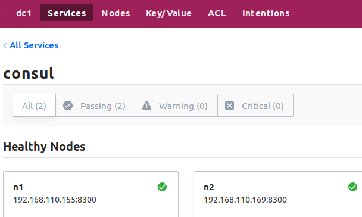
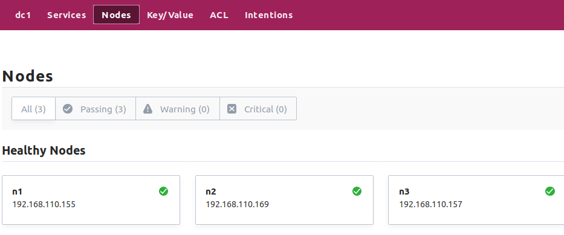

# 微服务（microservices）

​	近几年,微服这个词闯入了我们的视线范围。在百度与谷歌中随便搜一搜也有几千万条的结果。那么，什么是微服务呢？微服务的概念是怎么产生的呢？
我们就来了解一下Go语言与微服务的千丝万缕与来龙去脉。

# 项目展示

机器信息

| 机器       | 主机一          | 主机二          | 主机三          |
| ---------- | --------------- | --------------- | --------------- |
| ip         | 192.168.110.155 | 192.168.110.169 | 192.168.110.157 |
| web服务    | 开启            |                 |                 |
| 地区服务   |                 | 开启            | 开启            |
| 验证码服务 |                 | 开启            |                 |
| 搜索服务   |                 |                 | 开启            |


服务发现启动命令

```shell
#主机1
$ consul agent -server -bootstrap-expect 2 -data-dir /tmp/consul -node=n1 -bind=192.168.110.155 -ui  -config-dir /etc/consul.d -rejoin -join 192.168.110.155 -client 0.0.0.0

#主机2
$ consul agent -server -bootstrap-expect 2 -data-dir /tmp/consul -node=n2 -bind=192.168.110.169 -ui  -rejoin -join 192.168.110.155

#主机3
$ consul agent  -data-dir /tmp/consul -node=n3 -bind=192.168.110.157 -config-dir /etc/consul.d -rejoin -join 192.168.110.155

#打开文件文件夹不存在
$ sudo mkdir /etc/consul.d
```

在主机1或主机2打开 127.0.0.1可以查看到服务只有consul2个




结点有三个分别是n1-n3




