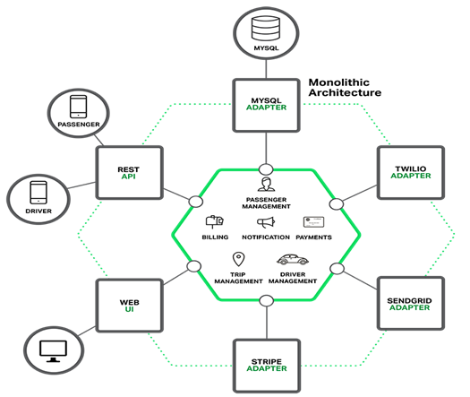
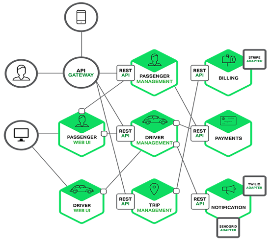
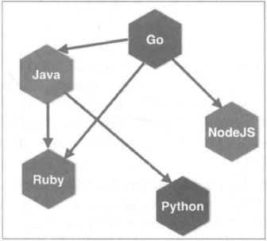
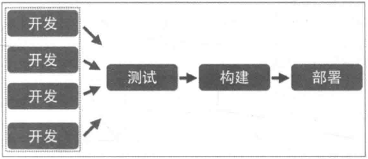
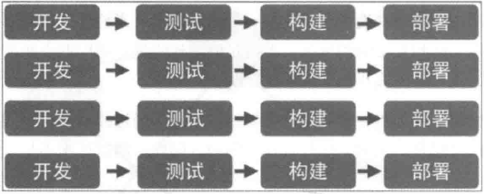
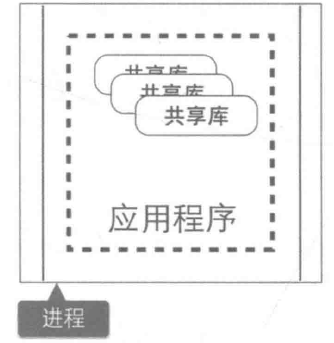
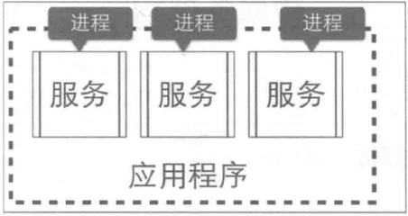

## 微服务架构和整体式架构的区别？

 

### 开发单体式（整体式）应用的不足之处

​                                                  

**三层架构（MVC）的具体内容如下：**

​       **表示层（view）**： 用户使用应用程序时，看到的、听见的、输入的或者交互的部分。

​       **业务逻辑层（controller）**： 根据用户输入的信息，进行逻辑计算或者业务处理的部分。

​       **数据访问层（model）**： 关注有效地操作原始数据的部分，如将数据存储到存储介质（如数据库、文件系统）及从存储介质中读取数据等。

 

​       虽然现在程序被分成了三层，但只是逻辑上的分层，并不是物理上的分层。也就是说，对不同层的代码而言，经过编译、打包和部署后，所有的代码最终还是运行在同一个进程中。而这，就是所谓的单块架构。

 

​       单体架构在规模比较小的情况下工作情况良好，但是随着系统规模的扩大，它暴露出来的问题也越来越多，主要有以下几点：

 

**复杂性逐渐变高**

 

​       比如有的项目有几十万行代码，各个模块之间区别比较模糊，逻辑比较混乱，代码越多复杂性越高，越难解决遇到的问题。

 

**技术债务逐渐上升**

​       公司的人员流动是再正常不过的事情，有的员工在离职之前，疏于代码质量的自我管束，导致留下来很多坑，由于单体项目代码量庞大的惊人，留下的坑很难被发觉，这就给新来的员工带来很大的烦恼，人员流动越大所留下的坑越多，也就是所谓的技术债务越来越多。

 

**维护成本大**

 

​       当应用程序的功能越来越多、团队越来越大时，沟通成本、管理成本显著增加。当出现 bug 时，可能引起 bug 的原因组合越来越多，导致分析、定位和修复的成本增加；并且在对全局功能缺乏深度理解的情况下，容易在修复 bug 时引入新的 bug。

 

**持续交付周期长**

 

​       构建和部署时间会随着功能的增多而增加，任何细微的修改都会触发部署流水线。新人培养周期长：新成员了解背景、熟悉业务和配置环境的时间越来越长。

 

**技术选型成本高**

 

​       单块架构倾向于采用统一的技术平台或方案来解决所有问题，如果后续想引入新的技术或框架，成本和风险都很大。

 

**可扩展性差**

 

​       随着功能的增加，垂直扩展的成本将会越来越大；而对于水平扩展而言，因为所有代码都运行在同一个进程，没办法做到针对应用程序的部分功能做独立的扩展。

 

### 微服务架构的特性

 

 **单一职责**

 

​       微服务架构中的每个服务，都是具有业务逻辑的，符合高内聚、低耦合原则以及单一职责原则的单元，不同的服务通过“管道”的方式灵活组合，从而构建出庞大的系统。

 

 **轻量级通信**

 

​       服务之间通过轻量级的通信机制实现互通互联，而所谓的轻量级，通常指语言无关、平台无关的交互方式。

​       对于轻量级通信的格式而言，我们熟悉的 XML 和 JSON，它们是语言无关、平台无关的；对于通信的协议而言，通常基于 HTTP，能让服务间的通信变得标准化、无状态化。目前大家熟悉的 REST（Representational State Transfer）是实现服务间互相协作的轻量级通信机制之一。使用轻量级通信机制，可以让团队选择更适合的语言、工具或者平台来开发服务本身。

 

 

 **独立性**

​       每个服务在应用交付过程中，独立地开发、测试和部署。

 

​       在单块架构中所有功能都在同一个代码库，功能的开发不具有独立性；当不同小组完成多个功能后，需要经过集成和回归测试，测试过程也不具有独立性；当测试完成后，应用被构建成一个包，如果某个功能存在 bug，将导致整个部署失败或者回滚。

 

 

​       在微服务架构中，每个服务都是独立的业务单元，与其他服务高度解耦，只需要改变当前服务本身，就可以完成独立的开发、测试和部署。

 

 

 **进程隔离**

 

​       单块架构中，整个系统运行在同一个进程中，当应用进行部署时，必须停掉当前正在运行的应用，部署完成后再重启进程，无法做到独立部署。

 

​       有时候我们会将重复的代码抽取出来封装成组件，在单块架构中，组件通常的形态叫做共享库（如 jar 包或者 DLL），但是当程序运行时，所有组件最终也会被加载到同一进程中运行。

 

 

 

​       在微服务架构中，应用程序由多个服务组成，每个服务都是高度自治的独立业务实体，可以运行在独立的进程中，不同的服务能非常容易地部署到不同的主机上。

 

 

 

 

### 微服务架构的缺点

 

 **运维要求较高**

 

​       对于单体架构来讲，我们只需要维护好这一个项目就可以了，但是对于微服务架构来讲，由于项目是由多个微服务构成的，每个模块出现问题都会造成整个项目运行出现异常，想要知道是哪个模块造成的问题往往是不容易的，因为我们无法一步一步通过debug的方式来跟踪，这就对运维人员提出了很高的要求。

 

 **分布式的复杂性**

 

​       对于单体架构来讲，我们可以不使用分布式，但是对于微服务架构来说，分布式几乎是必会用的技术，由于分布式本身的复杂性，导致微服务架构也变得复杂起来。

 

 **接口调整成本高**

 

​       比如，用户微服务是要被订单微服务和电影微服务所调用的，一旦用户微服务的接口发生大的变动，那么所有依赖它的微服务都要做相应的调整，由于微服务可能非常多，那么调整接口所造成的成本将会明显提高。

 

 **重复劳动**

 

​       对于单体架构来讲，如果某段业务被多个模块所共同使用，我们便可以抽象成一个工具类，被所有模块直接调用，但是微服务却无法这样做，因为这个微服务的工具类是不能被其它微服务所直接调用的，从而我们便不得不在每个微服务上都建这么一个工具类，从而导致代码的重复。

**对比表格**

|            | 传统单体架构           | 分布式微服务化架构                               |
| ---------- | ---------------------- | ------------------------------------------------ |
| 新功能开发 | 需要时间               | 容易开发和实现                                   |
| 部署       | 不经常而且容易部署     | 经常发布，部署复杂                               |
| 隔离性     | 故障影响范围大         | 故障影响范围小                                   |
| 架构设计   | 初期技术选型难度大     | 设计逻辑难度大                                   |
| 系统性能   | 相对时间快，吞吐量小   | 相对时间慢，吞吐量大                             |
| 系统运维   | 运维难度简单           | 运维难度复杂                                     |
| 新人上手   | 学习曲线大（应用逻辑） | 学习曲线大（架构逻辑）                           |
| 技术       | 技术单一而且封闭       | 技术多样而且容易开发                             |
| 测试和差错 | 简单                   | 复杂（每个服务都要进行单独测试，还需要集群测试） |
| 系统扩展性 | 扩展性差               | 扩展性好                                         |
| 系统管理   | 重点在于开发成本       | 重点在于服务治理和调度                           |

### 为什么还要使用微服务架构

#### 开发简单

​	微服务架构将复杂系统进行拆分之后，让每个微服务应用都开放变得非常简单，没有太多的累赘。对于每一个开发者来说，这无疑是一种解脱，因为再也不用进行繁重的劳动了，每天都在一种轻松愉快的氛围中工作，其效率也会整备地提高

#### 快速响应需求变化

​	一般的需求变化都来自于局部功能的改变，这种变化将落实到每个微服务上，二每个微服务的功能相对来说都非常简单，更改起来非常容易，所以微服务非常适合敏捷开发方法，能够快速的影响业务的需求变化。

#### 随时随地更新

​	一方面，微服务的部署和更新并不会影响全局系统的正常运行；另一方面，使用多实例的部署方法，可以做到一个服务的重启和更新在不易察觉的情况下进行。所以每个服务任何时候都可以进行更新部署。

#### 系统更加稳定可靠

​	微服务运行在一个高可用的分布式环境之中，有配套的监控和调度管理机制，并且还可以提供自由伸缩的管理，充分保障了系统的稳定可靠性