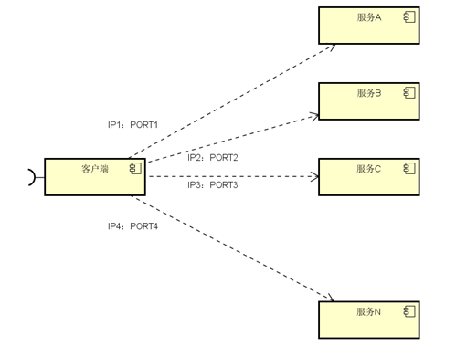
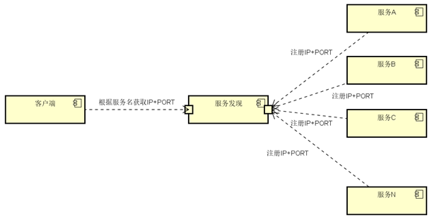

### 什么是服务发现

​	微服务的框架体系中，服务发现是不能不提的一个模块。我相信了解或者熟悉微服务的童鞋应该都知道它的重要性。这里我只是简单的提一下，毕竟这不是我们的重点。我们看下面的一幅图片：

图中，客户端的一个接口，需要调用服务A-N。客户端必须要知道所有服务的网络位置的，以往的做法是配置是配置文件中，或者有些配置在数据库中。这里就带出几个问题：

​	需要配置N个服务的网络位置，加大配置的复杂性

​	服务的网络位置变化，都需要改变每个调用者的配置

​	集群的情况下，难以做负载（反向代理的方式除外）

**总结起来一句话：服务多了，配置很麻烦，问题多多**

既然有这些问题，那么服务发现就是解决这些问题的。话说，怎么解决呢？我们再看一张图：

​	与之前一张不同的是，加了个服务发现模块。图比较简单，这边文字描述下。服务A-N把当前自己的网络位置注册到服务发现模块（这里注册的意思就是告诉），服务发现就以K-V的方式记录下，K一般是服务名，V就是IP:PORT。服务发现模块定时的轮询查看这些服务能不能访问的了（这就是健康检查）。客户端在调用服务A-N的时候，就跑去服务发现模块问下它们的网络位置，然后再调用它们的服务。这样的方式是不是就可以解决上面的问题了呢？客户端完全不需要记录这些服务网络位置，客户端和服务端完全解耦！

#### 下面的例子有助于我们理解服务发现的形式：

​	例如邮递员去某公司一栋大楼投递快件，向门卫询问员工甲在哪一个房间，门卫拿起桌上的通讯录查询，告知邮递员员工甲在具体什么位置。假如公司来了一个员工乙，他想让邮递员送过来，就要先让门卫知道自己在哪一个房间，需要去门卫那边登记，员工乙登记后，当邮递员向门卫询问时，门卫就可以告诉邮递员员工乙的具体位置。门卫知道员工乙的具体位置的过程就是服务发现，员工乙的位置信息可以被看作服务信息，门卫的通讯录就是上文中提到的数据交换格式，此例中员工乙就是上文的已方，门卫就是服务发现的提供者。