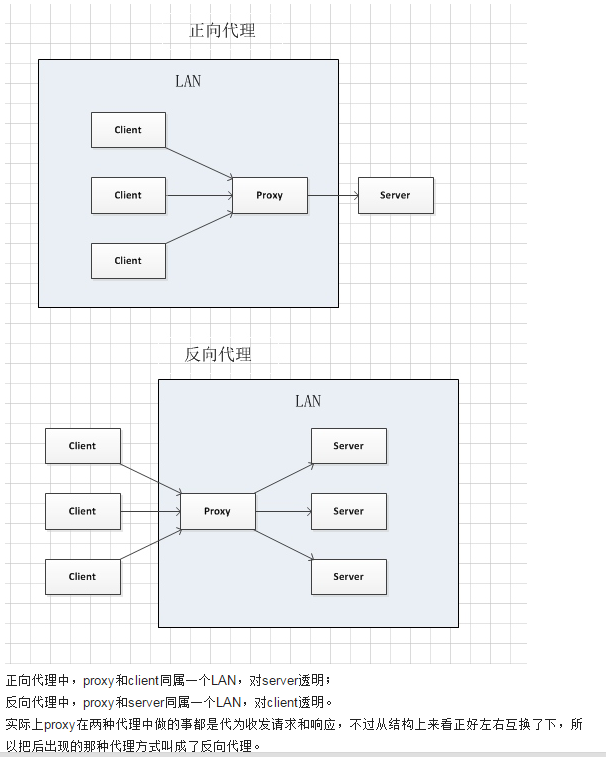
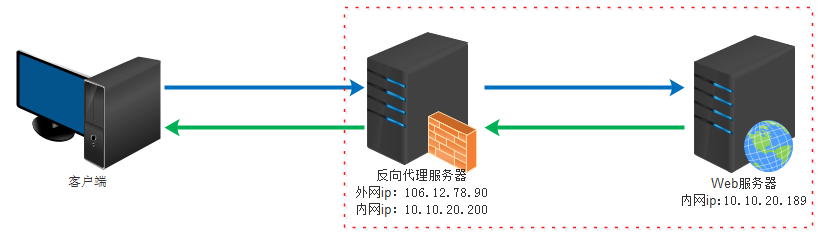
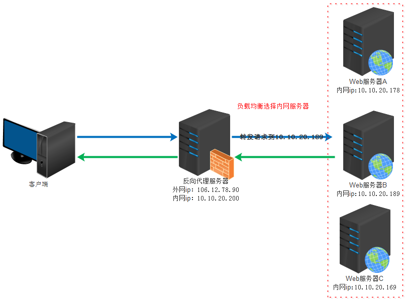

# 正向代理

​**正向代理**，意思是一个位于客户端和原始服务器(origin server)之间的服务器，为了从原始服务器取得内容，客户端向代理发送一个请求并指定目标(原始服务器)，然后代理向原始服务器转交请求并将获得的内容返回给客户端。所以已知我们目标的原始服务。

# 反向代理

**反向代理**是代理服务器的一种。服务器根据客户端的请求，从其关系的一组或多组后端服务器（如Web服务器）上获取资源，然后再将这些资源返回给客户端，客户端只会得知反向代理的IP地址，而不知道在代理服务器后面的服务器簇的存在

# 负载均衡

负载均衡*（Load Balance）*其意思就是分摊到多个操作单元上进行执行，例如Web[服务器](https://baike.baidu.com/item/%E6%9C%8D%E5%8A%A1%E5%99%A8/100571)、[FTP服务器](https://baike.baidu.com/item/FTP%E6%9C%8D%E5%8A%A1%E5%99%A8)、[企业](https://baike.baidu.com/item/%E4%BC%81%E4%B8%9A/707680)关键应用服务器和其它关键任务服务器等，从而共同完成工作任务。

