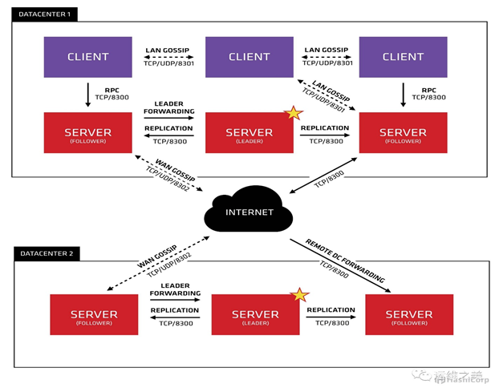

# 四、Consul

**为什么要学习consul服务发现？**

因为一套微服务架构中有很多个服务需要管理，也就是说会有很多对grpc。

如果一一对应的进行管理会很繁琐所以我们需要有一个管理发现的机制


## Consul的介绍

### Consul是什么

​	Consul是HashiCorp公司推出的开源工具，用于实现分布式系统的服务发现与配置。 Consul是分布式的、高可用的、可横向扩展的。它具备以下特性 :

​	服务发现：consul通过DNS或者HTTP接口使服务注册和服务发现变的很容易，一些外部服务，例如saas提供的也可以一样注册。

​	健康检查：健康检测使consul可以快速的告警在集群中的操作。和服务发现的集成，可以防止服务转发到故障的服务上面。

​	键/值存储：一个用来存储动态配置的系统。提供简单的HTTP接口，可以在任何地方操作。

​	多数据中心：无需复杂的配置，即可支持任意数量的区域。

### Consul的安装

​	Consul用Golang实现，因此具有天然可移植性 (支持 Linux、windows和macOS)。安装包仅包含一个可执行文件。 Consul安装非常简单，只需要下载对应系统的软件包并解压后就可使用。 

#### 下载安装


```shell
# 这里以 Linux系统为例：
$ wget https://releases.hashicorp.com/consul/1.4.2/consul_1.4.2_linux_amd64.zip

$ unzip consul_1.4.2_linux_amd64.zip
$ mv consul /usr/local/bin/
```

其它系统版本可在这里下载： https://www.consul.io/downloads.html

#### 验证安装

安装 Consul后，通过执行 consul命令，你可以看到命令列表的输出

```shell
$ consul
```


就证明成功了

### Consul 的角色

**client**: 客户端, 无状态, 将 HTTP 和 DNS 接口请求转发给局域网内的服务端集群.

**server**: 服务端, 保存配置信息, 高可用集群, 在局域网内与本地客户端通讯, 通过广域网与其他数据中心通讯. 每个数据中心的 server 数量推荐为 3 个或是 5 个.

### 运行 Consul代理 

​	Consul是典型的 C/S架构，可以运行服务模式或客户模式。每一个数据中心必须有至少一个服务节点， 3到5个服务节点最好。非常不建议只运行一个服务节点，因为在节点失效的情况下数据有极大的丢失风险。 

#### 运行Agent

​	完成Consul的安装后,必须运行agent. agent可以运行为server或client模式.每个数据中心至少必须拥有一台server . 建议在一个集群中有3或者5个server.部署单一的server,在出现失败时会不可避免的造成数据丢失.

​	其他的agent运行为client模式.一个client是一个非常轻量级的进程.用于注册服务,运行健康检查和转发对server的查询.agent必须在集群中的每个主机上运行.

#### 启动 Consul Server

```shell
#node1:
$ consul agent -server -bootstrap-expect 2 -data-dir /tmp/consul -node=n1 -bind=192.168.110.155 -ui  -config-dir /etc/consul.d -rejoin -join 192.168.110.155 -client 0.0.0.0
#运行cosnul agent以server模式
-server ： 定义agent运行在server模式
-bootstrap-expect ：在一个datacenter中期望提供的server节点数目，当该值提供的时候，consul一直等到达到指定sever数目的时候才会引导整个集群，该标记不能和bootstrap共用
-data-dir：提供一个目录用来存放agent的状态，所有的agent允许都需要该目录，该目录必须是稳定的，系统重启后都继续存在
-node：节点在集群中的名称，在一个集群中必须是唯一的，默认是该节点的主机名
-bind：该地址用来在集群内部的通讯，集群内的所有节点到地址都必须是可达的，默认是0.0.0.0
-ui： 启动web界面
-config-dir：：配置文件目录，里面所有以.json结尾的文件都会被加载
-rejoin：使consul忽略先前的离开，在再次启动后仍旧尝试加入集群中。
-client：consul服务侦听地址，这个地址提供HTTP、DNS、RPC等服务，默认是127.0.0.1所以不对外提供服务，如果你要对外提供服务改成0.0.0.0

```


```shell
#node2:
$ consul agent -server -bootstrap-expect 2 -data-dir /tmp/consul -node=n2 -bind=192.168.110.169 -ui  -rejoin -join 192.168.110.155

-server ： 定义agent运行在server模式
-bootstrap-expect ：在一个datacenter中期望提供的server节点数目，当该值提供的时候，consul一直等到达到指定sever数目的时候才会引导整个集群，该标记不能和bootstrap共用
-bind：该地址用来在集群内部的通讯，集群内的所有节点到地址都必须是可达的，默认是0.0.0.0
-node：节点在集群中的名称，在一个集群中必须是唯一的，默认是该节点的主机名
-ui： 启动web界面
-rejoin：使consul忽略先前的离开，在再次启动后仍旧尝试加入集群中。
-config-dir：：配置文件目录，里面所有以.json结尾的文件都会被加载
-client：consul服务侦听地址，这个地址提供HTTP、DNS、RPC等服务，默认是127.0.0.1所以不对外提供服务，如果你要对外提供服务改成0.0.0.0
-join 192.168.110.121 ： 启动时加入这个集群
```


#### 启动 Consul Client

```shell
#node3：
$ consul agent  -data-dir /tmp/consul -node=n3 -bind=192.168.110.157 -config-dir /etc/consul.d -rejoin -join 192.168.110.155

运行cosnul agent以client模式，-join 加入到已有的集群中去。
```


#### 查看集群成员

新开一个终端窗口运行consul members, 你可以看到Consul集群的成员.

```shell
$ consul members
#节点  网络地址               状态     类型     版本   协议       数据中心  分管部分 
Node  Address               Status  Type    Build  Protocol  DC   Segment

n1    192.168.110.7:8301    alive   server  1.1.0  2         dc1  <all>
n2    192.168.110.121:8301  alive   server  1.1.0  2         dc1  <all>
n3    192.168.110.122:8301  alive   client  1.1.0  2         dc1  <default>
```


#### 停止Agent

​	你可以使用Ctrl-C 优雅的关闭Agent. 中断Agent之后你可以看到他离开了集群并关闭.

​	在退出中,Consul提醒其他集群成员,这个节点离开了.如果你强行杀掉进程.集群的其他成员应该能检测到这个节点失效了.当一个成员离开,他的服务和检测也会从目录中移除.当一个成员失效了,他的健康状况被简单的标记为危险,但是不会从目录中移除.Consul会自动尝试对失效的节点进行重连.允许他从某些网络条件下恢复过来.离开的节点则不会再继续联系.

​	此外,如果一个agent作为一个服务器,一个优雅的离开是很重要的,可以避免引起潜在的可用性故障影响达成一致性协议.
consul优雅的退出

```shell
$ consul leave
```


#### 注册服务

​	搭建好conusl集群后，用户或者程序就能到consul中去查询或者注册服务。可以通过提供服务定义文件或者调用HTTP API来注册一个服务.

​	首先,为Consul配置创建一个目录.Consul会载入配置文件夹里的所有配置文件.在Unix系统中通常类似 /etc/consul.d (.d 后缀意思是这个路径包含了一组配置文件).

```shell
$ mkdir /etc/consul.d
```

​	然后,我们将编写服务定义配置文件.假设我们有一个名叫web的服务运行在 10000端口.另外,我们将给他设置一个标签.这样我们可以使用他作为额外的查询方式:

```shell
{
  "service": {                                      #服务
	 "name": "web",									#名称
	 "tags": ["master"],                            #标记
	 "address": "127.0.0.1",						#ip
	 "port": 10000,									#端口
	 "checks": [
	   {
	     "http": "http://localhost:10000/health",
	     "interval": "10s"							#检查时间
	   }
	 ]
  }
}
```


#### 测试程序

```go
package main
import (
	"fmt"
	"net/http"
)
func handler(w http.ResponseWriter, r *http.Request) {
	fmt.Println("hello Web3! This is n3或者n2")
	fmt.Fprintf(w, "Hello Web3! This is n3或者n2")
}
func healthHandler(w http.ResponseWriter, r *http.Request) {
	fmt.Println("health check! n3或者n2")
}
func main() {
	http.HandleFunc("/", handler)
	http.HandleFunc("/health", healthHandler)
	http.ListenAndServe(":10000", nil)
}
```

### Consul架构 



​	我们只看数据中心1，可以看出consul的集群是由N个SERVER，加上M个CLIENT组成的。而不管是SERVER还是CLIENT，都是consul的一个节点，所有的服务都可以注册到这些节点上，正是通过这些节点实现服务注册信息的共享。除了这两个，还有一些小细节，一一简单介绍。
​	**CLIENT**
​	CLIENT表示consul的client模式，就是客户端模式。是consul节点的一种模式，这种模式下，所有注册到当前节点的服务会被转发到SERVER【通过HTTP和DNS接口请求server】，本身是**不持久化**这些信息。
​	**SERVER**
​	SERVER表示consul的server模式，表明这个consul是个server，这种模式下，功能和CLIENT都一样，唯一不同的是，它会把所有的信息持久化的本地，这样遇到故障，信息是可以被保留的
​	**SERVER-LEADER**
​	中间那个SERVER下面有LEADER的字眼，表明这个SERVER是它们的老大，它和其它SERVER不一样的一点是，它需要负责同步注册的信息给其它的SERVER，同时也要负责各个节点的健康监测。


#### Consul的client mode把请求转向server，那么client的作用是什么？

​	consul可以用来实现分布式系统的服务发现与配置。client把服务请求传递给server，server负责提供服务以及和其他数据中心交互。题主的问题是，既然server端提供了所有服务，那为何还需要多此一举地用client端来接收一次服务请求。我想，采用这种架构有以下几种理由：

​	首先server端的网络连接资源有限。对于一个分布式系统，一般情况下访问量是很大的。如果用户能不通过client直接地访问数据中心，那么数据中心必然要为每个用户提供一个单独的连接资源(线程，端口号等等)，那么server端的负担会非常大。所以很有必要用大量的client端来分散用户的连接请求，在client端先统一整合用户的服务请求，然后一次性地通过一个单一的链接发送大量的请求给server端，能够大量减少server端的网络负担。

​	其次，在client端可以对用户的请求进行一些处理来提高服务的效率，比如将相同的请求合并成同一个查询，再比如将之前的查询通过cookie的形式缓存下来。但是这些功能都需要消耗不少的计算和存储资源。如果在server端提供这些功能，必然加重server端的负担，使得server端更加不稳定。而通过client端来进行这些服务就没有这些问题了，因为client端不提供实际服务，有很充足的计算资源来进行这些处理这些工作。

​	最后还有一点，consul规定只要接入一个client就能将自己注册到一个服务网络当中。这种架构使得系统的可扩展性非常的强，网络的拓扑变化可以特别的灵活。这也是依赖于client—server结构的。如果系统中只有几个数据中心存在，那网络的扩张也无从谈起了。


Consul资料：http://www.liangxiansen.cn/2017/04/06/consul 
https://blog.csdn.net/yuanyuanispeak/article/details/54880743