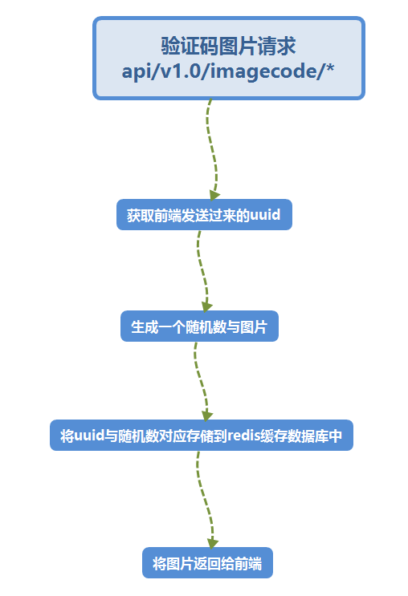

# 03 获取验证码图片

获取验证码图片服务（注册相关）


## 流程与接口


```json
#Request:
method: GET
url:api/v1.0/imagecode/:uuid
#data:
no input data
#Response
#返回成功：
{
    二进制图片
}
#注册失败：
{
    "errno": "4001",   //状态码
    "errmsg":"状态错误信息"
}

```




## 创建命令

```shell
$ micro new --type "srv" sss/GetImageCd
```


## 使用验证码库

```shell
$ go get -u -v github.com/afocus/captcha
```

接口api

```go
	//创建1个句柄
	cap := captcha.New()
	//通过句柄调用 字体文件
	if err := cap.SetFont("comic.ttf"); err != nil {
		panic(err.Error())
	}

	//设置图片的大小
	cap.SetSize(91, 41)
	// 设置干扰强度
	cap.SetDisturbance(captcha.MEDIUM)
	// 设置前景色 可以多个 随机替换文字颜色 默认黑色
	//SetFrontColor(colors ...color.Color)  这两个颜色设置的函数属于不定参函数
	cap.SetFrontColor(color.RGBA{255, 255, 255, 255})
	// 设置背景色 可以多个 随机替换背景色 默认白色
	cap.SetBkgColor(color.RGBA{255, 0, 0, 255}, color.RGBA{0, 0, 255, 255}, color.RGBA{0, 153, 0, 255})
	//生成图片 返回图片和 字符串(图片内容的文本形式)
	img, str := cap.Create(4, captcha.NUM)
```

proto文件

```protobuf
service Example {
	rpc GetImageCd(Request) returns (Response) {}
}

message Request {
	string uuid = 1;
}

message Response {
    //错误码
	string Errno =1 ;
	//错误消息
    string Errmsg = 2;
    //图片结构信息
    bytes Pix = 3;

    //图片跨步
    int64 Stride =4 ;

    message  Point{
    int64 X =1;
    int64 Y =2;
    }

    // Min, Max Point
    Point Min =5;
    Point Max =6;
}

```

web服务main.go添加1条路由

```go
//获取图片验证码
rou.GET("/api/v1.0/imagecode/:uuid",handler.GetImageCd)
```

web服务handler.go添加代码

```go
func GetImageCd(w http.ResponseWriter, r *http.Request, ps httprouter.Params) {
	beego.Info("获取图片验证码 url：api/v1.0/imagecode/:uuid")
	//创建服务
	server :=grpc.NewService()
	//服务初始化
	server.Init()

	//连接服务
	exampleClient := GETIMAGECD.NewExampleService("go.micro.srv.GetImageCd", server.Client())

	//获取前端发送过来的唯一uuid
	beego.Info(ps.ByName("uuid"))
	//通过句柄调用我们proto协议中准备好的函数
	//第一个参数为默认,第二个参数 proto协议中准备好的请求包
	rsp, err := exampleClient.GetImageCd(context.TODO(),&GETIMAGECD.Request{
		Uuid:ps.ByName("uuid"),
	})
	//判断函数调用是否成功
	if err != nil {
		beego.Info(err)
		http.Error(w, err.Error(), 502)
		return
	}

	//处理前端发送过来的图片信息
	var img image.RGBA

	img.Stride = int(rsp.Stride)

	img.Rect.Min.X = int(rsp.Min.X)
	img.Rect.Min.Y = int(rsp.Min.Y)
	img.Rect.Max.X = int(rsp.Max.X)
	img.Rect.Max.Y = int(rsp.Max.Y)

	img.Pix =[]uint8(rsp.Pix)

	var image captcha.Image

	image.RGBA = &img

	//将图片发送给前端
	png.Encode(w, image)
}

```

GetImageCd服务业务代码

```go
package handler

import (
	"context"

	"github.com/micro/go-log"

	example "go-1/GetImageCd/proto/example"
	"go-1/homeweb/utils"
	"github.com/astaxie/beego"
	"encoding/json"
	"github.com/astaxie/beego/cache"
	_ "github.com/astaxie/beego/cache/redis"
	_ "github.com/gomodule/redigo/redis"
	"time"
	"github.com/afocus/captcha"
	"image/color"
)

type Example struct{}

// Call is a single request handler called via client.Call or the generated client code
func (e *Example) GetImageCd(ctx context.Context, req *example.Request, rsp *example.Response) error {

	beego.Info("---------------- GET  /api/v1.0/imagecode/:uuid GetImage() ------------------")


	//创建1个句柄
	cap := captcha.New()
	//通过句柄调用 字体文件
	if err := cap.SetFont("comic.ttf"); err != nil {
		beego.Info("没有字体文件")
		panic(err.Error())
	}
	//设置图片的大小
	cap.SetSize(91, 41)
	// 设置干扰强度
	cap.SetDisturbance(captcha.MEDIUM)
	// 设置前景色 可以多个 随机替换文字颜色 默认黑色
	//SetFrontColor(colors ...color.Color)  这两个颜色设置的函数属于不定参函数
	cap.SetFrontColor(color.RGBA{255, 255, 255, 255})
	// 设置背景色 可以多个 随机替换背景色 默认白色
	cap.SetBkgColor(color.RGBA{255, 0, 0, 255}, color.RGBA{0, 0, 255, 255}, color.RGBA{0, 153, 0, 255})
	//生成图片 返回图片和 字符串(图片内容的文本形式)
	img, str := cap.Create(4, captcha.NUM)
	beego.Info(str)


	b := *img //解引用
	c := *(b.RGBA) //解引用
	//成功返回
	rsp.Errno = utils.RECODE_OK
	rsp.Errmsg = utils.RecodeText(rsp.Errno)

	//图片信息
	rsp.Pix = []byte(c.Pix)
	rsp.Stride =  int64(c.Stride)
	rsp.Max  =  &example.Response_Point{X:int64(c.Rect.Max.X),Y:int64(c.Rect.Max.Y) }
	rsp.Min  =  &example.Response_Point{X:int64(c.Rect.Min.X),Y:int64(c.Rect.Min.Y) }


	/*将uuid与 随机数验证码对应的存储在redis缓存中*/
	//初始化缓存全局变量的对象

	redis_config_map := map[string]string{
		"key":"ihome",

		"conn":utils.G_redis_addr+":"+utils.G_redis_port,
		"dbNum":utils.G_redis_dbnum,
	}
	beego.Info(redis_config_map)
	redis_config ,_:=json.Marshal(redis_config_map)


	//连接redis数据库 创建句柄
	bm, err := cache.NewCache("redis", string(redis_config) )
	if err !=nil{
		beego.Info("GetImage()   cache.NewCache err ",err)
		rsp.Errno = utils.RECODE_DBERR
		rsp.Errmsg = utils.RecodeText(rsp.Errno)
	}
	//验证码进行1个小时缓存
	bm.Put(req.Uuid ,str, 300 *time.Second )


	return nil
}
```

