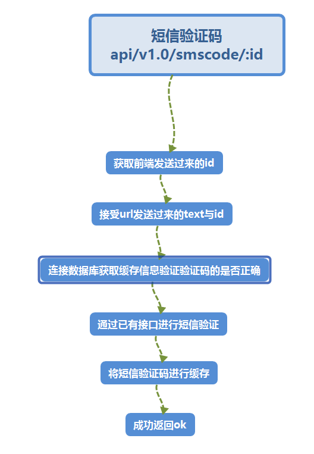

# 13获取短信验证码服务（注册相关）


## 流程与接口



```json
#Request:
method: GET
#111表示的是手机号
url:api/v1.0/smscode/:mobile
url:api/v1.0/smscode/111?  text=248484&id=9cd8faa9-5653-4f7c-b653-0a58a8a98c81
data:no input data
#Response
#返回成功：
{
    "errno": "0",   //状态码
    "errmsg":"ok"
}
#注册失败：
{
    "errno": "4001",   //状态码
    "errmsg":"状态错误信息"
}

```


## 使用短信验证的api

```go
//网站：https://www.mysubmail.com


//短信map
	messageconfig := make(map[string]string)
	//id
	messageconfig["appid"] = "29672"
	//key
	messageconfig["appkey"] = "89d90165cbea8cae80137d7584179bdb"
	//编码格式
	messageconfig["signtype"] = "md5"


	//短信操作对象
	messagexsend := submail.CreateMessageXSend()
	//短信发送到那个手机号
	submail.MessageXSendAddTo(messagexsend, “手机号”)
	//短信发送的模板
	submail.MessageXSendSetProject(messagexsend, "NQ1J94")
	//发送的验证码
	submail.MessageXSendAddVar(messagexsend, "code", "1111")
	//发送
	fmt.Println("MessageXSend ", submail.MessageXSendRun(submail.MessageXSendBuildRequest(messagexsend), messageconfig))
```

## 创建命令

```shell
$ micro new --type "srv" sss/GetSmscd
```


proto文件

```protobuf
service Example {
	rpc GetSmscd(Request) returns (Response) {}
}

//客户端发送给服务器
message Request {
	//手机号
	string Mobile = 1;
	//uuid
    string Id = 2;
    //验证码
    string Text = 3;
}
//服务器回发给客户端
message Response {
	string Errno = 1;
    string Errmsg = 2;
}
```

web服务main.go添加1条路由

```go
//获取短信验证码
rou.GET("/api/v1.0/smscode/:mobile",handler.Getsmscd)
```

web服务中的handler.go添加内容

```go
func Getsmscd(w http.ResponseWriter, r *http.Request, ps httprouter.Params) {
	beego.Info(" 获取短信验证   api/v1.0/smscode/:id ")

	//创建服务
	service := grpc.NewService()
	service.Init()

	//获取 前端发送过来的手机号
	mobile := ps.ByName("mobile")
	beego.Info(mobile)
	//后端进行正则匹配
	//创建正则句柄
	myreg := regexp.MustCompile(`0?(13|14|15|17|18|19)[0-9]{9}`)
	//进行正则匹配
	bo := myreg.MatchString(mobile)

	//如果手机号错误则
	if bo == false {
		// we want to augment the response
		resp := map[string]interface{}{
			"errno":  utils.RECODE_NODATA,
			"errmsg": "手机号错误",
		}
		//设置返回数据格式
		w.Header().Set("Content-Type", "application/json")

		//将错误发送给前端
		if err := json.NewEncoder(w).Encode(resp); err != nil {
			http.Error(w, err.Error(), 503)
			beego.Info(err)
			return
		}
		beego.Info("手机号错误返回")
		return
	}


	//获取url携带的验证码 和key（uuid）
	beego.Info(r.URL.Query())
	//获取url携带的参数
	text := r.URL.Query()["text"][0] //text=248484

	id := r.URL.Query()["id"][0]     //id=9cd8faa9-5653-4f7c-b653-0a58a8a98c81


	//调用服务
	exampleClient := GETSMSCD.NewExampleService("go.micro.srv.GetSmscd", service.Client())
	rsp, err := exampleClient.GetSmscd(context.TODO(), &GETSMSCD.Request{
		Mobile: mobile,
		Id:     id,
		Text:   text,
	})

	if err != nil {
		http.Error(w, err.Error(), 502)
		beego.Info(err)
		//beego.Debug(err)
		return
	}
	//创建返回map
	resp := map[string]interface{}{
		"errno":  rsp.Errno,
		"errmsg": rsp.Errmsg,
	}
	//设置返回格式
	w.Header().Set("Content-Type", "application/json")

	//将数据回发给前端
	if err := json.NewEncoder(w).Encode(resp); err != nil {
		http.Error(w, err.Error(), 503)
		beego.Info(err)
		return
	}
}
```


服务下的handler

```go
package handler

import (
	"context"

	"github.com/micro/go-log"

	example "go-1/GetSmscd/proto/example"
	"strconv"
	"fmt"
	"time"
	"github.com/astaxie/beego"
	"go-1/homeweb/utils"
	"encoding/json"
	"github.com/astaxie/beego/cache"
	_ "github.com/astaxie/beego/cache/redis"
	_ "github.com/gomodule/redigo/redis"
	"github.com/garyburd/redigo/redis"
	"reflect"
	"math/rand"
	"github.com/SubmailDem/submail"
	"github.com/astaxie/beego/orm"
	"go-1/homeweb/models"
)

//获取短信验证码
func (e *Example) GetSmscd(ctx context.Context, req *example.Request, rsp *example.Response) error {
	beego.Info(" GET smscd  api/v1.0/smscode/:id ")
	//初始化返回正确的返回值
	rsp.Errno = utils.RECODE_OK
	rsp.Errmsg = utils.RecodeText(rsp.Errno)
	/*验证uuid的缓存*/


	//验证手机号
	o:=orm.NewOrm()
	user := models.User{Mobile:req.Mobile}
	err := o.Read(&user)
	if err==nil{
		beego.Info("用户已经存在")
		rsp.Errno  =  utils.RECODE_DBERR
		rsp.Errmsg  = utils.RecodeText(rsp.Errno)
		return  nil
	}
	beego.Info(err)

	//连接redis数据库
	redis_config_map := map[string]string{
		"key":utils.G_server_name,
		"conn":utils.G_redis_addr+":"+utils.G_redis_port,
		"dbNum":utils.G_redis_dbnum,
	}
	beego.Info(redis_config_map)
	redis_config ,_:=json.Marshal(redis_config_map)
	beego.Info( string(redis_config) )


	//连接redis数据库 创建句柄
	bm, err := cache.NewCache("redis", string(redis_config) )
	//bm,err:=cache.NewCache("redis",`{"key":"ihome","conn":"127.0.0.1:6379","dbNum":"0"} `)//创建1个缓存句柄
	if err != nil {
		beego.Info("缓存创建失败",err)
		rsp.Errno = utils.RECODE_DBERR
		rsp.Errmsg = utils.RecodeText(rsp.Errno)
		return nil
	}

	beego.Info(req.Id,reflect.TypeOf(req.Id))
	//查询相关数据

	value:=bm.Get(req.Id)
	if value  ==nil{
		beego.Info("获取到缓存数据查询失败",value)

		rsp.Errno = utils.RECODE_DBERR
		rsp.Errmsg = utils.RecodeText(rsp.Errno)

		return nil
	}
	beego.Info(value,reflect.TypeOf(value))
	value_str ,_ :=redis.String(value,nil)


	beego.Info(value_str,reflect.TypeOf(value_str))
	//数据对比
	if req.Text != value_str{
		beego.Info("图片验证码 错误 ")
		rsp.Errno = utils.RECODE_DBERR
		rsp.Errmsg = utils.RecodeText(rsp.Errno)
		return nil
	}


	r := rand.New(rand.NewSource(time.Now().UnixNano()))
	size := r.Intn(8999)+1000  //1000-9999
	beego.Info(size)

	//短信map
	messageconfig := make(map[string]string)
	//id
	messageconfig["appid"] = "29672"
	//key
	messageconfig["appkey"] = "89d90165cbea8cae80137d7584179bdb"
	//编码格式
	messageconfig["signtype"] = "md5"


	//短信操作对象
	messagexsend := submail.CreateMessageXSend()
	//短信发送到那个手机号
	submail.MessageXSendAddTo(messagexsend, req.Mobile  )
	//短信发送的模板
	submail.MessageXSendSetProject(messagexsend, "NQ1J94")
	//发送的验证码
	submail.MessageXSendAddVar(messagexsend, "code", strconv.Itoa(size))
	//发送
	fmt.Println("MessageXSend ", submail.MessageXSendRun(submail.MessageXSendBuildRequest(messagexsend), messageconfig))


	/*通过手机号将验证短信进行缓存*/

	err = bm.Put(req.Mobile,size,time.Second*300)
	if err !=nil{
		beego.Info("缓存出现问题")
		rsp.Errno = utils.RECODE_DBERR
		rsp.Errmsg = utils.RecodeText(rsp.Errno)
		return nil
	}

	return  nil
}
```

