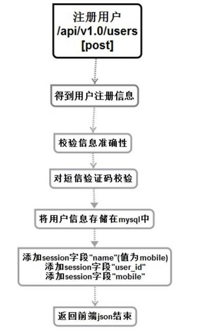

# 发送注册信息服务（注册相关）


## 流程和接口



```json
#Request:
method: POST
url:api/v1.0/users
#data:
{
    mobile: "123", //手机号
    password: "123", //密码
    sms_code: "123"   //短信验证码
}
#Response
#返回成功：
{
    "errno": "0",   //状态码
    "errmsg":"ok"
}
#注册失败：
{
    "errno": "4001",   //状态码
    "errmsg":"状态错误信息"
}
```


## 创建命令

```shell
$ micro new --type "srv" sss/PostRet
```


proto文件

```shell
service Example {
	rpc PostRet(Request) returns (Response) {}
}


message Request {
    //手机号
	string Mobile = 1;
	//密码
	string Password = 2;
	//短信验证码
	string Sms_code = 3;
}

message Response {
    string Errno = 1;
    string Errmsg = 2;
	string SessionID = 3;
}
```

web服务main.go添加1条路由

```
//注册
rou.POST("/api/v1.0/users",handler.Postreg)
```

web服务的handler.go中

```go
//注册请求
func Postreg(w http.ResponseWriter, r *http.Request, ps httprouter.Params) {
	beego.Info(" 注册请求   /api/v1.0/users ")
	/*获取前端发送过来的json数据*/
	var request map[string]interface{}
	if err := json.NewDecoder(r.Body).Decode(&request); err != nil {
		http.Error(w, err.Error(), 500)
		return
	}
	for key, value := range request {
		beego.Info(key,value,reflect.TypeOf(value))
	}

	//由于前端每作所以后端进行下操作
	if request["mobile"] == "" || request["password"] =="" || request["sms_code"] =="" {
		resp := map[string]interface{}{
			"errno": utils.RECODE_NODATA,
			"errmsg": "信息有误请从新输入",
		}

		//如果不存在直接给前端返回
		w.Header().Set("Content-Type", "application/json")

		if err := json.NewEncoder(w).Encode(resp); err != nil {
			http.Error(w, err.Error(), 503)
			beego.Info(err)
			return
		}
		beego.Info("有数据为空")
		return
	}


	//创建服务
	service := grpc.NewService()
	service.Init()

	// 连接服务将数据发送给注册服务进行注册
	exampleClient := POSTRET.NewExampleService("go.micro.srv.PostRet", service.Client())
	rsp, err := exampleClient.PostRet(context.TODO(), &POSTRET.Request{
		Mobile:request["mobile"].(string),
		Password:request["password"].(string),
		SmsCode:request["sms_code"].(string),
	})
	if err != nil {
		http.Error(w, err.Error(), 502)

		beego.Info(err)
		//beego.Debug(err)
		return
	}


	resp := map[string]interface{}{
		"errno": rsp.Errno,
		"errmsg": rsp.Errmsg,
	}

	//读取cookie
	cookie,err :=r.Cookie("userlogin")


	//如果读取失败或者cookie的value中不存在则创建cookie
	if err !=nil || ""==cookie.Value{
		cookie  := http.Cookie{Name: "userlogin", Value: rsp.SessionID, Path: "/", MaxAge: 600}
		http.SetCookie(w, &cookie)
	}

	//设置回发数据格式
	w.Header().Set("Content-Type", "application/json")

	//将数据回发给前端
	if err := json.NewEncoder(w).Encode(resp); err != nil {
		http.Error(w, err.Error(), 503)
		beego.Info(err)
		return
	}


	return
}
```

服务端


```go
func GetMd5String(s string) string {
	h := md5.New()
	h.Write([]byte(s))
	return hex.EncodeToString(h.Sum(nil))
}
// Call is a single request handler called via client.Call or the generated client code
func (e *Example) PostRet(ctx context.Context, req *example.Request, rsp *example.Response) error {
	beego.Info(" POST userreg    /api/v1.0/users !!!")
	//初始化错误码
	rsp.Errno = utils.RECODE_OK
	rsp.Errmsg = utils.RecodeText(rsp.Errno)


	//构建连接缓存的数据
	redis_config_map := map[string]string{
		"key":utils.G_server_name,
		"conn":utils.G_redis_addr+":"+utils.G_redis_port,
		"dbNum":utils.G_redis_dbnum,
	}
	redis_config ,_:=json.Marshal(redis_config_map)


	//连接redis数据库 创建句柄
	bm, err := cache.NewCache("redis", string(redis_config) )
	if err != nil {
		beego.Info("缓存创建失败",err)
		rsp.Errno = utils.RECODE_DBERR
		rsp.Errmsg = utils.RecodeText(rsp.Errno)

		return nil
	}

	//查询相关数据
	value:=bm.Get(req.Mobile)
	if value  ==nil{
		beego.Info("获取到缓存数据查询失败",value)
		rsp.Errno = utils.RECODE_DBERR
		rsp.Errmsg = utils.RecodeText(rsp.Errno)

		return nil
	}
	beego.Info(value,reflect.TypeOf(value))
	//进行解码
	var info interface{}
	json.Unmarshal(value.([]byte),&info)
	beego.Info(info,reflect.TypeOf(info))


	//类型转换
	s := int(info.(float64))
	beego.Info(s,reflect.TypeOf(s))
	s1,err :=strconv.Atoi( req.SmsCode)

	if s1 != s{
		beego.Info("短信验证码错误")
		rsp.Errno = utils.RECODE_DBERR
		rsp.Errmsg = utils.RecodeText(rsp.Errno)
		return nil
	}

	user := models.User{}
	user.Name = req.Mobile   //就用手机号登陆
	//密码正常情况下 md5 sha256 sm9  存入数据库的是你加密后的编码不是明文存入
	//user.Password_hash = GetMd5String(req.Password)
	user.Password_hash = req.Password
	user.Mobile = req.Mobile
	//创建数据库剧本
	o:=orm.NewOrm()
	//插入数据库
	id,err:=o.Insert(&user)
	if err != nil {
		rsp.Errno = utils.RECODE_DBERR
		rsp.Errmsg = utils.RecodeText(rsp.Errno)
		return nil
	}
	beego.Info("id",id)

	//生成sessionID 保证唯一性
	h := GetMd5String(req.Mobile+req.Password)
	//返回给客户端session
	rsp.SessionID = h

	//拼接key sessionid + name
	bm.Put(h+"name",string(user.Mobile),time.Second*3600)
	//拼接key sessionid + user_id
	bm.Put(h+"user_id", string(user.Id) ,time.Second*3600)
	//拼接key sessionid + mobile
	bm.Put(h+"mobile",string(user.Mobile) ,time.Second*3600)


	return nil
}

```

# cookie与session（了解）

Web开发中一个很重要的议题就是如何做好用户的整个浏览过程的控制，因为HTTP协议是无状态的，所以用户的每一次请求都是无状态的，我们不知道在整个web操作过程中那些连接与该用户有关系，我们应该如何解决这个问题呢？

​              Web的经典解决方案就是COOKIE和SESSION，cookie机制是一种客户端机制，把用户的数据保存在客户端，而session是一种服务器机制，服务器会使用一种类似于散列表的结构来保存信息，每一个网站客户都会被分配一个唯一的标识符，即sessionID ，它的存放形式无非是两种：要么经过url传递，要么保存在客户端的cookies里。当然最安全的方式还是将session保存在数据库中，但是这样效率会下降很多。

 

​              Session和cookie是浏览器中常见的两个概念，也是比较难以辨析的两个概念，但是它们在浏览需要认证的服务器页面以及页面统计中还是相当关键的。我们先通过日常的应用来了解下session和cookie怎么来的？

​              首先考虑如何抓取一个访问受限的网页这个问题。例如新浪微博好友的主页，这个人微博页面等

​              显然，通过浏览器，我们可以手动的输入用户名和密码来访问页面，而所谓的“抓取”，其实就是使用程序来模拟完成同样的工作，因此我们需要了解“登陆”过程到底发生了什么。

​              当用户来到微博登陆页面，输入用户名密码之后点击登陆后，浏览器会将认证信息POST发送给远端的服务器，服务器执行验证逻辑，然后验证通过。


 

​              则浏览器会跳转到登录用户的微博首页


​              在登陆成功后，浏览器如何验证我们对其他受限制页面的访问？因为HTTP协议是无状态的，所以很显然服务器不可能知道我们已经在上一次的HTTP请求中通过了登陆验证。

​              当然最简单的解决方案就是所有的请求里面都带上用户名和密码，这样虽然可行，但是大大加重了服务器的负担（对于每个request都需要到数据库中进行验证），也大大降低了用户的体验（每个页面都需要重新输入用户名和密码，每个页面都需要带有登录表单）。

​              既然直接在请求中带上用户名和密码不行，那么只有在服务器或者客户端保存一些类似的代表身份的信息，所有就有了COOKIE和SESSION。

## cookie

​              

​              Cookie，简而言之就是在本地计算机保存一些用户操作的历史信息（当然也包括登陆信息）并在用户再次访问该站点时浏览器通过HTTP协议将本地cookie内容发送给服务器，从而完成验证，或继续上一步操作。。

 


 

​              Cookie是由浏览器维持的，存储在客户端的一小段文本信息，伴随着用户请求和页面在Web服务器和浏览器之间传递。用户每次访问站点时，Web应用程序都可以读取cookie包含的信息。浏览器设置里面有cookie隐私数据选项，打开它，可以看到很多已访问网站的cookies。


 

​              cookie是有时间限制的，根据生命期不同分成两种：会话cookie和持久cookie；

​              如果不设置过期时间，则表示这个cookie生命周期为从创建到浏览器关闭止，只要关闭浏览器窗口，cookie就消失了。这种生命期为浏览会话期的cookie被称为会话cookie。会话cookie一般不保存在硬盘上而是保存在内存里。

​              如果设置了过期时间(setMaxAge(60*60*24))，浏览器就会把cookie保存到硬盘上，关闭后再次打开浏览器，这些cookie依然有效直到超过设定的过期时间。存储在硬盘上的cookie可以在不同的浏览器进程间共享，比如两个IE窗口。而对于保存在内存的cookie，不同的浏览器有不同的处理方式。 　　

 

## session

​              

​              Session，简而言之就是在服务器上保存用户操作的历史信息。服务器使用sessionid来标识session，sessionid由服务器负责产生，保证随机性和唯一性，相当于一个随机秘钥，避免在握手和传输中暴露用户真正密码。单在该方式下，仍然需要将发送请求给客户端与session进行对应，所以可以借助cookie机制来获取客户端的标识（即sessionid），也可通过GET方式将ID提交给服务器。


​              Session，中文通常被翻译为会话，本来的含义是指有使用中的一系列动作/信息，比如打电话，从拿起电话拨号到挂断电话这中间的一系列工程称之为一个session。然而session一次与网络协议向管理时，他往往隐含了“面向连接”或者“保持状态”这两个含义。

​              Session在web开发环境下的语义又有了新的扩展，它的含义是指一类用来在客户端与服务器之间保持状态的解决方案。有时候session也是用来指这种解决方案的存储结构。

​              Session机制是一种服务器端的机制，服务器只用一种类似于散列报的结构（也可能是散列表）来保存信息。

​              当程序需要为某个客户端请求创建一个session的时候，服务器首先要先检查这个客户端的请求里是否包含一个session表示——称之为session id，如果已经包含一个session id则说明以前已经为此用户创建过session，服务器就按照session id把这个session检索出来使用（如果检索不到，可能会创建一个新的。这种情况可能会出现在服务端已经删除了该用户对应的session对象，单用户认为地在请求的url后面加上一个SESSION的参数。）如果客户端请求不包含session id，则为此服务创建一个session并同时生成一个与此session向管理的session id，在这个session id将本次响应包中返回给客户端。

​              Session机制本身并不复杂，然而其实现和配置上的灵活却使得具体情况复杂多变。这也要求我们不能仅仅某一次的经验或者某一个浏览器、服务器的经验当做普遍使用。

​              

​              Session和cookie的目的相同，都是为了克服HTTP协议的无状态缺陷，但完成方法不同。Session通过cookie，在客户端保存session id，而将用户的其他会话消息保存在服务端的session对象中，与此相对的，cookie需要将所有信息都保存在客户端。因此cookie存在这一定的安全隐患。例如本地cookie中保存的用户名密码被破译，或者cooie被其他网站收集（例如：

​                     1.aapA主动设置域B cookie，让域B cookie获取；

​                     2.XSS（跨站脚本*攻击*），在appA中通过javascript获取document.cookie,并传递给自己的appB）