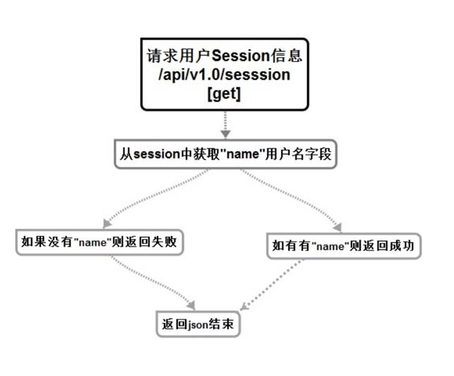

# 获取session信息服务（登陆相关）


## 流程与接口



```json
#Request:
method: GET
url:api/v1.0/session
data:no input data
#Response
#返回成功：
{
    "errno": "0",
    "errmsg":"OK",
    "data": {"name" : "13313331333"}

}
#注册失败：
{
    "errno": "400x",   //状态码
    "errmsg":"状态错误信息"
}
```


## 创建命令

```shell
$ micro new --type "srv" sss/GetSession
```


proto协议

```protobuf
service Example {
	rpc GetSession(Request) returns (Response) {}
}

message Request {
    string Sessionid = 1;
}

message Response {
	string Errno = 1;
    string Errmsg = 2;
    string Data = 3;
}
```

修改web服务中的GetSession

```go
//获取session
func GetSession(w http.ResponseWriter, r *http.Request,_ httprouter.Params) {
	beego.Info("获取Session url：api/v1.0/session")

	//创建服务
	service := grpc.NewService()
	service.Init()

	//创建句柄
	exampleClient := GETSESSION.NewExampleService("go.micro.srv.GetSession", service.Client())

	//获取cookie
	userlogin,err:=r.Cookie("userlogin")

	//如果不存在就返回
	if err != nil{

		//创建返回数据map
		response := map[string]interface{}{
			"errno": utils.RECODE_SESSIONERR,
			"errmsg": utils.RecodeText(utils.RECODE_SESSIONERR),

		}

		w.Header().Set("Content-Type", "application/json")
		// encode and write the response as json
		if err := json.NewEncoder(w).Encode(response); err != nil {
			http.Error(w, err.Error(), 503)
			beego.Info(err)
			return
		}
		return
	}

	//存在就发送数据给服务
	rsp, err := exampleClient.GetSession(context.TODO(),&GETSESSION.Request{
		Sessionid:userlogin.Value,
	})

	if err != nil {
		http.Error(w, err.Error(), 502)

		beego.Info(err)
		//beego.Debug(err)
		return
	}


	// we want to augment the response
	//将获取到的用户名返回给前端
	data := make(map[string]string)
	data["name"]=rsp.Data
	response := map[string]interface{}{
		"errno": rsp.Errno,
		"errmsg": rsp.Errmsg,
		"data" : data,
	}

	w.Header().Set("Content-Type", "application/json")

	// 将返回数据map发送给前端
	if err := json.NewEncoder(w).Encode(response); err != nil {
		http.Error(w, err.Error(), 503)
		return
	}
}

```

服务端

```go
func (e *Example) GetSession(ctx context.Context, req *example.Request, rsp *example.Response) error {
	beego.Info(" GET session    /api/v1.0/session !!!")
	//创建返回空间
	//初始化的是否返回不存在
	rsp.Errno = utils.RECODE_SESSIONERR
	rsp.Errmsg = utils.RecodeText(rsp.Errno)

	////获取前端的cookie
	beego.Info(req.Sessionid,reflect.TypeOf(req.Sessionid))
	//构建连接缓存的数据
	redis_config_map := map[string]string{
		"key":utils.G_server_name,
		"conn":utils.G_redis_addr+":"+utils.G_redis_port,
		"dbNum":utils.G_redis_dbnum,
	}
	beego.Info(redis_config_map)
	redis_config ,_:=json.Marshal(redis_config_map)
	beego.Info( string(redis_config) )

	//连接redis数据库 创建句柄
	bm, err := cache.NewCache("redis", string(redis_config) )
	if err != nil {
		beego.Info("缓存创建失败",err)
		rsp.Errno  =  utils.RECODE_DBERR
		rsp.Errmsg  = utils.RecodeText(rsp.Errno)
		return  nil
	}

	//拼接key
	sessionidname :=  req.Sessionid + "name"
	//从缓存中获取session 那么使用唯一识别码  通过key查询用户名
	areas_info_value:=bm.Get(sessionidname)
	//查看返回数据类型
	beego.Info(reflect.TypeOf(areas_info_value) ,areas_info_value )

	//通过redis方法进行转换
	name ,err :=redis.String(areas_info_value,nil)
	if err!=nil{
		rsp.Errno = utils.RECODE_DATAERR
		rsp.Errmsg = utils.RecodeText(rsp.Errno)
	}
	//查看返回数据类型
	beego.Info(name,reflect.TypeOf(name))


 	//获取到了session
	rsp.Errno = utils.RECODE_OK
	rsp.Errmsg = utils.RecodeText(rsp.Errno)
	rsp.Data = name

	return nil

}
```

