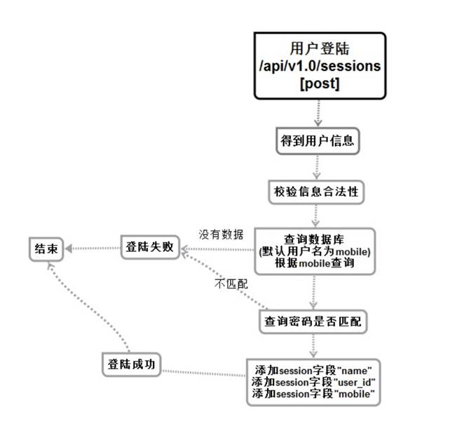

# 发送登陆信息服务（登陆相关）


## 流程与接口



```json
#Request:
method: POST
url:api/v1.0/sessions
#data:
{
    mobile: "133", //手机号
    password: "itcast"//密码
}
#Response
#返回成功：
{
    "errno": "0",
    "errmsg":"OK",
}
#返回失败：
{
    "errno": "400x",   //状态码
    "errmsg":"状态错误信息"
}
```

## 创建命令

```shell
$ micro new --type "srv" sss/PostLogin
```

proto

```protobuf
service Example {
	rpc PostLogin(Request) returns (Response) {}
}

message Request {
	string Mobile =1 ;
	string Password =2 ;
}

message Response {
    string Errno = 1 ;
    string Errmsg =2 ;
    string SessionID = 3 ;
}
```

 web中添加路由

```go
//登陆
rou.POST("/api/v1.0/sessions",handler.PostLogin)
```

web的handler中添加

```go
//登陆
func PostLogin(w http.ResponseWriter, r *http.Request, _ httprouter.Params) {
	beego.Info("登陆 api/v1.0/sessions")
	//获取前端post请求发送的内容
	var request map[string]interface{}
	if err := json.NewDecoder(r.Body).Decode(&request); err != nil {
		http.Error(w, err.Error(), 500)
		return
	}

	for key, value := range request {
		beego.Info(key,value,reflect.TypeOf(value))
	}
	//判断账号密码是否为空
	if request["mobile"] == "" || request["password"] =="" {
		resp := map[string]interface{}{
			"errno": utils.RECODE_NODATA,
			"errmsg": "信息有误请从新输入",
		}
		w.Header().Set("Content-Type", "application/json")

		// encode and write the response as json
		if err := json.NewEncoder(w).Encode(resp); err != nil {
			http.Error(w, err.Error(), 503)
			beego.Info(err)
			return
		}
		beego.Info("有数据为空")
		return
	}

	//创建连接

	service := grpc.NewService()
	service.Init()
	exampleClient :=POSTLOGIN.NewExampleService("go.micro.srv.PostLogin",service.Client())

	rsp, err := exampleClient.PostLogin(context.TODO(),&POSTLOGIN.Request{
		Password:request["password"].(string),
		Mobile:request["mobile"].(string),
	})


	if err != nil {
		http.Error(w, err.Error(), 502)

		beego.Info(err)
		//beego.Debug(err)
		return
	}

	cookie,err :=r.Cookie("userlogin")
	if err !=nil || ""==cookie.Value{
		cookie  := http.Cookie{Name: "userlogin", Value: rsp.SessionID, Path: "/", MaxAge: 600}
		http.SetCookie(w, &cookie)
	}
	beego.Info(rsp.SessionID)
	resp := map[string]interface{}{
		"errno": rsp.Errno,
		"errmsg": rsp.Errmsg,

	}
	w.Header().Set("Content-Type", "application/json")

	// encode and write the response as json
	if err := json.NewEncoder(w).Encode(resp); err != nil {
		http.Error(w, err.Error(), 503)
		beego.Info(err)
		return
	}
}
```

服务

```go
func (e *Example) PostLogin(ctx context.Context, req *example.Request, rsp *example.Response) error {
	beego.Info("登陆 api/v1.0/sessions")

	//返回给前端的map结构体
	rsp.Errno =  utils.RECODE_OK
	rsp.Errmsg = utils.RecodeText(rsp.Errno)


	//查询数据库
	var user models.User
	o:=orm.NewOrm()

	//select * from user
	//创建查询句柄
	qs:=o.QueryTable("user")
	//qs.Filter("profile__age", 18)
	//查询符合的数据
	err:=qs.Filter("mobile",req.Mobile).One(&user)
	if err != nil {

		rsp.Errno =  utils.RECODE_NODATA
		rsp.Errmsg = utils.RecodeText(rsp.Errno)

		return nil
	}

	//判断密码是否正确
	if req.Password != user.Password_hash{
		rsp.Errno =  utils.RECODE_PWDERR
		rsp.Errmsg = utils.RecodeText(rsp.Errno)

		return nil
	}

	//编写redis缓存数据库信息
	redis_config_map := map[string]string{
		"key":utils.G_server_name,
		//"conn":"127.0.0.1:6379",
		"conn":utils.G_redis_addr+":"+utils.G_redis_port,
		"dbNum":utils.G_redis_dbnum,
	}
	beego.Info(redis_config_map)
	redis_config ,_:=json.Marshal(redis_config_map)


	//连接redis数据库 创建句柄
	bm, err := cache.NewCache("redis", string(redis_config) )

	if err != nil {
		beego.Info("缓存创建失败",err)
		rsp.Errno = utils.RECODE_DBERR
		rsp.Errmsg = utils.RecodeText(rsp.Errno)

		return nil
	}

	//生成sessionID
	h := GetMd5String(req.Mobile+req.Password)
	rsp.SessionID = h

	beego.Info(h)

	//拼接key sessionid + name
	bm.Put(h+"name",string(user.Name),time.Second*3600)
	//拼接key sessionid + user_id
	bm.Put(h+"user_id", string(user.Id) ,time.Second*3600)
	//拼接key sessionid + mobile
	bm.Put(h+"mobile",string(user.Mobile) ,time.Second*3600)

	//成功返回数据
	return nil

}
```

