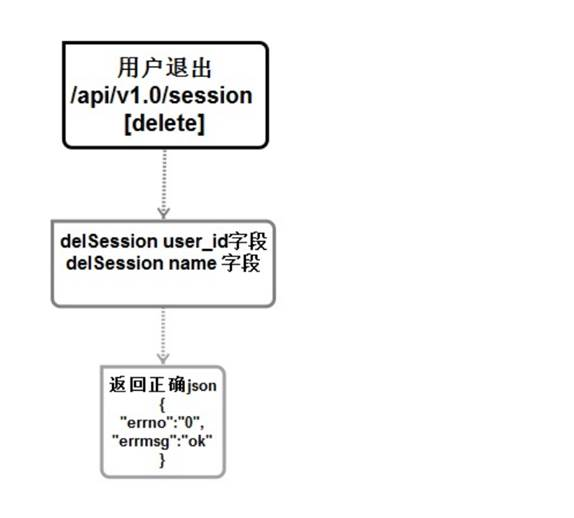

# 删除（退出）登陆信息服务（登陆相关）


## 流程与接口



```json
#Request:
method: DELETE
url:api/v1.0/session
#data:
no input data
#Response
#返回成功：
{
    "errno": "0",
    "errmsg":"OK",
}
#返回失败：
{
    "errno": "400x",   //状态码
    "errmsg":"状态错误信息"
}
```

## 创建命令

```shell
$ micro new --type "srv" sss/DeleteSession 
```


proto

```protobuf
service Example {
	rpc DeleteSession(Request) returns (Response) {}
}


message Request {
    string Sessionid = 1;
}

message Response {
    string Errno = 1;
    string Errmsg = 2;
}
```

在web中添加1个路由

```go
//退出登陆
rou.DELETE("/api/v1.0/session", handler.DeleteSession)
```

web下的handler

```go
func DeleteSession(w http.ResponseWriter, r *http.Request,_ httprouter.Params) {
	beego.Info("---------------- DELETE  /api/v1.0/session Deletesession() ------------------")
	//创建返回空间

	server :=grpc.NewService()
	server.Init()
	exampleClient := DELETESESSION.NewExampleService("go.micro.srv.DeleteSession", server.Client())

	//获取session
	userlogin,err:=r.Cookie("userlogin")
	//如果没有数据说明没有的登陆直接返回错误
	if err != nil{
		resp := map[string]interface{}{
			"errno": utils.RECODE_SESSIONERR,
			"errmsg": utils.RecodeText(utils.RECODE_SESSIONERR),
		}

		w.Header().Set("Content-Type", "application/json")
		// encode and write the response as json
		if err := json.NewEncoder(w).Encode(resp); err != nil {
			http.Error(w, err.Error(), 503)
			beego.Info(err)
			return
		}
		return
	}

	rsp, err := exampleClient.DeleteSession(context.TODO(),&DELETESESSION.Request{
		Sessionid:userlogin.Value,
	})

	if err != nil {
		http.Error(w, err.Error(), 502)

		beego.Info(err)
		//beego.Debug(err)
		return
	}
	//再次读取数据
	cookie,err :=r.Cookie("userlogin")

	//数据不为空则将数据设置副的
	if err !=nil || ""==cookie.Value{
		return
	}else {
		cookie := http.Cookie{Name: "userlogin", Path: "/", MaxAge: -1}
		http.SetCookie(w, &cookie)
	}


	//返回数据
	resp := map[string]interface{}{
		"errno": rsp.Errno,
		"errmsg": rsp.Errmsg,
	}
	//设置格式
	w.Header().Set("Content-Type", "application/json")

	// encode and write the response as json
	if err := json.NewEncoder(w).Encode(resp); err != nil {
		http.Error(w, err.Error(), 503)
		beego.Info(err)
		return
	}


	return
}
```


服务端

```go
func (e *Example) DeleteSession(ctx context.Context, req *example.Request, rsp *example.Response) error {
	beego.Info(" DELETE session    /api/v1.0/session !!!")

	//创建返回空间
	//初始化的是否返回不存在
	rsp.Errno = utils.RECODE_OK
	rsp.Errmsg = utils.RecodeText(rsp.Errno)

	////获取前端的cookie
	beego.Info(req.Sessionid,reflect.TypeOf(req.Sessionid))


	//构建连接缓存的数据
	redis_config_map := map[string]string{
		"key":utils.G_server_name,
		"conn":utils.G_redis_addr+":"+utils.G_redis_port,
		"dbNum":utils.G_redis_dbnum,
	}
	beego.Info(redis_config_map)
	redis_config ,_:=json.Marshal(redis_config_map)

	//连接redis数据库 创建句柄
	bm, err := cache.NewCache("redis", string(redis_config) )
	if err != nil {
		beego.Info("缓存创建失败",err)
		rsp.Errno  =  utils.RECODE_DBERR
		rsp.Errmsg  = utils.RecodeText(rsp.Errno)
		return  nil
	}
	sessionidname :=  req.Sessionid + "name"
	sessioniduserid :=  req.Sessionid + "user_id"
	sessionidmobile :=  req.Sessionid + "mobile"

	//从缓存中获取session 那么使用唯一识别码
	bm.Delete(sessionidname)
	bm.Delete(sessioniduserid)
	bm.Delete(sessionidmobile)

	return nil
}
```

