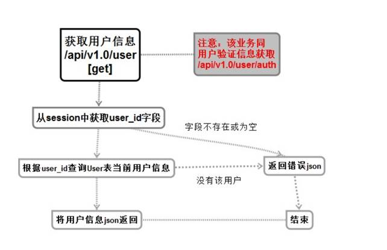

# 获取用户基本信息服务（用户相关）


## 流程与接口



```json
#Request:
method: GET
url:api/v1.0/user
#data:
no input data
#Response
#返回成功：
{
  "errno": "0",
  "errmsg": "成功",
  "data": {
    "user_id": 1,
    "name": "Panda",
    "mobile": "110",
    "real_name": "熊猫",
    "id_card": "210112244556677",
    "avatar_url": "http://101.200.170.171:9998/group1/M00/00/00/Zciqq1n7It2ANn1dAADexS5wJKs808.png"
  }
}
#返回失败：
{
    "errno": "400x",   //状态码
    "errmsg":"状态错误信息"
}
```

## 创建命令

```shell
$ micro new  --type "srv" sss/GetUserInfo
```


proto

```protobuf
service Example {
	rpc GetUserInfo(Request) returns (Response) {}
}
message Request {
    string Sessionid = 1 ;
}
message Response {
    //错误码
	string Errno =1 ;
	//错误信息
    string Errmsg = 2;
    //用户id
    int64  User_id = 3 ;
    //用户名
    string Name =4;
    //手机号
    string Mobile =5 ;
    //真实姓名
    string Real_name =6 ;
    //身份证号
    string Id_card =7;
    //头衔地址
    string Avatar_url =8 ;
}
```

web中添加路由

```
//请求用户基本信息 GET /api/v1.0/user
rou.GET("/api/v1.0/user", handler.GetUserInfo)
```

web下handler添加函数

```go
func GetUserInfo(w http.ResponseWriter, r *http.Request,_ httprouter.Params) {
	beego.Info("GetUserInfo  获取用户信息   /api/v1.0/user")
	//初始化服务
	service := grpc.NewService()
	service.Init()

	//创建句柄
	exampleClient := GETUSERINFO.NewExampleService("go.micro.srv.GetUserInfo", service.Client())

	//获取用户的登陆信息
	userlogin,err:=r.Cookie("userlogin")

	//判断是否成功不成功就直接返回
	if err != nil{
		resp := map[string]interface{}{
			"errno": utils.RECODE_SESSIONERR,
			"errmsg": utils.RecodeText(utils.RECODE_SESSIONERR),
		}

		w.Header().Set("Content-Type", "application/json")
		// encode and write the response as json
		if err := json.NewEncoder(w).Encode(resp); err != nil {
			http.Error(w, err.Error(), 503)
			beego.Info(err)
			return
		}
		return
	}

	//成功就将信息发送给前端
	rsp, err := exampleClient.GetUserInfo(context.TODO(),&GETUSERINFO.Request{
		Sessionid:userlogin.Value,
	})

	if err != nil {
		http.Error(w, err.Error(), 502)

		beego.Info(err)
		//beego.Debug(err)
		return
	}
	//


	// 准备1个数据的map
	data := make(map[string]interface{})
	//将信息发送给前端
	data["user_id"] = int(rsp.UserId)
	data["name"] = rsp.Name
	data["mobile"] = rsp.Mobile
	data["real_name"] = rsp.RealName
	data["id_card"] = rsp.IdCard
	data["avatar_url"] = utils.AddDomain2Url(rsp.AvatarUrl)

	resp := map[string]interface{}{
		"errno": rsp.Errno,
		"errmsg": rsp.Errmsg,
		"data" : data,
	}
	//设置格式
	w.Header().Set("Content-Type", "application/json")

	// encode and write the response as json
	if err := json.NewEncoder(w).Encode(resp); err != nil {
		http.Error(w, err.Error(), 503)
		beego.Info(err)
		return
	}

	return
}

```

服务端

```
func (e *Example) GetUserInfo(ctx context.Context, req *example.Request, rsp *example.Response) error {

	beego.Info("---------------- GET  /api/v1.0/user Getuserinfo() ------------------")
	//打印sessionid
	beego.Info(req.Sessionid,reflect.TypeOf(req.Sessionid))
	//错误码
	rsp.Errno  =  utils.RECODE_OK
	rsp.Errmsg  = utils.RecodeText(rsp.Errno)


	//构建连接缓存的数据
	redis_config_map := map[string]string{
		"key":utils.G_server_name,
		//"conn":"127.0.0.1:6379",
		"conn":utils.G_redis_addr+":"+utils.G_redis_port,
		"dbNum":utils.G_redis_dbnum,
	}
	beego.Info(redis_config_map)
	redis_config ,_:=json.Marshal(redis_config_map)

	//连接redis数据库 创建句柄
	bm, err := cache.NewCache("redis", string(redis_config) )
	if err != nil {
		beego.Info("缓存创建失败",err)
		rsp.Errno  =  utils.RECODE_DBERR
		rsp.Errmsg  = utils.RecodeText(rsp.Errno)
		return  nil
	}

	//拼接用户信息缓存字段
	sessioniduserid :=  req.Sessionid + "user_id"

	//获取到当前登陆用户的user_id
	value_id :=bm.Get(sessioniduserid)
	//打印
	beego.Info(value_id,reflect.TypeOf(value_id))

	//数据格式转换
	id :=  int(value_id.([]uint8)[0])
	beego.Info(id ,reflect.TypeOf(id))
	//创建user表
	user := models.User{Id:id}
	//创建数据库orm句柄
	o := orm.NewOrm()
	//查询表
	err =o.Read(&user)
	if err !=nil{
		rsp.Errno  =  utils.RECODE_DBERR
		rsp.Errmsg  = utils.RecodeText(rsp.Errno)
		return  nil
	}
	//将查询到的数据依次赋值
	rsp.UserId= int64(user.Id)
	rsp.Name= user.Name
	rsp.Mobile = user.Mobile
	rsp.RealName = user.Real_name
	rsp.IdCard = user.Id_card
	rsp.AvatarUrl = user.Avatar_url


	return nil
}
```


