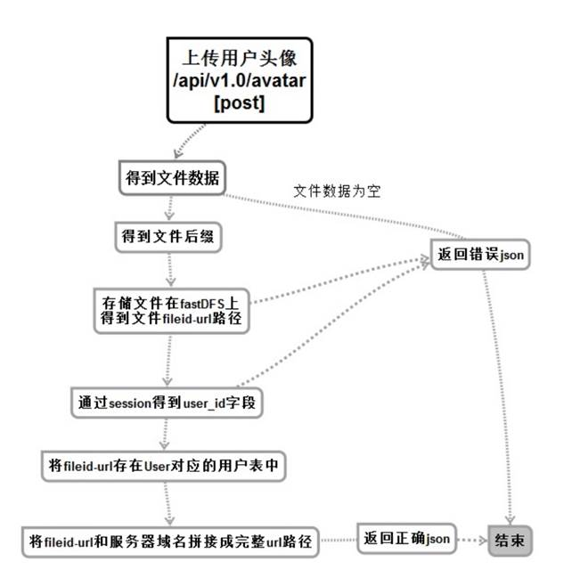
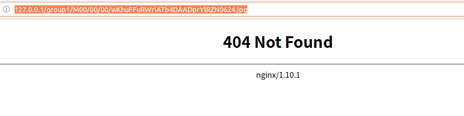

# 10 上传用户头像

发送（上传）用户头像服务（用户相关）


## 流程与接口




```json
#Request:
method: POST
url:api/v1.0/user/avatar
#data:
图片的二进制数据
#Response
#返回成功：
{
  "errno": "0",
  "errmsg": "成功",
  "data": {
    "avatar_url": "http://101.200.170.171:9998/group1/M00/00/00/Zciqq1n6_L-AOB04AADexS5wJKs662.png" //图片地址需要进行拼接
  } 

}
#返回失败：
{
    "errno": "400x",   //状态码
    "errmsg":"状态错误信息"
}
```

fastdfs操纵函数

```go
package models

import (
	"github.com/weilaihui/fdfs_client"
	"github.com/astaxie/beego"
)

//通过文件名的方式进行上传
func UploadByFilename( filename string)(GroupName,RemoteFileId string ,err error ) {
	//通过配置文件创建fdfs操作句柄
	fdfsClient, thiserr :=fdfs_client.NewFdfsClient("/home/itcast/go/src/go-1/homeweb/conf/client.conf")
	if thiserr  !=nil{
		//说一下那里出问题了
		beego.Info("UploadByFilename( ) fdfs_client.NewFdfsClient  err",err)
		GroupName = ""
		RemoteFileId = ""
		err = thiserr
		return
	}

	//unc (this *FdfsClient) UploadByFilename(filename string) (*UploadFileResponse, error)
	//通过句柄上传文件（被上传的文件）

	uploadResponse, thiserr := fdfsClient.UploadByFilename(filename)
	if thiserr !=nil{
		beego.Info("UploadByFilename( ) fdfsClient.UploadByFilename(filename)  err",err)
		GroupName = ""
		RemoteFileId = ""
		err = thiserr
		return
	}

	beego.Info(uploadResponse.GroupName)
	beego.Info(uploadResponse.RemoteFileId)
	//回传
	return  uploadResponse.GroupName , uploadResponse.RemoteFileId ,nil

}


//功能函数 操作fdfs上传二进制文件
func UploadByBuffer(filebuffer []byte, fileExtName string)(GroupName,RemoteFileId string ,err error ){

	//通过配置文件创建fdfs操作句柄
	fdfsClient, thiserr :=fdfs_client.NewFdfsClient("/home/itcast/go/src/go-1/homeweb/conf/client.conf")
	if thiserr  !=nil{
		beego.Info("UploadByBuffer( ) fdfs_client.NewFdfsClient  err",err)
		GroupName = ""
		RemoteFileId = ""
		err = thiserr
		return
	}

	//通过句柄上传二进制的文件
	uploadResponse, thiserr :=fdfsClient.UploadByBuffer(filebuffer,fileExtName)
	if thiserr  !=nil{
		beego.Info("UploadByBuffer( ) fdfs_client.UploadByBuffer  err",err)
		GroupName = ""
		RemoteFileId = ""
		err = thiserr
		return
	}
	beego.Info(uploadResponse.GroupName)
	beego.Info(uploadResponse.RemoteFileId)
	//回传入
	return uploadResponse.GroupName,uploadResponse.RemoteFileId,nil

}

```


## 创建命令

```shell
$ micro new  --type "srv" sss/PostAvatar
```


proto

```protobuf
service Example {
	rpc PostAvatar(Request) returns (Response) {}
}

message Message {
	string say = 1;
}

message Request {
    //二进制图片
	bytes Avatar =1;
	//sessionid
    string Sessionid=2;
    //文件大小
    int64 filesize =3;
    //文件名字
    string filename =4 ;
}

message Response {
	//错误码
	string Errno = 1;
	//错误信息
    string Errmsg = 2;
    //回传的url
    string Avatar_url = 3;
}
```

web中添加路由

```go
//上传头像 POST
rou.POST("/api/v1.0/user/avatar",handler.PostAvatar)
```

web下handle

```go
//上传用户头像 PostAvatar
func PostAvatar(w http.ResponseWriter, r *http.Request,_ httprouter.Params) {
	beego.Info("上传用户头像 PostAvatar /api/v1.0/user/avatar")

	//创建服务
	service := grpc.NewService()
	service.Init()

	//创建句柄
	exampleClient := POSTAVATAR.NewExampleService("go.micro.srv.PostAvatar", service.Client())

	//查看登陆信息
	userlogin,err:=r.Cookie("userlogin")

	//如果没有登陆就返回错误
	if err != nil{
		resp := map[string]interface{}{
			"errno": utils.RECODE_SESSIONERR,
			"errmsg": utils.RecodeText(utils.RECODE_SESSIONERR),
		}

		w.Header().Set("Content-Type", "application/json")
		// encode and write the response as json
		if err := json.NewEncoder(w).Encode(resp); err != nil {
			http.Error(w, err.Error(), 503)
			beego.Info(err)
			return
		}
		return
	}

	//接收前端发送过来的文集
	file,hander,err:=r.FormFile("avatar")

	//判断是否接受成功
	if err != nil{
		beego.Info("Postupavatar   c.GetFile(avatar) err" ,err)

		resp := map[string]interface{}{
			"errno": utils.RECODE_IOERR,
			"errmsg": utils.RecodeText(utils.RECODE_IOERR),
		}
		w.Header().Set("Content-Type", "application/json")
		// encode and write the response as json
		if err := json.NewEncoder(w).Encode(resp); err != nil {
			http.Error(w, err.Error(), 503)
			beego.Info(err)
			return
		}
		return
	}
	//打印基本信息
	beego.Info(file ,hander)
	beego.Info("文件大小",hander.Size)
	beego.Info("文件名",hander.Filename)

	//二进制的空间用来存储文件
	filebuffer:= make([]byte,hander.Size)

	//将文件读取到filebuffer里
	_,err = file.Read(filebuffer)
	if err !=nil{
		beego.Info("Postupavatar   file.Read(filebuffer) err" ,err)
		resp := map[string]interface{}{
			"errno": utils.RECODE_IOERR,
			"errmsg": utils.RecodeText(utils.RECODE_IOERR),
		}
		w.Header().Set("Content-Type", "application/json")
		// encode and write the response as json
		if err := json.NewEncoder(w).Encode(resp); err != nil {
			http.Error(w, err.Error(), 503)
			beego.Info(err)
			return
		}
		return
	}
	//调用函数传入数据
	rsp, err := exampleClient.PostAvatar(context.TODO(),&POSTAVATAR.Request{
		Sessionid:userlogin.Value,
		Filename:hander.Filename,
		Filesize:hander.Size,
		Avatar:filebuffer,
	})
	if err != nil {
		http.Error(w, err.Error(), 502)

		beego.Info(err)
		//beego.Debug(err)
		return
	}
	//

	//准备回传数据空间
	data := make(map[string]interface{})
	//url拼接然回回传数据
	data["avatar_url"]=utils.AddDomain2Url(rsp.AvatarUrl)


	resp := map[string]interface{}{
		"errno": rsp.Errno,
		"errmsg": rsp.Errmsg,
		"data":data,
	}

	w.Header().Set("Content-Type", "application/json")

	// encode and write the response as json
	if err := json.NewEncoder(w).Encode(resp); err != nil {
		http.Error(w, err.Error(), 503)
		beego.Info(err)
		return
	}


	return
}
```

服务端

```go
// Call is a single request handler called via client.Call or the generated client code
func (e *Example) PostAvatar(ctx context.Context, req *example.Request, rsp *example.Response) error {
	beego.Info("上传用户头像 PostAvatar /api/v1.0/user/avatar")
	//初始化返回正确的返回值
	rsp.Errno = utils.RECODE_OK
	rsp.Errmsg = utils.RecodeText(rsp.Errno)

	//检查下数据是否正常
	beego.Info(len(req.Avatar),req.Filesize)


	/*获取文件的后缀名*/     //dsnlkjfajadskfksda.sadsdasd.sdasd.jpg
	beego.Info("后缀名",path.Ext(req.Filename))

	/*存储文件到fastdfs当中并且获取 url*/
	//.jpg
	fileext :=path.Ext(req.Filename)
	//group1 group1/M00/00/00/wKgLg1t08pmANXH1AAaInSze-cQ589.jpg
	//上传数据
	Group,FileId ,err :=  models.UploadByBuffer(req.Avatar,fileext[1:])
	if err != nil {
		beego.Info("Postupavatar  models.UploadByBuffer err" ,err)
		rsp.Errno = utils.RECODE_IOERR
		rsp.Errmsg = utils.RecodeText(rsp.Errno)
		return nil
	}
	beego.Info(Group)

	/*通过session 获取我们当前现在用户的uesr_id*/
	redis_config_map := map[string]string{
		"key":utils.G_server_name,
		//"conn":"127.0.0.1:6379",
		"conn":utils.G_redis_addr+":"+utils.G_redis_port,
		"dbNum":utils.G_redis_dbnum,
	}
	beego.Info(redis_config_map)
	redis_config ,_:=json.Marshal(redis_config_map)
	beego.Info( string(redis_config) )
	//连接redis数据库 创建句柄
	bm, err := cache.NewCache("redis", string(redis_config) )
	if err != nil {
		beego.Info("缓存创建失败",err)
		rsp.Errno  =  utils.RECODE_DBERR
		rsp.Errmsg  = utils.RecodeText(rsp.Errno)
		return  nil
	}
	//拼接key
	sessioniduserid :=  req.Sessionid + "user_id"

	//获得当前用户的userid
	value_id :=bm.Get(sessioniduserid)
	beego.Info(value_id,reflect.TypeOf(value_id))


	id :=  int(value_id.([]uint8)[0])
	beego.Info(id ,reflect.TypeOf(id))

	//创建表对象
	user := models.User{Id:id,Avatar_url:FileId}
	/*将当前fastdfs-url 存储到我们当前用户的表中*/
	o:=orm.NewOrm()
	//将图片的地址存入表中
	_ ,err =o.Update(&user ,"avatar_url")
	if err !=nil {

		rsp.Errno = utils.RECODE_DBERR
		rsp.Errmsg = utils.RecodeText(rsp.Errno)

	}

	//回传图片地址
	rsp.AvatarUrl=FileId

	return nil
}
```


## 使用fastdfs+nginx

### fastdfs安装

```shell
#安装libevent
#解压 
$ tar zxvf libevent-2.1.8-stable.tar.gz 
$ cd libevent-2.1.8-stable/
#检查 
$ ./configure
#编译
$ make 
#安装
$ sudo make install
#检查安装是否成功 
$ ls -al /usr/local/lib/ | grep libevent
#防止在系统默认路径下 找不到库文件
$ sudo ln -s /usr/local/lib/libevent-2.1.so.6 /usr/lib/libevent-2.1.so.6

#安装libfastcommon
$ unzip libfastcommon-1.36.zip 
$ cd libfastcommon-master/
$ ./make.sh
$ sudo ./make.sh install

#安装fastdfs
#解压
$ tar -zxvf fastdfs-5.10.tar.gz 
$ cd fastdfs-5.10/
#编译
$ ./make.sh 
#安装
$ sudo ./make.sh install 
#验证
$ ls -al /usr/bin/fdfs*
$ fdfs_test
```

### 配置 fastdfs

```shell
#默认的配置文件地址在/etc/fdfs下
#因为我们的项目需要
#所以我们需要将配置文件拷贝到我们的conf文件夹下进配置
$ cd /etc/fdfs
$ cp  client.conf.sample  storage.conf.sample  tracker.conf.sample $GOPATH/src/sss/Ihomeweb/conf
#将配置文件的名字进行下修改
#客户端
$ mv client.conf.sample  client.conf
#存储文件
$ mv storage.conf.sample  storage.conf
#跟踪器
$ mv tracker.conf.sample  tracker.conf
#准备文件夹在项目下创建文件夹
$ cd /home/itcast/go/src/sss
$ mkdir fastdfs 
#在fastdfs下创建四个文件夹 
$ cd fastdfs
$ mkdir tracker client storage storage_data

##配置tracker.conf
#6行的ip地址设置
# bind an address of this host
# empty for bind all addresses of this host
bind_addr=192.168.110.123（需要配置的ip）

#21行的的log日志设置
# the base path to store data and log files
base_path=/home/itcast/go/src/sss/fastdfs/tracker（log目录）

##配置storage.conf
#13行配置ip
# bind an address of this host
# empty for bind all addresses of this host
bind_addr=192.168.110.123
#40行的log日志设置
# the base path to store data and log files
base_path=/home/itcast/go/src/sss/fastdfs/storage（log目录）

#107行的文件存放设置
# store_path#, based 0, if store_path0 not exists, it's value is base_path
# the paths must be exist
store_path0=/home/itcast/go/src/sss/fastdfs/storage_data（文件存放路径）
#store_path1=/home/yuqing/fastdfs2

#116行tracker的ip地址
# tracker_server can ocur more than once, and tracker_server format is
#  "host:port", host can be hostname or ip address
tracker_server=192.168.110.7:22122

##配置client.conf日志
#9行的log日志地址
# the base path to store log files
base_path=/home/itcast/go/src/sss/fastdfs/client（log目录）
#12行追踪器的ip
# tracker_server can ocur more than once, and tracker_server format is
#  "host:port", host can be hostname or ip address
tracker_server=192.168.110.123:22122

更新项目目录下的的setup_server.sh文件
#启动redis服务
redis-server ./conf/redis.conf

#启动trackerd

fdfs_trackerd  /home/itcast/go/src/sss/homeweb/conf/tracker.conf restart
#启动storaged

fdfs_storaged  /home/itcast/go/src/sss/homeweb/conf/storage.conf restart

我们先测试下 
Fdfs_upload_file ./conf/client.conf cj.jpg

```


### 安装步骤nginx操作fast步骤

#### 关于nginx操作fastdfs的插件

```shell
#将事先准备好的fastdfs的插件拷贝到ubuntu中
#解压nginx关于fastdfs的插件
$ tar -zxvf fastdfs-nginx-module_v1.16.tar.gz 
#查看当前目录下存在两个解压好的文件
$ ls
fastdfs-nginx-module    nginx-1.10.1  
#进入fastdfs-nginx-module
$ cd fastdfs-nginx-module
#查看当前文件夹下文件
$ tree
.
├── HISTORY
├── INSTALL
└── src
    ├── common.c
    ├── common.h
    ├── config
    ├── mod_fastdfs.conf
    └── ngx_http_fastdfs_module.c
#查看INSTALL文件
$ vim INSTALL
```

#### 关于fastdfs插件的安装介绍

```
版权所有 2010开心鱼 / 余庆
这个软件只能在GNU通用条款下被复制
公共许可证V3，请访问FastDFS主页以获得更多详细信息。
英语:http://english.csource.org/
中文:http://www.csource.org/

#步骤1.首先安装FastDFS存储服务器和客户端库，
FastDFS版本应该是>= 2.09。下载地址:
https://code.google.com/p/fastdfs/downloads/list

#步骤2.安装nginx服务器
FastDFS nginx模块测试通过nginx 0.8.53，
我的nginx安装在/usr/local/nginx

#步骤3.下载FastDFS nginx模块源代码包并解压，如:
tar xzf fastdfs_nginx_module_v1.16.tar.gz

#步骤4.输入nginx源目录，编译并安装模块，如:
cd nginx-1.5.12
./configure --add-module=/home/yuqing/fastdfs-nginx-module/src
make; make install

注意:在编译之前，你可以更改FDFS_OUTPUT_CHUNK_SIZE和
FDFS_MOD_CONF_FILENAME的宏定义在配置文件中:

CFLAGS="$CFLAGS -D_FILE_OFFSET_BITS=64 -DFDFS_OUTPUT_CHUNK_SIZE='256*1024' -DFDFS_MOD_CONF_FILENAME='\"/etc/fdfs/mod_fastdfs.conf\"'"


#步骤5.配置nginx配置文件，例如nginx.conf，添加以下行:

        location /M00 {
            root /home/yuqing/fastdfs/data;
            ngx_fastdfs_module;
        }

#步骤6.将一个符号链接${fastdfs_base_path}/data/M00到${fastdfs_base_path}/data，

命令行，例如:
ln -s /home/yuqing/fast /data/ home/yuqing/fast /data/ m00

#步骤7.更改配置文件/etc/fdfs/mod_fastdfs.conf，更多细节请看

#步骤8.重新启动nginx服务器，例如:
/usr/local/nginx/sbin/nginx -s stop; /usr/local/nginx/sbin/nginx
```

#### 修改fastdfs插件安装的配置文件

```shell
#进入到插件的src目录下
$ cd/home/itcast/ffdfs/fastdfs-nginx-module/src
#修改config配置文件
$ vi config
CORE_INCS="$CORE_INCS /usr/local/include/fastdfs /usr/local/include/fastcommon/" 
#修改为:
CORE_INCS="$CORE_INCS /usr/include/fastdfs /usr/include/fastcommon/"
```


#### nginx的安装依赖

```shell
#讲准备好的依赖文件拷贝到ubuntu中
#依次解压依赖
$ tar -zxvf openssl-1.0.1t.tar.gz 
$ tar -zxvf zlib-1.2.11.tar.gz
$ tar -jxvf pcre-8.40.tar.bz2 
 

#进入openssl-1.0.1t
$ cd openssl-1.0.1t
#检查
$ sudo ./config
#编译
$ sudo make
#安装
$ sudo make install

#进入zlib-1.2.11
$ cd zlib-1.2.11
#检查
$ sudo ./configure
#编译
$ sudo make
#安装
$ sudo make install

#进入pcre-8.40
$ cd pcre-8.40
#检查
$ sudo ./configure
#编译
$ sudo make
#安装
$ sudo make install
```


#### nginx正规联合编译方法

```shell
#将事先准备好的nginx安装包拷贝到ubuntu中 
#解压nginx压缩包
$ tar -zxvf nginx-1.10.1.tar.gz 
#进入nginx
$ cd /home/itcast/ffdfs/nginx-1.10.1
#进行nginx和fastdfs插件的联合编译
#检查
$ ./configure --with-openssl=openssl源码目录 --with-pcre=pcre的源码目录 --with-zlib=zlib  --add-module=插件src目录

$ ./configure --with-openssl=/home/itcast/openssl-1.0.1t --with-pcre=/home/itcast/pcre-8.40 --with-zlib=/home/itcast/zlib-1.2.11 --with-http_ssl_module  --add-module=/home/itcast/fastdfs-nginx-module_v1.16/fastdfs-nginx-module/src 
#编译
$ make
#安装
$ make install
#创建软连接方便调用
$ ln -s /usr/local/nginx/sbin/nginx /usr/bin/nginx
```


##### 注意1：找不到sha1的库

```
#在nginx 下执行 ./configure后最近结果显示会出现如下问题
sha1 library is not found
#找不到sha1的库
#configure的时候增加参数 --with-http_ssl_module
```

##### 注意2：编译异常

```shell
#在 make时出现如下问题
src/core/ngx_murmurhash.c: In function ‘ngx_murmur_hash2’:
src/core/ngx_murmurhash.c:37:11: error: this statement may fall through [-Werror=implicit-fallthrough=]
         h ^= data[2] << 16;
         ~~^~~~~~~~~~~~~~~~
src/core/ngx_murmurhash.c:38:5: note: here
     case 2:
     ^~~~
src/core/ngx_murmurhash.c:39:11: error: this statement may fall through [-Werror=implicit-fallthrough=]
         h ^= data[1] << 8;
         ~~^~~~~~~~~~~~~~~
src/core/ngx_murmurhash.c:40:5: note: here
     case 1:
     ^~~~
cc1: all warnings being treated as errors
objs/Makefile:485: recipe for target 'objs/src/core/ngx_murmurhash.o' failed
make[1]: *** [objs/src/core/ngx_murmurhash.o] Error 1
make[1]: 离开目录“/home/itcast/ffdfs/nginx-1.10.1”
Makefile:8: recipe for target 'build' failed
make: *** [build] Error 2

#主要原因是 Makefile 里面  gcc 的参数多了一个"-Werror"
#进入到/home/itcast/ffdfs/nginx-1.10.1/objs中修改Makefile
vim Makefile 
#删除"-Werror"得到如下内容
CFLAGS =  -pipe  -O -W -Wall -Wpointer-arith -Wno-unused  -g  -D_FILE_OFFSET_BITS=64 -DFDFS_OUTPUT_CHUNK_SIZE='256*1024' -DFDFS_MOD_CONF_FILENAME='"/etc/fdfs/mod_fastdfs.conf"'

```

##### 注意3：插件配置文件不存在

```shell
#联合编译安装好nginx后启动nginx如下效果发现只有1个进程
$ nginx 
$ ps aux|grep nginx
ps aux |grep nginx 
root  105455 cd 
#查看 /usr/local/nginx/logs 目录下的日志 
$ cat /usr/local/nginx/logs/error.log
#发现这样一条错误
ERROR - file: shared_func.c, line: 968, file /etc/fdfs/mod_fastdfs.conf not exist
错误 - 文件 :shared_func.c 968行 访问 /etc/fdfs/mod_fastdfs.conf 不存在 

#确认下文件是否存在
$ cd /etc/fdfs/
$ ls
client.conf.sample  storage.conf.sample  storage_ids.conf.sample  tracker.conf.sample
#确实不存在

#解决
#需要从fastdfs源码目录中复制过来
$ cd /home/itcast/ffdfs/fastdfs-nginx-module/src
#将mod_fastdfs.conf 文件从当前目录下拷贝到/etc/fdfs/目录下
$ sudo cp /home/itcast/ffdfs/fastdfs-nginx-module/src/mod_fastdfs.conf /etc/fdfs/
```


##### 注意4：配置文件修改

```shell
#修改fastdfs插件的配置文件进行修改，参数当前存储节点的storage.conf进行修改
#进入到/etc/fdfs/目录
$ cd /etc/fdfs/
#编辑 mod_fastdfs.conf 文件
$ sudo vim mod_fastdfs.conf

# 存储log日志的目录
 9 # the base path to store log files
 10 base_path=/home/itcast/go/src/sss/fastdfs/storage
# 追踪器的地址信息
 37 # FastDFS tracker_server can ocur more than once, and tracker_server format is
 38 #  "host:port", host can be hostname or ip address
 39 # valid only when load_fdfs_parameters_from_tracker is true
 40 tracker_server=192.168.110.20:22122
# 当前存储节点监听的端口
 42 # the port of the local storage server
 43 # the default value is 23000
 44 storage_server_port=23000
 # 当前存储节点所属的组
 46 # the group name of the local storage server
 47 group_name=group1
# 客户端访问的url中是不是出现组名
 49 # if the url / uri including the group name
 50 # set to false when uri like /M00/00/00/xxx
 51 # set to true when uri like ${group_name}/M00/00/00/xxx, such as group1/M00/xxx
 52 # default value is false
 53 url_have_group_name = true
 # 当前存储节点存储路径的个数 参照 storage.conf
 55 # path(disk or mount point) count, default value is 1
 56 # must same as storage.conf
 57 store_path_count=1
# 详细的存储路径
 59 # store_path#, based 0, if store_path0 not exists, it's value is base_path
 60 # the paths must be exist
 61 # must same as storage.conf
 62 store_path0=/home/itcast/go/src/sss/fastdfs/storage_data


#完成修改后再次启动nginx 依然是1个nginx进程
$ sudo nginx 
$ ps aux |grep nginx 
root  106838  0.0  0.0 31384   764 ?    Ss 22:09   0:00 nginx: master process nginx
itcast 106841 0.0  0.0 21536  1048 pts/15  S+ 22:09   0:00 grep --color=auto nginx
#查看日志
$ cat /usr/local/nginx/logs/error.log
#发现新的错误
ERROR - file: ini_file_reader.c, line: 631, include file "http.conf" not exists, line: "#include http.conf"
#那么说明我们的配置文件就改好了
```

##### 注意5：新的错误

```shell
#上面我们查看了新的日志发现了新的错误
ERROR - file: ini_file_reader.c, line: 631, include file "http.conf" not exists, line: "#include http.conf"
#错误 -文件 ：ini_file_reader.c 的第631行 导入文件的 http.conf 不存在
	- 原因是从/etc/fdfs下加载该http.conf文件没找到
	- 从fastdfs的源码安装目录中找
	- fastdfs源码安装目录/conf/http.conf
	- cp fastdfs源码安装目录/conf/http.conf /etc/fdfs
$ sudo cp ./http.conf /etc/fdfs/
#进入etc下验证是否成功
$ cd /etc/fdfs/
$ ls
client.conf.sample  http.conf  mod_fastdfs.conf  storage.conf.sample  storage_ids.conf.sample  tracker.conf.sample
#停掉之前启动的nginx
$ sudo nginx -s stop 
#查看是否停止
$ ps aux |grep nginx 
itcast 107419 0.0 0.0 21536 1040 pts/15 S+ 09:36  0:00 grep --color=auto nginx
#启动新的nginx
$ sudo nginx 
#查看还是1个线程
$ ps aux |grep nginx 
root   107422 0.0 0.0 31384  760 ?      Ss  09:36  0:00 nginx: master process nginx
itcast 107425 0.0 0.0 21536 1048 pts/15 S+  09:36  0:00 grep --color=auto nginx

#发现还是有错误所以我们再次查看日志
$ cat /usr/local/nginx/logs/error.log

#又一次出现了新的错误
ERROR - file: shared_func.c, line: 968, file /etc/fdfs/mime.types not exist
#说明我们http.conf的错误已经解决了
```

##### 注意6：找不到文件

```SHELL
#ERROR - file: shared_func.c, line: 968, file /etc/fdfs/mime.types not exist
#错误 - file ： shared_func.c 文件的 第968 行 不能找到 /etc/fdfs/mime.types
- 从nginx的源码安装目录中找
- nginx源码安装目录/conf/mime.types
- cp nginx源码安装目录/conf/mime.types /etc/fdfs
#找到nginx源码安装目录的文件
$ cd /home/itcast/ffdfs/nginx-1.10.1/conf
$ ls
fastcgi.conf  fastcgi_params  koi-utf  koi-win  mime.types  nginx.conf  scgi_params  uwsgi_params  win-utf
#发现文件存在后将其拷贝到/etc/fdfs
$ sudo cp ./mime.types  /etc/fdfs/

#再次验证是否成功
#停掉之前启动的nginx
$ sudo nginx -s stop 
#查看是否停止
$ ps aux |grep nginx 
itcast 107488 0.0 0.0 21536 1092 pts/15  S+  09:52  0:00 grep --color=auto nginx
#启动nginx
$ sudo nginx
itcast@itcast-virtual-machine:~/ffdfs/nginx-1.10.1/conf$ ps aux |grep nginx 
root   107491 0.0  0.0 31384   764 ?     Ss  09:53  0:00 nginx: master process nginx
nobody 107492 0.0  0.0 36212  4016 ?      S   09:53  0:00 nginx: worker process
itcast 107494 0.0  0.0 21536  1152 pts/15 S+  09:53  0:00 grep --color=auto nginx
#发现已经出现了worker的进程说明我们的nginx安装环境算是成功了
```


##### 注意7：可能出现的问题

```shell
#可能出现的问题
line: 177, "Permission denied" can't be accessed
#没有权限访问
    - 修改nginx.conf, 将worker进程的所有者改为root
    - user root;
```

#### 修改nginx的访问配置文件

```shell
#我们在虚拟机中访问我们的资源图片
http://127.0.0.1/group1/M00/00/00/wKhuFFuRWriATb4DAADprYlRZN0624.jpg
#会出现如下效果
```





```shell
#此时我们需要再次访问我们的日志文件
$ cat /usr/local/nginx/logs/error.log
# open() "/usr/local/nginx/html/group1/M00/00/00/wKhuFFuRWriATb4DAADprYlRZN0624.jpg" failed (2: No such file or directory), client: 127.0.0.1, server: localhost, request: "GET /group1/M00/00/00/wKhuFFuRWriATb4DAADprYlRZN0624.jpg HTTP/1.1", host: "127.0.0.1"
#打开图片文件失败（没有这样的文件或者是目录） 客户端是 127.0.0.1 服务器是localhost 
#发送请求"GET /group1/M00/00/00/wKhuFFuRWriATb4DAADprYlRZN0624.jpg HTTP/1.1" 
#主机127.0.0.1
#为什么是404？
#nginx在解析客户端请求的时查找的资源目录是不对的，所以找不到我们想要的文件 
#所以我们需要给nginx制定争取的目录

#nginx 处理 http://127.0.0.1/group1/M00/00/00/wKhuFFuRWriATb4DAADprYlRZN0624.jpg
#去掉ip与文件名，得到 /group1/M00/00/00/

#需要给修改nginx的配置文件添加location处理指令	
	location /group1/M00/00/00/
	{
		# 指定正确的资源路径
        root /root/fdfs/storage/data; // M00映射的实际路径
        ngx_fastdfs_module; # 添加nginx对fastdfs模块的调用
	}
	
	
	
#进入nginx的配置文件目录下
$ cd /usr/local/nginx/conf
#备份 nginx.conf
$ sudo cp nginx.conf nginx.conf.old
#编辑nginx.conf
$ sudo vim nginx.conf 
#修改内容为
	listen       8888;
    server_name  localhost;
    #location  /group1/M00/ {
    location  ~/group([0-9])/M00 {
    #正确的数据路径
        root   /home/itcast/go/src/sss/fastdfs/storage_data/data;
        ngx_fastdfs_module; # 添加nginx对fastdfs模块的调用
    }


#修改好文件之后加载文件则会出现1个新的进程就是这个插件的进程
$ sudo nginx -s reload
[sudo] itcast 的密码： 
ngx_http_fastdfs_set pid=107791
#修改app.conf文件添加配置信息

#成功之后我们再次访问图片
http://127.0.0.1:8888/group1/M00/00/00/wKhuFFuRWriATb4DAADprYlRZN0624.jpg
#会出现以下效果
```


## go操作fastdfs

安装库

```shell
go get github.com/weilaihui/fdfs_client
```

在models中创建fastdfs_client.go

```go
package models

import (
	"github.com/weilaihui/fdfs_client"
	"github.com/astaxie/beego"
)


//通过文件名的方式进行上传
func UploadByFilename( filename string)(GroupName,RemoteFileId string ,err error ) {
	//通过配置文件创建fdfs操作句柄
	fdfsClient, thiserr :=fdfs_client.NewFdfsClient("/home/itcast/go/srcsss/homeweb/conf/client.conf")
	if thiserr  !=nil{
		//说一下那里出问题了
		beego.Info("UploadByFilename( ) fdfs_client.NewFdfsClient  err",err)
		GroupName = ""
		RemoteFileId = ""
		err = thiserr
		return
	}

	//unc (this *FdfsClient) UploadByFilename(filename string) (*UploadFileResponse, error)
	//通过句柄上传文件（被上传的文件）

	uploadResponse, thiserr := fdfsClient.UploadByFilename(filename)
	if thiserr !=nil{
		beego.Info("UploadByFilename( ) fdfsClient.UploadByFilename(filename)  err",err)
		GroupName = ""
		RemoteFileId = ""
		err = thiserr
		return
	}

	beego.Info(uploadResponse.GroupName)
	beego.Info(uploadResponse.RemoteFileId)
	//回传
	return  uploadResponse.GroupName , uploadResponse.RemoteFileId ,nil

}

//功能函数 操作fdfs上传二进制文件
func UploadByBuffer(filebuffer []byte, fileExtName string)(GroupName,RemoteFileId string ,err error ){

	//通过配置文件创建fdfs操作句柄
	fdfsClient, thiserr :=fdfs_client.NewFdfsClient("/home/itcast/go/src/sss/homeweb/conf/client.conf")
	if thiserr  !=nil{
		beego.Info("UploadByBuffer( ) fdfs_client.NewFdfsClient  err",err)
		GroupName = ""
		RemoteFileId = ""
		err = thiserr
		return
	}

	//通过句柄上传二进制的文件
	uploadResponse, thiserr :=fdfsClient.UploadByBuffer(filebuffer,fileExtName)
	if thiserr  !=nil{
		beego.Info("UploadByBuffer( ) fdfs_client.UploadByBuffer  err",err)
		GroupName = ""
		RemoteFileId = ""
		err = thiserr
		return
	}
	beego.Info(uploadResponse.GroupName)
	beego.Info(uploadResponse.RemoteFileId)
	//回传
	return uploadResponse.GroupName,uploadResponse.RemoteFileId,nil

}
```

