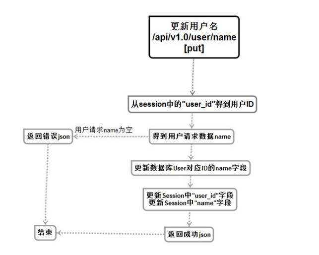

# 11 更新用户名

更新用户名服务（用户相关）


## 流程与接口



```json
#Request:
method: PUT
url:api/v1.0/user/name
#data:
{
 "name":"panda"
}
#Response
#返回成功：
{
  "errno": "0",
  "errmsg": "成功",
  "data": {
    "name": "Panda"
  }
}

#返回失败：
{
    "errno": "400x",   //状态码
    "errmsg":"状态错误信息"
}
```

## 创建命令

```shell
$ micro new --type "srv" sss/PutUserInfo
```


proto

```protobuf
service Example {
	rpc PutUserInfo(Request) returns (Response) {}
	rpc Stream(StreamingRequest) returns (stream StreamingResponse) {}
	rpc PingPong(stream Ping) returns (stream Pong) {}
}

message Message {
	string say = 1;
}

message Request {
	string Sessionid=1;
    string Username = 2 ;
}

message Response {
	string Errno = 1;
    string Errmsg = 2;
    string Username = 3;
}

```


web中添加路由

```go
//请求更新用户名 PUT
rou.PUT("/api/v1.0/user/name",handler.PutUserInfo)
```


web中的handler添加函数

```go
//更新用户名//PutUserInfo
func PutUserInfo(w http.ResponseWriter, r *http.Request,_ httprouter.Params) {
	beego.Info(" 更新用户名 Putuserinfo /api/v1.0/user/name")
	//创建服务
	service := grpc.NewService()
	service.Init()
	// 接收前端发送内容
	var request map[string]interface{}
	if err := json.NewDecoder(r.Body).Decode(&request); err != nil {
		http.Error(w, err.Error(), 500)
		return
	}

	// 调用服务
	exampleClient := PUTUSERINFO.NewExampleService("go.micro.srv.PutUserInfo", service.Client())

	//获取用户登陆信息
	userlogin,err:=r.Cookie("userlogin")
	if err != nil{
		resp := map[string]interface{}{
			"errno": utils.RECODE_SESSIONERR,
			"errmsg": utils.RecodeText(utils.RECODE_SESSIONERR),
		}

		w.Header().Set("Content-Type", "application/json")
		// encode and write the response as json
		if err := json.NewEncoder(w).Encode(resp); err != nil {
			http.Error(w, err.Error(), 503)
			beego.Info(err)
			return
		}
		return
	}


	rsp, err := exampleClient.PutUserInfo(context.TODO(), &PUTUSERINFO.Request{
		Sessionid:userlogin.Value,
		Username:request["name"].(string),
	})
	if err != nil {
		http.Error(w, err.Error(), 500)
		return
	}

	//接收回发数据
	data := make(map[string]interface{})
	data["name"]=rsp.Username


	response := map[string]interface{}{
		"errno": rsp.Errno,
		"errmsg": rsp.Errmsg,
		"data":data,
	}
	w.Header().Set("Content-Type", "application/json")

	// 返回前端
	if err := json.NewEncoder(w).Encode(response); err != nil {
		http.Error(w, err.Error(), 501)
		return
	}
}

```

服务端

```go
func (e *Example) PutUserInfo(ctx context.Context, req *example.Request, rsp *example.Response) error {

	//打印被调用的函数
	beego.Info("---------------- PUT  /api/v1.0/user/name PutUersinfo() ------------------")

	//创建返回空间
	rsp.Errno= utils.RECODE_OK
	rsp.Errmsg = utils.RecodeText(rsp.Errno)

	/*得到用户发送过来的name*/
	beego.Info(rsp.Username)

	/*从从sessionid获取当前的userid*/
	//连接redis
	redis_config_map := map[string]string{
		"key":utils.G_server_name,
		//"conn":"127.0.0.1:6379",
		"conn":utils.G_redis_addr+":"+utils.G_redis_port,
		"dbNum":utils.G_redis_dbnum,
	}
	beego.Info(redis_config_map)
	redis_config ,_:=json.Marshal(redis_config_map)
	beego.Info( string(redis_config) )

	//连接redis数据库 创建句柄
	bm, err := cache.NewCache("redis", string(redis_config) )
	if err != nil {
		beego.Info("缓存创建失败",err)
		rsp.Errno  =  utils.RECODE_DBERR
		rsp.Errmsg  = utils.RecodeText(rsp.Errno)
		return  nil
	}
	//拼接key
	sessioniduserid :=  req.Sessionid + "user_id"
	//获取userid
	value_id :=bm.Get(sessioniduserid)
	beego.Info(value_id,reflect.TypeOf(value_id))

	id :=  int(value_id.([]uint8)[0])
	beego.Info(id ,reflect.TypeOf(id))

	//创建表对象
	user:=models.User{Id:id,Name:req.Username}
	/*更新对应user_id的name字段的内容*/
	//创建数据库句柄
	o:= orm.NewOrm()
	//更新
	_ , err =o.Update(&user ,"name")
	if err !=nil{
		rsp.Errno= utils.RECODE_DBERR
		rsp.Errmsg = utils.RecodeText(rsp.Errno)

		return nil
	}

	/*更新session user_id*/
	sessionidname :=  req.Sessionid + "name"
	bm.Put(sessioniduserid,string(user.Id),time.Second*600)
	/*更新session name*/
	bm.Put(sessionidname,string(user.Name),time.Second*600)

	/*成功返回数据*/
	rsp.Username = user.Name
	return nil
}

```

