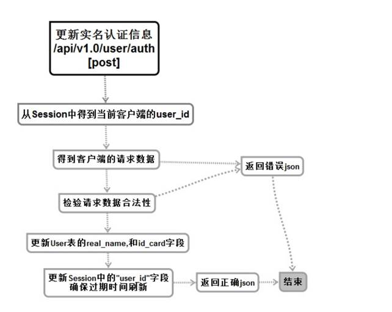

# 发送用户实名认证信息服务（认证相关）


## 流程与接口



```json
#Request:
method: POST
url:api/v1.0/user/auth
#data:
{
    real_name: "熊猫", 
    id_card: "21011223344556677"
}
#Response
#返回成功：
{
  "errno": "0",
  "errmsg": "成功"
}
#返回失败：
{
    "errno": "400x",   //状态码
    "errmsg":"状态错误信息"
}
```

## 创建命令

```shell
$ micro new –type "srv" sss/PostUserAuth
```

proto

```proto
syntax = "proto3";

package go.micro.srv.PostUserAuth;

service Example {
	rpc PostUserAuth(Request) returns (Response) {}

}


message Request {
	string real_name = 1;
	string id_card = 2;
	string sessionid = 3;
}

message Response {
	string errno = 1;
	string errmsg = 2;
}

```

web hander

```
func PostUserAuth(w http.ResponseWriter, r *http.Request , _ httprouter.Params ) {
	fmt.Println("更新实名认证检测  URL: /api/v1.0/user/auth PostUserAuth ")
	// decode the incoming request as json
	var request map[string]interface{}
	if err := json.NewDecoder(r.Body).Decode(&request); err != nil {
		http.Error(w, err.Error(), 500)
		return
	}

	fmt.Println(request["real_name"])
	fmt.Println(request["id_card"])


	//获取session
	//从cookie获取sessionid
	cookie , err:=r.Cookie("userlogin")
	if err!=nil{
		response := map[string]interface{}{
			"errno": utils.RECODE_SESSIONERR,
			"errmsg": utils.RecodeText(utils.RECODE_SESSIONERR),
		}
		w.Header().Set("Content-Type","application/json")
		// encode and write the response as json
		if err := json.NewEncoder(w).Encode(response); err != nil {
			http.Error(w, err.Error(), 500)
			return
		}

		return
	}

	client :=grpc.NewService()
	client.Init()

	// call the backend service
	exampleClient := POSTUSERAUTH.NewExampleService("go.micro.srv.PostUserAuth", client.Client())
	rsp, err := exampleClient.PostUserAuth(context.TODO(), &POSTUSERAUTH.Request{
		Sessionid:cookie.Value,
		RealName:request["real_name"].(string),
		IdCard: request["id_card"].(string),
	})
	if err != nil {
		http.Error(w, err.Error(), 500)
		return
	}

	//将sessionid设置给cookie

	cookie , err = r.Cookie("userlogin")
	if err!=nil ||""==cookie.Value{
		cookie := http.Cookie{
			Name:"userlogin",
			Value:cookie.Value,
			Path:"/",
			MaxAge:600,
		}

		http.SetCookie(w,&cookie)
	}


	// we want to augment the response
	response := map[string]interface{}{
		"errno": rsp.Errno,
		"errmsg": rsp.Errmsg,
	}
	w.Header().Set("Content-Type","application/json")
	// encode and write the response as json
	if err := json.NewEncoder(w).Encode(response); err != nil {
		http.Error(w, err.Error(), 500)
		return
	}
}


```

srv hander

```
func (e *Example) PostUserAuth(ctx context.Context, req *example.Request, rsp *example.Response) error {

	fmt.Println("更新实名认证检测  URL: /api/v1.0/user/auth PostUserAuth ")

	/*初始化返回*/
	rsp.Errno = utils.RECODE_OK
	rsp.Errmsg = utils.RecodeText(rsp.Errno)
	/*通过sessionid拼接key*/

	sessionuserid := req.Sessionid+"user_id"

	/*链接redis*/
	bm ,err:=utils.OpenRedis(utils.G_server_name,utils.G_redis_addr,utils.G_redis_port,utils.G_redis_dbnum)
	if err!=nil{
		fmt.Println("redis链接失败",err)
		rsp.Errno = utils.RECODE_DBERR
		rsp.Errmsg = utils.RecodeText(rsp.Errno)
		return nil
	}
	/*通过redis 以sessionid拼接的key来查询userid*/
	value :=bm.Get(sessionuserid)

	valueid :=int(value.([]uint8)[0])


	/*通过userid 更新user数据*/
	o:=orm.NewOrm()
	//创建数据对象
	user:=models.User{Id:valueid,Real_name:req.RealName,Id_card:req.IdCard}

	_,err=o.Update(&user,"real_name","id_card")
	if err!=nil{
		fmt.Println("数据更新失败",err)
		rsp.Errno = utils.RECODE_DBERR
		rsp.Errmsg = utils.RecodeText(rsp.Errno)
		return nil
	}


	/*更新登录时间*/

	//先删除
	/*拼接key*/
	sname:= req.Sessionid +"name"
	suserid:= req.Sessionid +"user_id"
	smobile:= req.Sessionid +"mobile"

	/*删除登录数据*/
	bm.Delete(sname)
	bm.Delete(suserid)
	bm.Delete(smobile)
	//后添加
	/*将登录信息存入 redis*/
	bm.Put(sname,string(user.Name),time.Second*600)
	bm.Put(suserid,string(user.Id),time.Second*600)
	bm.Put(smobile,string(user.Mobile),time.Second*600)


	return nil
}
```

