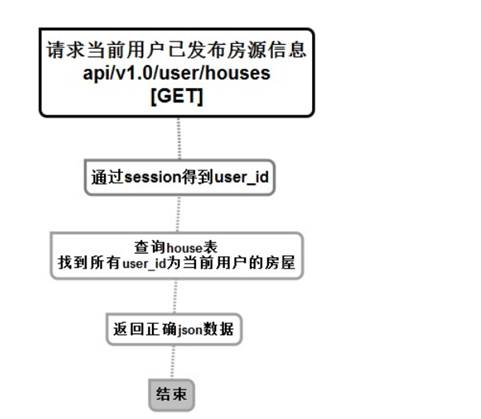
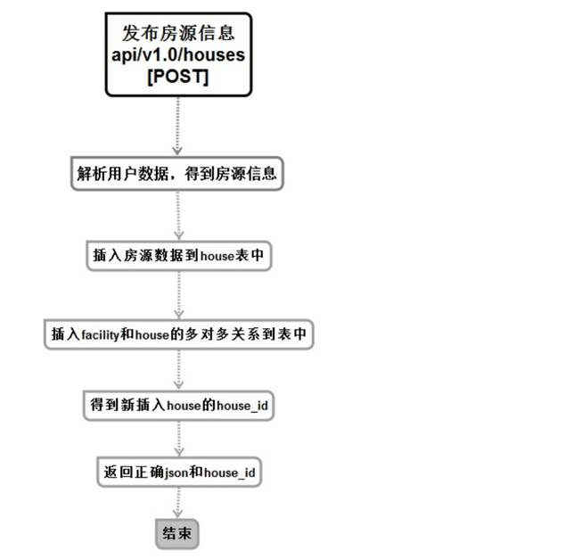
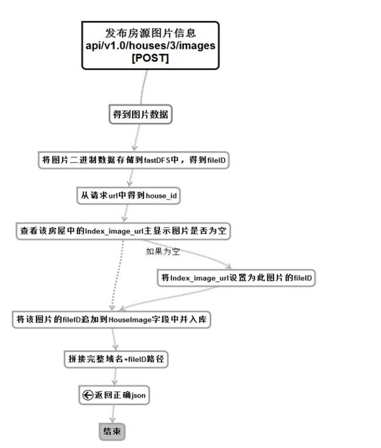
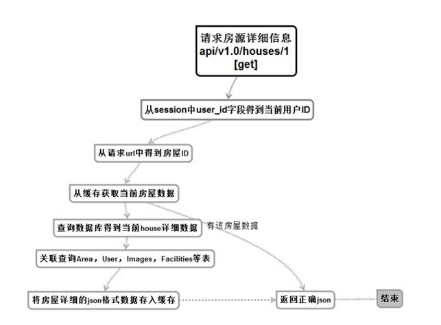
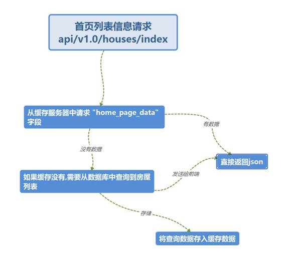
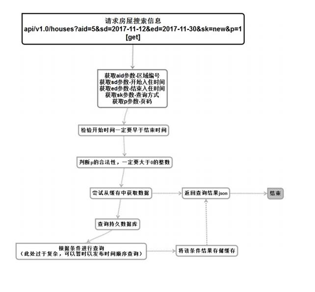
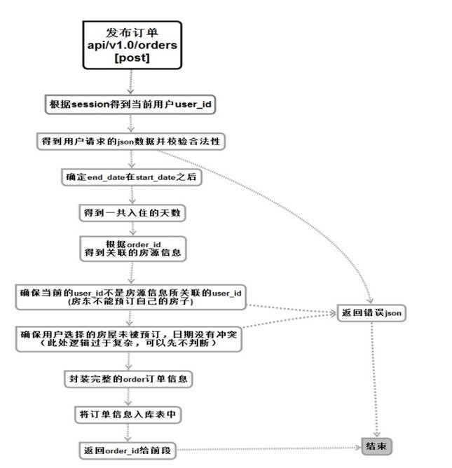
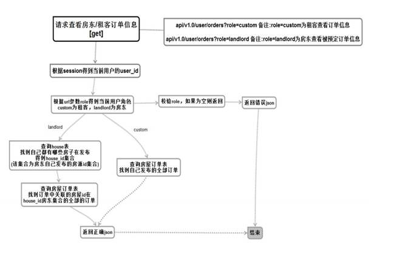
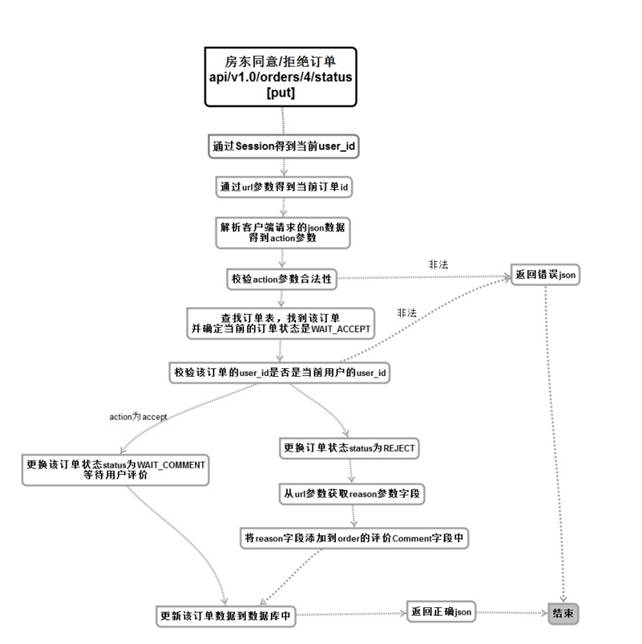
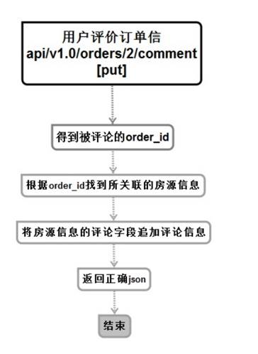

# 14 获取当前用户已发布房源信息

获取用户已发布房源信息服务（商品相关）

## 创建命令

```shell
$ micro new -type "srv" sss/GetUserHouses
```

## 流程与接口



```json
#Request:
method: GET
url:api/v1.0/user/houses
#data:
no input data
#Response
#返回成功：
{
  "errno": "0",
  "errmsg": "成功",
  "data": {
    "houses": [
      {
        "address": "西三旗桥东",
        "area_name": "昌平区",
        "ctime": "2017-11-06 11:16:24",
        "house_id": 1,
        "img_url": "http://101.200.170.171:9998/group1/M00/00/00/Zciqq1oBJY-AL3m8AAS8K2x8TDE052.jpg",
        "order_count": 0,
        "price": 100,
        "room_count": 2,
        "title": "上奥世纪中心",
        "user_avatar": "http://101.200.170.171:9998/group1/M00/00/00/Zciqq1oBLFeALIEjAADexS5wJKs340.png"
      },
      {
        "address": "北清路郑上路",
        "area_name": "顺义区",
        "ctime": "2017-11-06 11:38:54",
        "house_id": 2,
        "img_url": "http://101.200.170.171:9998/group1/M00/00/00/Zciqq1oBKtmAC8y8AAZcKg5PznU817.jpg",
        "order_count": 0,
        "price": 1000,
        "room_count": 1,
        "title": "修正大厦302教室",
        "user_avatar": "http://101.200.170.171:9998/group1/M00/00/00/Zciqq1oBLFeALIEjAADexS5wJKs340.png"
      }
    ]
  }
}

#返回失败：
{
    "errno": "400x",   //状态码
    "errmsg":"状态错误信息"
}
```


# 15 发布房源信息

发送（发布）房源信息服务（商品相关）

## 创建命令

```shell
$ micro new --type "srv" sss/PostHouses
```

## 流程与接口



```json
#Request:
method: POST
url:api/v1.0/houses
#data:
{
"title":"上奥世纪中心",
"price":"666",
"area_id":"5",
"address":"西三旗桥东建材城1号",
"room_count":"2",
"acreage":"60",
"unit":"2室1厅",
"capacity":"3",
"beds":"双人床2张",
"deposit":"200",
"min_days":"3",
"max_days":"0",
"facility":["1","2","3","7","12","14","16","17","18","21","22"]
}
#Response
#返回成功：
{
  "errno": "0",
  "errmsg": "成功"
  "data" :{
        "house_id": "1"
  }
}
#返回失败：
{
    "errno": "400x",   //状态码
    "errmsg":"状态错误信息"
}
```


# 16 上传房屋图片

发送（上传）房屋图片服务（商品相关）

## 创建命令

```shell
$ micro new --type "srv" sss/PostHousesImage
```

## 流程与接口



```json
#Request:
method: POST
#3表示房源id
url:api/v1.0/houses/3/images 
url:api/v1.0/houses/:id/images 

#data:
图片二进制数据
#Response
#返回成功：
{
  "errno": "0",
  "errmsg": "成功",
  "data": {
    "url": "http://101.200.170.171:9998/group1/M00/00/00/Zciqq1oBLmWAHlsrAAaInSze-cQ719.jpg"
  }
}
#返回失败：
{
    "errno": "400x",   //状态码
    "errmsg":"状态错误信息"
}
```


# 17 获取房源详细信息

获取房屋详细信息服务（商品相关）

## 创建命令

```shell
$ micro new --type "srv" sss/GetHouseInfo
```

## 流程与接口



```json
#Request:
method: GET
#1表示房源id
url:api/v1.0/houses/1
url:api/v1.0/houses/:id
#data:
no input data
#Response
#返回成功：
{
  "errno": "0",
  "errmsg": "成功",
  "data": {
    "house": {
      "acreage": 80,
      "address": "西三旗桥东",
      "beds": "2双人床",
      "capacity": 3,
      "comments": [
        {
          "comment": "评论的内容",
          "ctime": "2017-11-12 12:30:30",
          "user_name": "评论人的姓名"
        },
        {
          "comment": "评论的内容",
          "ctime": "2017-11-12 12:30:30",
          "user_name": "评论人的姓名"
        },
        {
          "comment": "评论的内容",
          "ctime": "2017-11-12 12:30:30",
          "user_name": "评论人的姓名"
        }
      ],
      "deposit": 200,
      "facilities": [9,11,13,16,19,20,21,23],
      "hid": 1,
      "img_urls": [
        "http://101.200.170.171:9998/group1/M00/00/00/Zciqq1oBJY-AL3m8AAS8K2x8TDE052.jpg",
        "http://101.200.170.171:9998/group1/M00/00/00/Zciqq1oBJZmAYqGWAAaInSze-cQ230.jpg"
      ],
      "max_days": 30,
      "min_days": 1,
      "price": 100,
      "room_count": 2,
      "title": "上奥世纪中心",
      "unit": "3室3厅",
      "user_avatar": "http://101.200.170.171:9998/group1/M00/00/00/Zciqq1oBLFeALIEjAADexS5wJKs340.png",
      "user_id": 1,
      "user_name": "Panda"
    },
    "user_id": 1
  }
}

#返回失败：
{
    "errno": "400x",   //状态码
    "errmsg":"状态错误信息"
}
```


# 18 获取首页动画图片

获取首页轮播图片服务（首页相关）

## 创建命令

```shell
$ micro new --type "srv" sss/GetIndex
```

## 流程与接口



```shell
#Request:
method: GET
url:api/v1.0/houses/index
#data:
no input data
#Response
#返回成功：
{
  "errno": "0",
  "errmsg": "成功",
  "data": {
        "houses": [
      {
		"house_id":    this.Id,
		"title":       this.Title,
		"price":       this.Price,
		"area_name":   this.Area.Name,
		"img_url":     utils.AddDomain2Url(this.Index_image_url),
		"room_count":  this.Room_count,
		"order_count": this.Order_count,
		"address":     this.Address,
		"user_avatar": utils.AddDomain2Url(this.User.Avatar_url),
		"ctime":       this.Ctime.Format("2006-01-02 15:04:05"),
	},
      {
		"house_id":    this.Id,
		"title":       this.Title,
		"price":       this.Price,
		"area_name":   this.Area.Name,
		"img_url":     utils.AddDomain2Url(this.Index_image_url),
		"room_count":  this.Room_count,
		"order_count": this.Order_count,
		"address":     this.Address,
		"user_avatar": utils.AddDomain2Url(this.User.Avatar_url),
		"ctime":       this.Ctime.Format("2006-01-02 15:04:05"),
	}
    ],
   
  }
}


#返回失败：
{
    "errno": "400x",   //状态码
    "errmsg":"状态错误信息"
}
```


# 19 搜索房源

获取（搜索）房源服务（商品相关）

## 创建命令

```shell
$ micro new --type "srv" sss/GetHouses
```

## 流程与接口



```json
#Request:
method: GET
#adi表示地区编号
#sd表示起始日期
#ed表示结束日期
#sk表示查询方式
#p表示页码
url:api/v1.0/houses?aid=5&sd=2017-11-12&ed=2017-11-30&sk=new&p=1
#data:
no input data
#Response
#返回成功：
{
  "errno": "0",
  "errmsg": "成功",
  "data": {
    "current_page": 1,
    "houses": [
      {
        "address": "西三旗桥东",
        "area_name": "昌平区",
        "ctime": "2017-11-06 11:16:24",
        "house_id": 1,
        "img_url": "http://101.200.170.171:9998/group1/M00/00/00/Zciqq1oBJY-AL3m8AAS8K2x8TDE052.jpg",
        "order_count": 0,
        "price": 100,
        "room_count": 2,
        "title": "上奥世纪中心13号楼",
        "user_avatar": "http://101.200.170.171:9998/group1/M00/00/00/Zciqq1oBLFeALIEjAADexS5wJKs340.png"
      },
      {
        "address": "西三旗桥东",
        "area_name": "昌平区",
        "ctime": "2017-11-06 11:16:24",
        "house_id": 1,
        "img_url": "http://101.200.170.171:9998/group1/M00/00/00/Zciqq1oBJY-AL3m8AAS8K2x8TDE052.jpg",
        "order_count": 0,
        "price": 100,
        "room_count": 2,
        "title": "上奥世纪中心18号楼",
        "user_avatar": "http://101.200.170.171:9998/group1/M00/00/00/Zciqq1oBLFeALIEjAADexS5wJKs340.png"
        }
    ],
    "total_page": 1
  }
}

#返回失败：
{
    "errno": "400x",   //状态码
    "errmsg":"状态错误信息"
}
```


# 20 发布订单

发送（发布）订单服务（订单相关）

## 创建命令

```shell
$ micro new --type "srv" sss/PostOrders
```

## 流程与接口



```json
#Request:
method: POST
url:api/v1.0/orders
#data:
{
  "house_id": "1",
  "start_date": "2017-11-11 21:23:49",
  "end_date": "2017-11-12 21:23:49",
}

#Response
#返回成功：
{
  "errno": "0",
  "errmsg": "成功",
  "data": {
    "order_id":"1"
  }
}

#返回失败：
{
    "errno": "400x",   //状态码
    "errmsg":"状态错误信息"
}
```


# 21 请求查看房东/租客订单信息

获取房东/租户订单信息服务（订单相关）

## 创建命令

```shell
$ micro new --type "srv" sss/GetUserOrder
```

## 流程与接口



```json
#Request:
method: GET
url:api/v1.0/user/orders?role=custom 备注:role=custom为租客查看订单信息
url:api/v1.0/user/orders?role=landlord 备注:role=landlord为房东查看被预定订单信息
#data:
no input data

#Response
#返回成功：
{
  "errno": "0",
  "errmsg": "成功",
  "data": {
    "orders": [
      {
        "amount": 200,
        "comment": "哈哈拒接",
        "ctime": "2017-11-11 21:23:49",
        "days": 2,
        "end_date": "2017-11-29 16:00:00",
        "img_url": "http://101.200.170.171:9998/group1/M00/00/00/Zciqq1oBJY-AL3m8AAS8K2x8TDE052.jpg",
        "order_id": 3,
        "start_date": "2017-11-28 16:00:00",
        "status": "REJECTED",//WAIT_ACCPET,WAIT_COMMENT,REJECTED,COMPLETE,CANCELED
        "title": "上奥世纪中心"
      },
      {
        "amount": 1500,
        "comment": "",
        "ctime": "2017-11-11 01:32:10",
        "days": 15,
        "end_date": "2017-11-24 16:00:00",
        "img_url": "http://101.200.170.171:9998/group1/M00/00/00/Zciqq1oBJY-AL3m8AAS8K2x8TDE052.jpg",
        "order_id": 2,
        "start_date": "2017-11-10 16:00:00",
        "status": "WAIT_COMMENT",
        "title": "上奥世纪中心"
      },
      {
        "amount": 300,
        "comment": "",
        "ctime": "2017-11-10 01:46:00",
        "days": 3,
        "end_date": "2017-11-11 16:00:00",
        "img_url": "http://101.200.170.171:9998/group1/M00/00/00/Zciqq1oBJY-AL3m8AAS8K2x8TDE052.jpg",
        "order_id": 1,
        "start_date": "2017-11-09 16:00:00",
        "status": "WAIT_COMMENT",
        "title": "上奥世纪中心"
      }
    ]
  }
}


#返回失败：
{
    "errno": "400x",   //状态码
    "errmsg":"状态错误信息"
}
```


# 22 房东同意/拒绝订单

更新房东同意/拒绝订单（订单相关）

## 创建命令

```shell
$ micro new --type "srv" sss/PutOrders
```

## 流程与接口




```json
#Request:
method: PUT
#4表示订单id
url:api/v1.0/orders/4/status
url:api/v1.0/orders/:id/status
#data:
#"accept"表示接受
#"reject"表示拒绝
{action: "accept"}   

#Response
#返回成功：

{
  "errno": "0",
  "errmsg": "成功"
}

#返回失败：
{
    "errno": "400x",   //状态码
    "errmsg":"状态错误信息"
}
```


# 23 用户评价订单信息

更新用户评价订单信息（订单相关）

## 创建命令

```shell
$ micro new --type "srv" sss/PutComment 
```

## 流程与接口



```json
#Request:
method: PUT
#2表示订单id
url:api/v1.0/orders/2/comment 
url:api/v1.0/orders/:id/comment 
#data:
{
    order_id: "2", 
    comment: "烂房子！"
}
#Response
#返回成功：

{
  "errno": "0",
  "errmsg": "成功"
}

#返回失败：
{
    "errno": "400x",   //状态码
    "errmsg":"状态错误信息"
}
```

